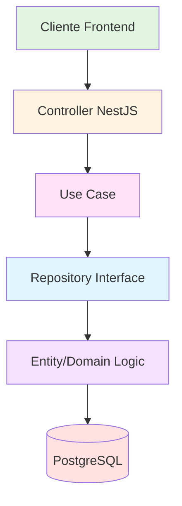
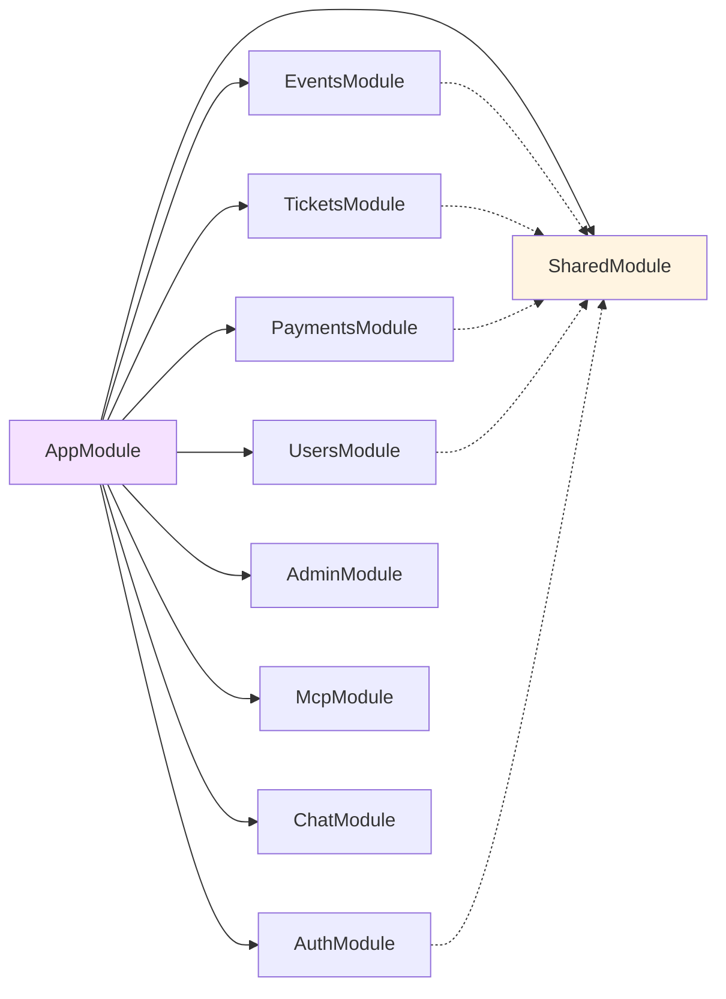
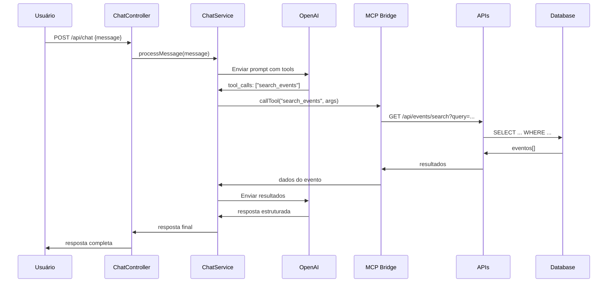

# 🎉 Gwan Events Backend

Backend da plataforma de eventos e venda de ingressos construído com NestJS e TypeScript, seguindo os princípios de **Clean Architecture** e **SOLID**.

## 🚀 Funcionalidades

- **Gestão de Eventos**: Criar, listar, atualizar e deletar eventos com categorias de ingressos
- **Sistema de Ingressos**: Comprar, validar, transferir e cancelar ingressos com QR Code
- **Pagamentos**: Sistema completo de pagamentos com múltiplos métodos
- **Autenticação**: JWT com Passport e roles (USER, ORGANIZER, ADMIN)
- **Chatbot Inteligente**: Agente conversacional via OpenAI integrado com MCP
- **MCP Server**: Model Context Protocol para integração com IA
- **Administração**: Dashboard administrativo com analytics
- **Logging Estruturado**: Sistema de logs no formato NestJS
- **Documentação Completa**: Swagger + Mermaid + Markdown
- **Migrações Automáticas**: TypeORM migrations para versionamento do banco

## 🛠️ Stack Tecnológica

### Core
- **NestJS** v10 - Framework Node.js para aplicações escaláveis
- **TypeScript** v5 - Tipagem estática e modernas features ES6+
- **TypeORM** v0.3 - ORM para PostgreSQL com migrations

### Banco de Dados
- **PostgreSQL** - Banco de dados relacional principal
- Migrations automáticas com TypeORM

### Autenticação e Segurança
- **JWT** com Passport para autenticação stateless
- **bcryptjs** para hash de senhas
- Roles: USER, ORGANIZER, ADMIN

### IA e Conversational Agents
- **OpenAI API** - GPT para chatbot inteligente
- **MCP (Model Context Protocol)** - Expor APIs como tools
- **axios** - Cliente HTTP para APIs externas

### Documentação e Validação
- **Swagger/OpenAPI** - Documentação interativa da API
- **class-validator** - Validação de DTOs
- **class-transformer** - Transformação de objetos

### Utilitários
- **QRCode** - Geração de QR Codes para ingressos
- **uuid** - Geração de identificadores únicos

### Testes e Qualidade
- **Jest** - Framework de testes
- **ESLint** - Linting de código
- **Prettier** - Formatação automática

## 📋 Pré-requisitos

- **Node.js** v20+
- **PostgreSQL** v14+
- **npm** ou **yarn**
- **Git**

## 🚀 Início Rápido

### 1. Clone o Repositório

```bash
git clone https://github.com/seu-usuario/gwan-events-backend.git
cd gwan-events-backend
```

### 2. Instale as Dependências

```bash
npm install
```

### 3. Configure as Variáveis de Ambiente

```bash
cp env.example .env
```

Edite o arquivo `.env` com suas configurações:

```env
# Servidor
NODE_ENV=development
PORT=3001

# Database
DB_HOST=localhost
DB_PORT=5432
DB_USER=postgres
DB_PASSWORD=postgres
DB_NAME=gwan_events

# JWT
JWT_SECRET=your-super-secret-jwt-key-change-in-production
JWT_EXPIRATION=24h

# OpenAI (para chatbot)
OPENAI_API_KEY=sk-proj-...
OPENAI_MODEL=gpt-4o-mini

# MCP (opcional)
MCP_BASE_URL=http://localhost:3001
MCP_AUTH_TOKEN=your-mcp-token
```

### 4. Execute as Migrações

```bash
npm run typeorm:migration:run
```

### 5. Crie um Usuário Admin

```bash
npm run admin:create
```

### 6. Seed o Banco (opcional)

```bash
npm run db:seed:simple
```

### 7. Inicie o Servidor

```bash
# Desenvolvimento com hot reload
npm run start:dev

# Produção
npm run start:prod
```

### 8. Acesse a Documentação

- **Swagger UI**: http://localhost:3001/api
- **Health Check**: http://localhost:3001/api/health

## 📁 Estrutura do Projeto

```
src/
├── main.ts                           # Ponto de entrada
├── app.module.ts                     # Módulo principal
├── shared/                           # Código compartilhado
│   ├── domain/                       # Entidades e regras de negócio
│   │   ├── entities/                 # Event, User, Ticket, Payment
│   │   ├── value-objects/            # Enums e value objects
│   │   ├── exceptions/                # Custom exceptions
│   │   └── interfaces/               # Repository interfaces
│   ├── infrastructure/               # Implementações externas
│   │   └── repositories/             # TypeORM repositories
│   ├── application/                  # Casos de uso
│   │   ├── use-cases/                # Use cases da aplicação
│   │   └── interfaces/               # Service interfaces
│   └── presentation/                 # Controllers e DTOs
│       ├── dtos/                     # Data Transfer Objects
│       └── filters/                  # Exception filters
├── modules/                          # Módulos da aplicação
│   ├── auth/                         # Autenticação e autorização
│   ├── users/                        # Gestão de usuários
│   ├── events/                       # Gestão de eventos
│   ├── tickets/                      # Gestão de ingressos
│   ├── payments/                     # Sistema de pagamentos
│   ├── admin/                        # Painel administrativo
│   ├── scanners/                     # Scanner de ingressos
│   ├── chat/                         # Chatbot inteligente
│   └── mcp/                          # Servidor MCP
├── config/                           # Configurações
│   ├── typeorm.config.ts             # Config TypeORM
│   └── data-source.ts               # Data Source migrations
├── database/                         # Database utilities
└── migrations/                        # TypeORM migrations
```

## 🏗️ Arquitetura

### Clean Architecture

O projeto segue **Clean Architecture** com 3 camadas principais:

```
┌─────────────────────────────────────────┐
│  Presentation Layer (Controllers, DTOs) │
├─────────────────────────────────────────┤
│  Application Layer (Use Cases, Services) │
├─────────────────────────────────────────┤
│  Domain Layer (Entities, Interfaces)    │
├─────────────────────────────────────────┤
│  Infrastructure Layer (Repositories, DB) │
└─────────────────────────────────────────┘
```

### Fluxo de Dados



### Módulos e Dependências



## 🔌 APIs Expostas

### Arquivos .http para Testes

Cada módulo possui um arquivo `.http` para facilitar testes via REST Client:

#### 1. Eventos (`src/events/events.http`)
**Endpoints disponíveis:**
- `GET /api/events` - Listar eventos
- `GET /api/events/:id` - Obter evento por ID
- `GET /api/events/search?query=...` - Buscar por nome/código
- `POST /api/events` - Criar evento (auth)
- `PUT /api/events/:id` - Atualizar evento (auth)
- `DELETE /api/events/:id` - Deletar evento (auth)
- `GET /api/events/:id/ticket-categories` - Listar categorias
- `POST /api/events/:id/ticket-categories` - Criar categoria (auth)
- `PUT /api/events/ticket-categories/:id` - Atualizar categoria (auth)
- `DELETE /api/events/ticket-categories/:id` - Deletar categoria (auth)

**Uso:**
```http
### Listar eventos
GET http://localhost:3001/api/events

### Buscar evento por código
GET http://localhost:3001/api/events/search?query=EVT-AMA3RU
```

#### 2. Ingressos (`src/tickets/tickets.http`)
**Endpoints disponíveis:**
- `GET /api/tickets` - Listar ingressos (auth)
- `GET /api/tickets/:id` - Obter ingresso por ID (auth)
- `GET /api/tickets/user/:userId` - Ingressos do usuário (auth)
- `GET /api/tickets/event/:eventId` - Ingressos do evento (auth)
- `POST /api/tickets` - Comprar ingresso (auth)
- `POST /api/tickets/validate` - Validar ingresso (auth)
- `PUT /api/tickets/:id/use` - Marcar como usado (auth)
- `PUT /api/tickets/:id/transfer` - Transferir ingresso (auth)
- `PUT /api/tickets/:id/cancel` - Cancelar ingresso (auth)
- `GET /api/tickets/stats` - Estatísticas (auth)

**Uso:**
```http
### Comprar ingresso
POST http://localhost:3001/api/tickets
Authorization: Bearer {{token}}
{
  "eventId": "1",
  "categoryId": "1",
  "quantity": 2
}
```

#### 3. Autenticação (`src/auth/auth.http`)
**Endpoints disponíveis:**
- `POST /api/auth/login` - Fazer login
- `POST /api/auth/register` - Registrar usuário
- `GET /api/auth/profile` - Obter perfil (auth)

**Uso:**
```http
### Login
POST http://localhost:3001/api/auth/login
{
  "email": "admin@gwanshop.com",
  "password": "password"
}
```

#### 4. Usuários (`src/users/users.http`)
**Endpoints disponíveis:**
- `GET /api/users` - Listar usuários (auth)
- `GET /api/users/:id` - Obter usuário por ID (auth)
- `PUT /api/users/:id` - Atualizar usuário (auth)
- `DELETE /api/users/:id` - Deletar usuário (auth)

#### 5. Pagamentos (`src/payments/payments.http`)
**Endpoints disponíveis:**
- `GET /api/payments` - Listar pagamentos (auth)
- `GET /api/payments/:id` - Obter pagamento por ID (auth)
- `GET /api/payments/user/:userId` - Pagamentos do usuário (auth)
- `POST /api/payments` - Criar pagamento (auth)
- `PUT /api/payments/:id/approve` - Aprovar pagamento (auth)
- `PUT /api/payments/:id/reject` - Rejeitar pagamento (auth)
- `PUT /api/payments/:id/refund` - Estornar pagamento (auth)
- `GET /api/payments/stats` - Estatísticas (auth)

#### 6. Admin (`src/admin/admin.http`)
**Endpoints disponíveis:**
- `GET /api/admin/dashboard` - Dashboard geral (auth)
- `GET /api/admin/events/:id/analytics` - Analytics do evento (auth)
- `GET /api/admin/users/:id/analytics` - Analytics do usuário (auth)

#### 7. Chat (`src/chat/chat.http`)
**Endpoints disponíveis:**
- `POST /api/chat` - Chatbot inteligente

**Uso:**
```http
### Chat - Listar eventos
POST http://localhost:3001/api/chat
{
  "message": "Liste eventos de Música em São Paulo"
}

### Chat - Buscar por nome
POST http://localhost:3001/api/chat
{
  "message": "Busque eventos com o nome Culto"
}

### Chat - Detalhes de evento
POST http://localhost:3001/api/chat
{
  "message": "Mostre os detalhes do evento ab1eb579-9fde-4a9b-b596-f0bc83649ac0"
}

### Chat - Preços de ingressos
POST http://localhost:3001/api/chat
{
  "message": "Quais os preços dos ingressos do evento ab1eb579-9fde-4a9b-b596-f0bc83649ac0?"
}
```

#### 8. Health (`src/health/health.http`)
**Endpoints disponíveis:**
- `GET /api/health` - Health check

#### 9. MCP Tools (`src/mcp/`)
**APIs MCP expostas:**
- `list_events` - Listar eventos
- `get_event_by_id` - Obter evento por ID
- `get_event_ticket_categories` - Categorias de ingressos
- `search_events_by_query` - Buscar eventos por nome/código

**Uso:**
```bash
# Via stdio
echo '{"jsonrpc": "2.0", "id": 1, "method": "tools/list"}' | npm run start:mcp:stdio

# Via HTTP bridge
GET http://localhost:3001/api/mcp/tools
POST http://localhost:3001/api/mcp/tools/call
{
  "name": "list_events",
  "arguments": {
    "category": "Música",
    "city": "São Paulo"
  }
}
```

## 🤖 Chatbot Inteligente

### Funcionalidades

O chatbot utiliza **OpenAI GPT** com integração **MCP** para:
- Buscar eventos por nome, categoria ou cidade
- Fornecer detalhes completos de eventos
- Listar preços de ingressos
- Buscar artistas por nome ou estilo
- Sugerir eventos com contexto do usuário
- Integração WhatsApp com mensagens sequenciais formatadas

### Tools Disponíveis

**Eventos:**
- `events.search` - Listar eventos (com filtros opcionais)
- `search_events_by_query` - Busca exata por nome/código
- `search_events_rag` - Busca semântica por significado/conceito
- `get_event_by_id` - Detalhes completos de evento
- `get_event_ticket_categories` - Preços de ingressos

**Artistas:**
- `list_artists` - Listar todos os artistas
- `search_artists_by_query` - Busca exata por nome/username
- `search_artists_rag` - Busca semântica por estilo/conceito
- `get_artist_by_id` - Detalhes completos de artista

### Uso

```http
POST http://localhost:3001/api/chat
Content-Type: application/json

{
  "message": "Liste eventos de Música em São Paulo",
  "userCtx": {
    "city": "São Paulo",
    "date": "2025-10-29",
    "language": "pt-BR"
  },
  "channel": "web" // ou "whatsapp"
}
```

### Documentação Completa

Para entender em detalhes o fluxo completo do chatbot, consulte:
- 📖 [Fluxo de Chamadas do Chatbot](./docs/chatbot/chatbot-flow.md) - Documentação completa
- 📊 [Diagramas do Chatbot](./docs/diagrams/chatbot-flow.md) - Diagramas Mermaid detalhados

### Fluxo Simplificado



## 📝 Scripts Disponíveis

### Desenvolvimento
- `npm run start:dev` - Desenvolvimento com hot reload
- `npm run start:debug` - Desenvolvimento com debug
- `npm run start:prod` - Produção
- `npm run build` - Compilar TypeScript

### MCP Server
- `npm run start:mcp:stdio` - MCP Server stdio
- `npm run start:mcp:sse` - MCP Server SSE
- `npm run build:mcp` - Compilar MCP

### Qualidade de Código
- `npm run lint` - ESLint
- `npm run format` - Prettier

### Database
- `npm run typeorm:migration:run` - Executar migrações
- `npm run typeorm:migration:revert` - Reverter última migração
- `npm run typeorm:migration:generate` - Gerar nova migração
- `npm run admin:create` - Criar usuário admin
- `npm run db:seed` - Executar seeder
- `npm run db:seed:simple` - Executar seeder simples

### Documentação Automática
- `npm run docs:generate` - Gerar toda a documentação
- `npm run docs:validate` - Validar documentação
- `npm run docs:serve` - Servir documentação localmente
- `npm run docs:watch` - Monitorar mudanças e regenerar
- `npm run docs:clean` - Limpar arquivos gerados
- `npm run docs:help` - Mostrar ajuda

### Deploy
- `npm run deploy:prepare` - Preparar para deploy (build + docs)
- `npm run deploy:prod` - Deploy para produção
- `npm run deploy:rollback` - Rollback

### Docker
- `npm run docker:build` - Build das imagens
- `npm run docker:up` - Subir containers
- `npm run docker:down` - Parar containers
- `npm run docker:logs` - Ver logs
- `npm run docker:restart` - Reiniciar containers

## 🚢 Deploy

### Deploy Local com Docker

```bash
# 1. Configurar variáveis de ambiente
cp env.example .env

# 2. Subir containers
docker-compose up -d

# 3. Executar migrações
docker exec -it gwan-events-backend npm run typeorm:migration:run

# 4. Criar admin
docker exec -it gwan-events-backend npm run admin:create
```

### Deploy com Portainer

```bash
# Via script (Windows)
npm run portainer:deploy:prod:win

# Via script (Linux/Mac)
npm run portainer:deploy:prod
```

Ver documentação completa em `docs/deployment/`.

## 🧪 Testes

```bash
# Testes unitários
npm run test

# Testes e2e
npm run test:e2e

# Coverage
npm run test:cov

# Testes com watch
npm run test:watch
```

## 📚 Documentação

### Documentação Completa
- [Arquitetura](./docs/architecture/overview.md)
- [Desenvolvimento](./docs/development/setup.md)
- [APIs](./docs/api/overview.md)
- [MCP](./docs/mcp/overview.md)
- [Deploy](./docs/deployment/deploy-automation.md)
- [Diagramas](./docs/diagrams/system-architecture.md)

### Gerar Documentação

```bash
# Gerar toda documentação
npm run docs:generate

# Validar documentação
npm run docs:validate
```

## 🛡️ Segurança

- **JWT Authentication** com Passport
- **Rate Limiting** para prevenir abuso
- **CORS** configurado para domínios específicos
- **Validação** de entrada com class-validator
- **Autenticação MCP** via token
- **bcryptjs** para hash de senhas

## 🐛 Solução de Problemas

### Erro: "EADDRINUSE: address already in use :::3001"

```bash
# Windows
netstat -ano | findstr :3001
taskkill /PID <PID> /F

# Linux/Mac
lsof -ti:3001 | xargs kill
```

### Erro de Dependências

```bash
npm cache clean --force
npm install
```

### Erro de Build

```bash
npm run build
```

## 🤝 Contribuindo

1. Fork o projeto
2. Crie sua branch (`git checkout -b feature/AmazingFeature`)
3. Commit suas mudanças (`git commit -m 'Add some AmazingFeature'`)
4. Push para a branch (`git push origin feature/AmazingFeature`)
5. Abra um Pull Request

### Padrões
- Siga os [padrões de código](./.cursorrules)
- Escreva testes para novas funcionalidades
- Atualize a documentação
- Use commits semânticos

## 📄 Licença

Este projeto está sob a licença MIT. Veja o arquivo [LICENSE](LICENSE) para mais detalhes.

## 🆘 Suporte

- **Documentação**: [docs/README.md](./docs/README.md)
- **Issues**: [GitHub Issues](https://github.com/seu-usuario/gwan-events-backend/issues)

## 🎯 Roadmap

- [ ] Implementar testes e2e completos
- [ ] Adicionar mais endpoints MCP
- [ ] Implementar cache distribuído
- [ ] Adicionar suporte a WebSockets
- [ ] Implementar sistema de notificações
- [ ] Adicionar suporte a múltiplos idiomas

---

**🎉 Backend da plataforma Gwan Events!**
