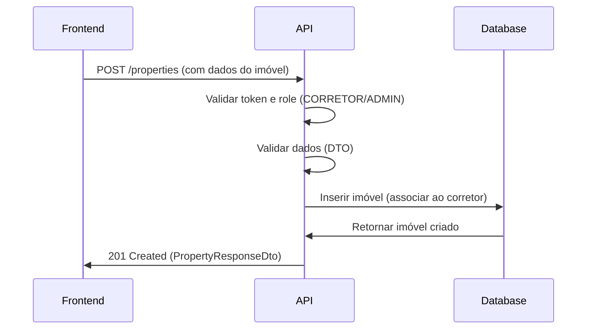
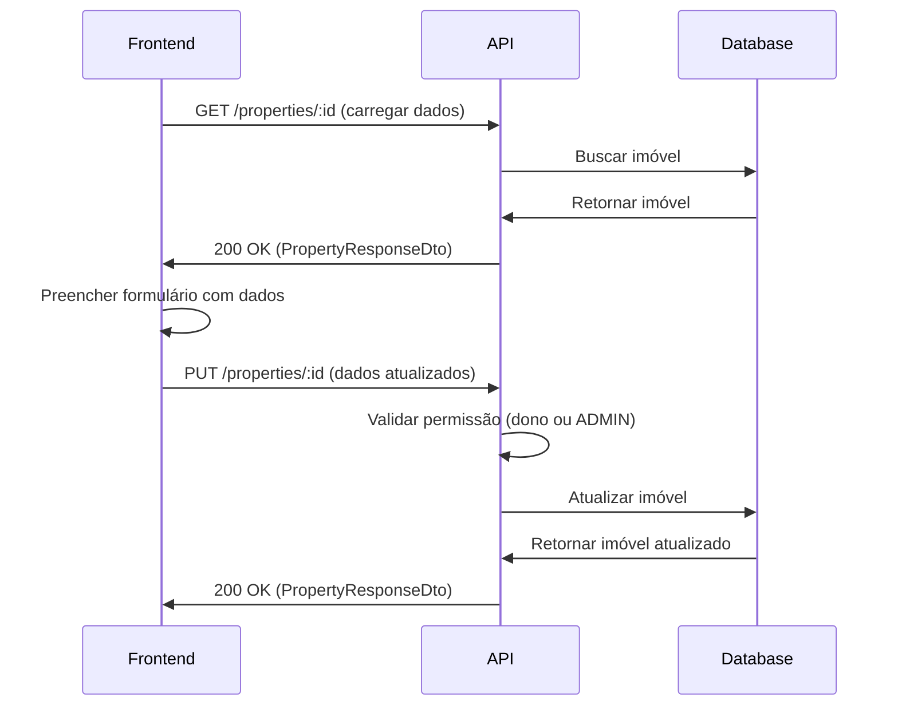

# API de Administração de Imóveis - Documentação para Frontend

## Visão Geral

Esta documentação descreve como o frontend deve interagir com a API de administração de imóveis da plataforma Litoral Imóveis. A API permite criar, listar, visualizar, atualizar e deletar imóveis, com controle de acesso baseado em roles de usuário.

## Base URL

```
Produção: https://api.litoralimoveis.com.br/api
Desenvolvimento: http://localhost:3009/api
```

## Autenticação

Todas as requisições requerem autenticação via JWT Bearer Token.

### Como obter o token

1. Fazer login via `POST /auth/login`
2. Receber o token no campo `access_token` da resposta
3. Incluir o token no header `Authorization: Bearer <token>`

### Exemplo de requisição autenticada

```javascript
fetch('http://localhost:3009/api/properties', {
  headers: {
    'Authorization': `Bearer ${token}`,
    'Content-Type': 'application/json'
  }
})
```

## Permissões e Roles

### Roles disponíveis

- **USER**: Pode apenas visualizar imóveis (listar e ver detalhes)
- **CORRETOR**: Pode criar, editar e deletar seus próprios imóveis
- **ADMIN**: Pode criar, editar e deletar qualquer imóvel

### Matriz de Permissões

| Ação | USER | CORRETOR | ADMIN |
|------|------|----------|-------|
| Listar imóveis | ✅ | ✅ | ✅ |
| Ver detalhes | ✅ | ✅ | ✅ |
| Criar imóvel | ❌ | ✅ | ✅ |
| Editar próprio imóvel | ❌ | ✅ | ✅ |
| Editar qualquer imóvel | ❌ | ❌ | ✅ |
| Deletar próprio imóvel | ❌ | ✅ | ✅ |
| Deletar qualquer imóvel | ❌ | ❌ | ✅ |

## Endpoints

### 1. Criar Imóvel

**POST** `/properties`

**Permissão**: CORRETOR ou ADMIN

**Descrição**: Cria um novo imóvel na plataforma. O imóvel será automaticamente associado ao corretor autenticado.

**Headers**:
```
Authorization: Bearer <token>
Content-Type: application/json
```

**Body** (CreatePropertyDto):
```json
{
  "title": "Casa de Praia Luxuosa com Vista para o Mar",
  "description": "Casa espaçosa com 3 quartos, 2 banheiros, área gourmet e piscina. Localizada em frente ao mar.",
  "type": "CASA",
  "price": 850000.00,
  "neighborhood": "Maresias",
  "city": "São Sebastião",
  "bedrooms": 3,
  "bathrooms": 2,
  "area": 150.50,
  "garageSpaces": 2,
  "piscina": true,
  "hidromassagem": false,
  "frenteMar": true,
  "jardim": true,
  "areaGourmet": true,
  "mobiliado": false
}
```

**Campos obrigatórios**:
- `title` (string, max 255 caracteres)
- `description` (string)
- `type` (enum: "CASA", "APARTAMENTO", "TERRENO", "SALA_COMERCIAL")
- `price` (number, mínimo 0, 2 casas decimais)
- `neighborhood` (string, max 255 caracteres)
- `city` (string, max 255 caracteres)
- `area` (number, mínimo 0, 2 casas decimais)

**Campos opcionais**:
- `bedrooms` (number, mínimo 0)
- `bathrooms` (number, mínimo 0)
- `garageSpaces` (number, mínimo 0)
- `piscina` (boolean, default: false)
- `hidromassagem` (boolean, default: false)
- `frenteMar` (boolean, default: false)
- `jardim` (boolean, default: false)
- `areaGourmet` (boolean, default: false)
- `mobiliado` (boolean, default: false)

**Resposta de Sucesso** (201 Created):
```json
{
  "id": "d4da01e3-2f5a-4edf-8fa3-71f262e04eb5",
  "title": "Casa de Praia Luxuosa com Vista para o Mar",
  "description": "Casa espaçosa com 3 quartos, 2 banheiros, área gourmet e piscina.",
  "type": "CASA",
  "price": 850000.00,
  "neighborhood": "Maresias",
  "city": "São Sebastião",
  "bedrooms": 3,
  "bathrooms": 2,
  "area": 150.50,
  "garageSpaces": 2,
  "piscina": true,
  "hidromassagem": false,
  "frenteMar": true,
  "jardim": true,
  "areaGourmet": true,
  "mobiliado": false,
  "corretorId": "98c494a3-e8bd-4b43-b164-50eec18af4cf",
  "createdAt": "2024-01-15T10:30:00.000Z",
  "updatedAt": "2024-01-15T10:30:00.000Z"
}
```

**Respostas de Erro**:
- `401 Unauthorized`: Token inválido ou ausente
- `403 Forbidden`: Usuário não tem permissão (não é CORRETOR ou ADMIN)
- `400 Bad Request`: Dados inválidos (validação falhou)

---

### 2. Listar Imóveis

**GET** `/properties`

**Permissão**: Qualquer usuário autenticado

**Descrição**: Retorna uma lista de imóveis cadastrados. Suporta filtros opcionais.

**Query Parameters** (todos opcionais):
- `city` (string): Filtrar por cidade
- `type` (string): Filtrar por tipo ("CASA", "APARTAMENTO", "TERRENO", "SALA_COMERCIAL")
- `minPrice` (number): Preço mínimo
- `maxPrice` (number): Preço máximo
- `corretorId` (string): Filtrar por corretor (UUID)

**Exemplos de requisição**:
```
GET /properties
GET /properties?city=São Sebastião
GET /properties?type=CASA
GET /properties?minPrice=500000&maxPrice=1000000
GET /properties?city=São Sebastião&type=CASA&minPrice=500000
```

**Resposta de Sucesso** (200 OK):
```json
[
  {
    "id": "d4da01e3-2f5a-4edf-8fa3-71f262e04eb5",
    "title": "Casa de Praia Luxuosa com Vista para o Mar",
    "description": "Casa espaçosa com 3 quartos...",
    "type": "CASA",
    "price": 850000.00,
    "neighborhood": "Maresias",
    "city": "São Sebastião",
    "bedrooms": 3,
    "bathrooms": 2,
    "area": 150.50,
    "garageSpaces": 2,
    "piscina": true,
    "hidromassagem": false,
    "frenteMar": true,
    "jardim": true,
    "areaGourmet": true,
    "mobiliado": false,
    "corretorId": "98c494a3-e8bd-4b43-b164-50eec18af4cf",
    "createdAt": "2024-01-15T10:30:00.000Z",
    "updatedAt": "2024-01-15T10:30:00.000Z"
  }
]
```

---

### 3. Obter Imóvel por ID

**GET** `/properties/:id`

**Permissão**: Qualquer usuário autenticado

**Descrição**: Retorna os dados completos de um imóvel específico.

**Parâmetros de URL**:
- `id` (string, UUID): ID do imóvel

**Resposta de Sucesso** (200 OK):
```json
{
  "id": "d4da01e3-2f5a-4edf-8fa3-71f262e04eb5",
  "title": "Casa de Praia Luxuosa com Vista para o Mar",
  "description": "Casa espaçosa com 3 quartos...",
  "type": "CASA",
  "price": 850000.00,
  "neighborhood": "Maresias",
  "city": "São Sebastião",
  "bedrooms": 3,
  "bathrooms": 2,
  "area": 150.50,
  "garageSpaces": 2,
  "piscina": true,
  "hidromassagem": false,
  "frenteMar": true,
  "jardim": true,
  "areaGourmet": true,
  "mobiliado": false,
  "corretorId": "98c494a3-e8bd-4b43-b164-50eec18af4cf",
  "createdAt": "2024-01-15T10:30:00.000Z",
  "updatedAt": "2024-01-15T10:30:00.000Z"
}
```

**Respostas de Erro**:
- `401 Unauthorized`: Token inválido ou ausente
- `404 Not Found`: Imóvel não encontrado

---

### 4. Atualizar Imóvel

**PUT** `/properties/:id`

**Permissão**: CORRETOR (apenas seus próprios imóveis) ou ADMIN (qualquer imóvel)

**Descrição**: Atualiza os dados de um imóvel existente. Apenas os campos enviados serão atualizados (PATCH-like).

**Parâmetros de URL**:
- `id` (string, UUID): ID do imóvel a ser atualizado

**Body** (UpdatePropertyDto - todos os campos opcionais):
```json
{
  "price": 900000.00,
  "piscina": true,
  "areaGourmet": true
}
```

**Resposta de Sucesso** (200 OK):
```json
{
  "id": "d4da01e3-2f5a-4edf-8fa3-71f262e04eb5",
  "title": "Casa de Praia Luxuosa com Vista para o Mar",
  "description": "Casa espaçosa com 3 quartos...",
  "type": "CASA",
  "price": 900000.00,
  "neighborhood": "Maresias",
  "city": "São Sebastião",
  "bedrooms": 3,
  "bathrooms": 2,
  "area": 150.50,
  "garageSpaces": 2,
  "piscina": true,
  "hidromassagem": false,
  "frenteMar": true,
  "jardim": true,
  "areaGourmet": true,
  "mobiliado": false,
  "corretorId": "98c494a3-e8bd-4b43-b164-50eec18af4cf",
  "createdAt": "2024-01-15T10:30:00.000Z",
  "updatedAt": "2024-01-15T11:45:00.000Z"
}
```

**Respostas de Erro**:
- `401 Unauthorized`: Token inválido ou ausente
- `403 Forbidden`: Usuário não tem permissão (não é dono do imóvel ou ADMIN)
- `404 Not Found`: Imóvel não encontrado
- `400 Bad Request`: Dados inválidos

---

### 5. Deletar Imóvel

**DELETE** `/properties/:id`

**Permissão**: CORRETOR (apenas seus próprios imóveis) ou ADMIN (qualquer imóvel)

**Descrição**: Remove um imóvel do sistema permanentemente.

**Parâmetros de URL**:
- `id` (string, UUID): ID do imóvel a ser deletado

**Resposta de Sucesso** (200 OK):
```json
{
  "message": "Imóvel deletado com sucesso"
}
```

**Respostas de Erro**:
- `401 Unauthorized`: Token inválido ou ausente
- `403 Forbidden`: Usuário não tem permissão (não é dono do imóvel ou ADMIN)
- `404 Not Found`: Imóvel não encontrado

---

## Estrutura de Dados

### PropertyType (Enum)

```typescript
enum PropertyType {
  CASA = 'CASA',
  APARTAMENTO = 'APARTAMENTO',
  TERRENO = 'TERRENO',
  SALA_COMERCIAL = 'SALA_COMERCIAL'
}
```

### PropertyResponseDto

```typescript
interface PropertyResponseDto {
  id: string;                    // UUID
  title: string;                 // Título do anúncio
  description: string;           // Descrição detalhada
  type: PropertyType;            // Tipo do imóvel
  price: number;                 // Preço em reais
  neighborhood: string;          // Bairro ou praia
  city: string;                  // Cidade
  bedrooms?: number;             // Número de quartos (opcional)
  bathrooms?: number;           // Número de banheiros (opcional)
  area: number;                 // Área em m²
  garageSpaces?: number;        // Vagas de garagem (opcional)
  piscina: boolean;             // Possui piscina
  hidromassagem: boolean;       // Possui hidromassagem
  frenteMar: boolean;           // Frente para o mar
  jardim: boolean;              // Possui jardim
  areaGourmet: boolean;         // Possui área gourmet
  mobiliado: boolean;           // Imóvel mobiliado
  corretorId: string;          // ID do corretor responsável
  createdAt: string;           // Data de criação (ISO 8601)
  updatedAt: string;           // Data de atualização (ISO 8601)
}
```

## Exemplos de Uso no Frontend

### React/TypeScript

```typescript
// Tipos TypeScript
enum PropertyType {
  CASA = 'CASA',
  APARTAMENTO = 'APARTAMENTO',
  TERRENO = 'TERRENO',
  SALA_COMERCIAL = 'SALA_COMERCIAL'
}

interface Property {
  id: string;
  title: string;
  description: string;
  type: PropertyType;
  price: number;
  neighborhood: string;
  city: string;
  bedrooms?: number;
  bathrooms?: number;
  area: number;
  garageSpaces?: number;
  piscina: boolean;
  hidromassagem: boolean;
  frenteMar: boolean;
  jardim: boolean;
  areaGourmet: boolean;
  mobiliado: boolean;
  corretorId: string;
  createdAt: string;
  updatedAt: string;
}

interface CreatePropertyDto {
  title: string;
  description: string;
  type: PropertyType;
  price: number;
  neighborhood: string;
  city: string;
  bedrooms?: number;
  bathrooms?: number;
  area: number;
  garageSpaces?: number;
  piscina?: boolean;
  hidromassagem?: boolean;
  frenteMar?: boolean;
  jardim?: boolean;
  areaGourmet?: boolean;
  mobiliado?: boolean;
}

// Serviço de API
class PropertiesService {
  private baseUrl = process.env.REACT_APP_API_URL || 'http://localhost:3009/api';
  
  private getHeaders(token: string) {
    return {
      'Authorization': `Bearer ${token}`,
      'Content-Type': 'application/json'
    };
  }

  async listProperties(token: string, filters?: {
    city?: string;
    type?: PropertyType;
    minPrice?: number;
    maxPrice?: number;
    corretorId?: string;
  }): Promise<Property[]> {
    const params = new URLSearchParams();
    if (filters?.city) params.append('city', filters.city);
    if (filters?.type) params.append('type', filters.type);
    if (filters?.minPrice) params.append('minPrice', filters.minPrice.toString());
    if (filters?.maxPrice) params.append('maxPrice', filters.maxPrice.toString());
    if (filters?.corretorId) params.append('corretorId', filters.corretorId);

    const response = await fetch(`${this.baseUrl}/properties?${params}`, {
      headers: this.getHeaders(token)
    });

    if (!response.ok) {
      throw new Error(`Erro ao listar imóveis: ${response.statusText}`);
    }

    return response.json();
  }

  async getPropertyById(token: string, id: string): Promise<Property> {
    const response = await fetch(`${this.baseUrl}/properties/${id}`, {
      headers: this.getHeaders(token)
    });

    if (!response.ok) {
      if (response.status === 404) {
        throw new Error('Imóvel não encontrado');
      }
      throw new Error(`Erro ao buscar imóvel: ${response.statusText}`);
    }

    return response.json();
  }

  async createProperty(token: string, data: CreatePropertyDto): Promise<Property> {
    const response = await fetch(`${this.baseUrl}/properties`, {
      method: 'POST',
      headers: this.getHeaders(token),
      body: JSON.stringify(data)
    });

    if (!response.ok) {
      if (response.status === 403) {
        throw new Error('Você não tem permissão para criar imóveis');
      }
      const error = await response.json();
      throw new Error(error.message || 'Erro ao criar imóvel');
    }

    return response.json();
  }

  async updateProperty(
    token: string, 
    id: string, 
    data: Partial<CreatePropertyDto>
  ): Promise<Property> {
    const response = await fetch(`${this.baseUrl}/properties/${id}`, {
      method: 'PUT',
      headers: this.getHeaders(token),
      body: JSON.stringify(data)
    });

    if (!response.ok) {
      if (response.status === 403) {
        throw new Error('Você não tem permissão para editar este imóvel');
      }
      if (response.status === 404) {
        throw new Error('Imóvel não encontrado');
      }
      const error = await response.json();
      throw new Error(error.message || 'Erro ao atualizar imóvel');
    }

    return response.json();
  }

  async deleteProperty(token: string, id: string): Promise<void> {
    const response = await fetch(`${this.baseUrl}/properties/${id}`, {
      method: 'DELETE',
      headers: this.getHeaders(token)
    });

    if (!response.ok) {
      if (response.status === 403) {
        throw new Error('Você não tem permissão para deletar este imóvel');
      }
      if (response.status === 404) {
        throw new Error('Imóvel não encontrado');
      }
      throw new Error('Erro ao deletar imóvel');
    }
  }
}

// Hook React
import { useState, useEffect } from 'react';

function useProperties(token: string, filters?: any) {
  const [properties, setProperties] = useState<Property[]>([]);
  const [loading, setLoading] = useState(true);
  const [error, setError] = useState<string | null>(null);

  useEffect(() => {
    const service = new PropertiesService();
    service.listProperties(token, filters)
      .then(setProperties)
      .catch(err => setError(err.message))
      .finally(() => setLoading(false));
  }, [token, JSON.stringify(filters)]);

  return { properties, loading, error };
}
```

## Fluxos de Trabalho

### 1. Criar Novo Imóvel



**Passos no Frontend**:
1. Usuário preenche formulário de cadastro
2. Validar campos obrigatórios no frontend
3. Enviar requisição POST com dados
4. Exibir mensagem de sucesso e redirecionar
5. Tratar erros (403, 400, etc.)

### 2. Editar Imóvel



**Passos no Frontend**:
1. Carregar dados do imóvel (GET)
2. Preencher formulário com dados existentes
3. Usuário edita campos desejados
4. Enviar apenas campos alterados (PUT)
5. Exibir mensagem de sucesso
6. Tratar erros (403 se não for dono, 404 se não existir)

### 3. Listar Imóveis com Filtros

**Passos no Frontend**:
1. Exibir formulário de filtros (cidade, tipo, preço)
2. Ao aplicar filtros, construir query string
3. Fazer requisição GET com parâmetros
4. Exibir lista de imóveis
5. Implementar paginação (se necessário no futuro)

## Tratamento de Erros

### Códigos HTTP e Como Tratar

| Código | Significado | Ação no Frontend |
|--------|-------------|------------------|
| 200 | Sucesso | Atualizar UI com dados retornados |
| 201 | Criado | Mostrar mensagem de sucesso, redirecionar ou atualizar lista |
| 400 | Dados inválidos | Exibir erros de validação específicos |
| 401 | Não autenticado | Redirecionar para login |
| 403 | Sem permissão | Mostrar mensagem: "Você não tem permissão para esta ação" |
| 404 | Não encontrado | Mostrar mensagem: "Imóvel não encontrado" |
| 500 | Erro do servidor | Mostrar mensagem genérica de erro |

### Exemplo de Tratamento de Erros

```typescript
try {
  const property = await propertiesService.createProperty(token, data);
  toast.success('Imóvel criado com sucesso!');
  navigate(`/properties/${property.id}`);
} catch (error: any) {
  if (error.message.includes('403') || error.message.includes('permissão')) {
    toast.error('Você não tem permissão para criar imóveis. Entre em contato com o administrador.');
  } else if (error.message.includes('400') || error.message.includes('validação')) {
    toast.error('Dados inválidos. Verifique os campos do formulário.');
  } else {
    toast.error('Erro ao criar imóvel. Tente novamente.');
  }
}
```

## Validações no Frontend

### Campos Obrigatórios

Antes de enviar, validar:
- `title`: Não vazio, máximo 255 caracteres
- `description`: Não vazio
- `type`: Deve ser um dos valores do enum
- `price`: Número positivo, 2 casas decimais
- `neighborhood`: Não vazio, máximo 255 caracteres
- `city`: Não vazio, máximo 255 caracteres
- `area`: Número positivo, 2 casas decimais

### Validações Adicionais

- `bedrooms`, `bathrooms`, `garageSpaces`: Se preenchidos, devem ser números inteiros >= 0
- `price`: Formatar como moeda brasileira (R$ 850.000,00)
- `area`: Formatar com 2 casas decimais (150,50 m²)

## Exemplo de Formulário Completo

### Estrutura de Formulário

```typescript
interface PropertyFormData {
  // Informações básicas
  title: string;
  description: string;
  type: PropertyType;
  price: number;
  
  // Localização
  neighborhood: string;
  city: string;
  
  // Detalhes
  bedrooms?: number;
  bathrooms?: number;
  area: number;
  garageSpaces?: number;
  
  // Comodidades
  piscina: boolean;
  hidromassagem: boolean;
  frenteMar: boolean;
  jardim: boolean;
  areaGourmet: boolean;
  mobiliado: boolean;
}
```

### Componente React de Exemplo

```tsx
import { useState } from 'react';
import { PropertyType } from './types';

function PropertyForm({ propertyId, token, onSuccess }: Props) {
  const [formData, setFormData] = useState<PropertyFormData>({
    title: '',
    description: '',
    type: PropertyType.CASA,
    price: 0,
    neighborhood: '',
    city: '',
    bedrooms: undefined,
    bathrooms: undefined,
    area: 0,
    garageSpaces: undefined,
    piscina: false,
    hidromassagem: false,
    frenteMar: false,
    jardim: false,
    areaGourmet: false,
    mobiliado: false
  });

  const handleSubmit = async (e: React.FormEvent) => {
    e.preventDefault();
    
    try {
      const service = new PropertiesService();
      if (propertyId) {
        await service.updateProperty(token, propertyId, formData);
      } else {
        await service.createProperty(token, formData);
      }
      onSuccess();
    } catch (error) {
      // Tratar erro
    }
  };

  return (
    <form onSubmit={handleSubmit}>
      {/* Campos do formulário */}
    </form>
  );
}
```

## Boas Práticas

### 1. Cache e Atualização

- Após criar/editar/deletar, atualizar a lista de imóveis
- Considerar usar React Query ou SWR para cache automático
- Invalidar cache após mutações

### 2. Feedback ao Usuário

- Mostrar loading durante requisições
- Exibir mensagens de sucesso/erro claras
- Confirmar antes de deletar (modal de confirmação)

### 3. Validação

- Validar no frontend antes de enviar (UX)
- A API também valida, mas validação no frontend melhora a experiência
- Mostrar erros de validação inline no formulário

### 4. Permissões

- Verificar role do usuário antes de mostrar botões de criar/editar/deletar
- Esconder ações não permitidas na UI
- Mostrar mensagem explicativa se tentar ação sem permissão

### 5. Filtros

- Implementar debounce em campos de busca/filtro
- Salvar filtros aplicados na URL (query params) para compartilhamento
- Permitir limpar filtros facilmente

## Integração com Swagger

A documentação completa da API está disponível em:
- **Desenvolvimento**: http://localhost:3009/api
- **Produção**: https://api.litoralimoveis.com.br/api

Acesse a documentação Swagger para:
- Ver todos os endpoints disponíveis
- Testar requisições diretamente no navegador
- Ver exemplos de requisições e respostas
- Entender melhor os schemas de dados

## Suporte

Para dúvidas ou problemas:
1. Consulte a documentação Swagger
2. Verifique os logs de erro no console do navegador
3. Entre em contato com a equipe de backend

