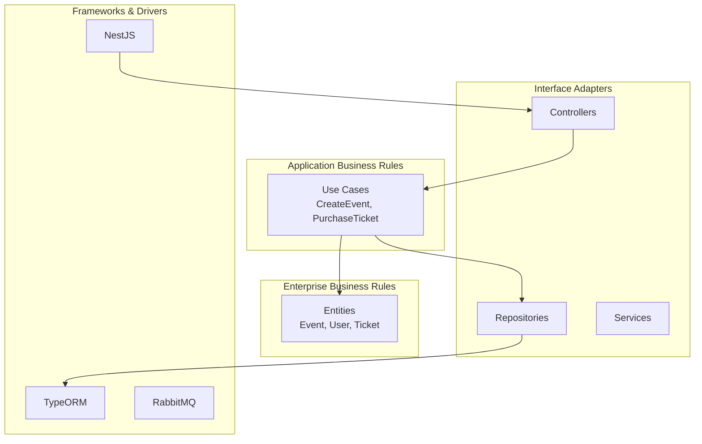
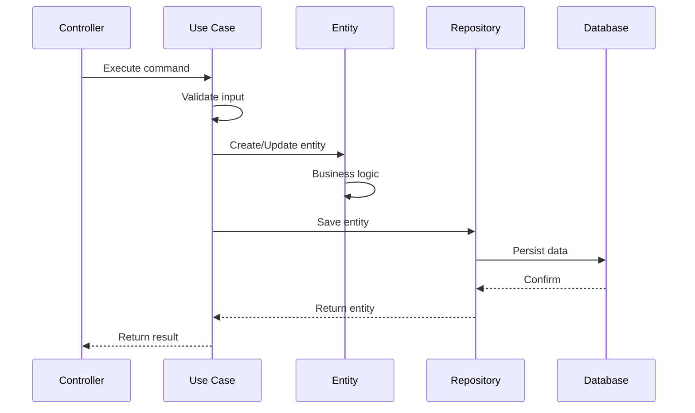
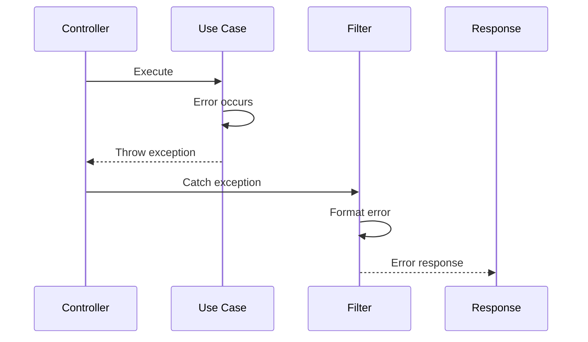

# 🏗️ Visão Geral da Arquitetura

## Introdução

O Gwan Events Backend é uma plataforma completa de eventos e venda de ingressos construída seguindo os princípios de **Clean Architecture**, **SOLID** e **Domain-Driven Design (DDD)**.

## Princípios Arquiteturais

### 🎯 Clean Architecture

A aplicação é organizada em camadas concêntricas, onde cada camada depende apenas das camadas internas:



### 🔧 SOLID Principles

- **S** - Single Responsibility: Cada classe tem uma única responsabilidade
- **O** - Open/Closed: Aberto para extensão, fechado para modificação
- **L** - Liskov Substitution: Objetos derivados devem ser substituíveis pelos base
- **I** - Interface Segregation: Interfaces específicas são melhores que genéricas
- **D** - Dependency Inversion: Dependa de abstrações, não de implementações

### 📊 Domain-Driven Design

- **Entities**: Objetos com identidade única (Event, User, Ticket)
- **Value Objects**: Objetos imutáveis sem identidade (Money, Address)
- **Aggregates**: Conjuntos de entidades relacionadas
- **Domain Services**: Lógica de negócio que não pertence a uma entidade
- **Repositories**: Abstrações para persistência de agregados

## Estrutura de Camadas

### 1. Domain Layer (Camada de Domínio)

```typescript
src/shared/domain/
├── entities/           # Entidades de negócio
│   ├── event.entity.ts
│   ├── user.entity.ts
│   └── ticket.entity.ts
├── value-objects/      # Objetos de valor
│   ├── money.value-object.ts
│   ├── address.value-object.ts
│   └── ticket-status.enum.ts
├── repositories/        # Interfaces de repositório
│   ├── event.repository.interface.ts
│   └── user.repository.interface.ts
└── services/          # Serviços de domínio
    └── ticket-validation.service.ts
```

### 2. Application Layer (Camada de Aplicação)

```typescript
src/shared/application/
├── use-cases/         # Casos de uso
│   ├── create-event.use-case.ts
│   ├── purchase-ticket.use-case.ts
│   └── validate-ticket.use-case.ts
├── interfaces/        # Interfaces de aplicação
│   ├── logger.interface.ts
│   └── email-service.interface.ts
└── dto/              # Data Transfer Objects
    ├── create-event.dto.ts
    └── purchase-ticket.dto.ts
```

### 3. Infrastructure Layer (Camada de Infraestrutura)

```typescript
src/shared/infrastructure/
├── repositories/      # Implementações de repositório
│   ├── event.repository.ts
│   └── user.repository.ts
├── services/         # Serviços externos
│   ├── email.service.ts
│   └── payment.service.ts
├── database/         # Configuração do banco
│   └── typeorm.config.ts
└── logger/          # Implementação de logging
    └── console-logger.service.ts
```

### 4. Presentation Layer (Camada de Apresentação)

```typescript
src/
├── events/           # Módulo de eventos
│   ├── events.controller.ts
│   ├── events.service.ts
│   └── events.module.ts
├── users/            # Módulo de usuários
├── tickets/          # Módulo de ingressos
├── payments/         # Módulo de pagamentos
└── auth/             # Módulo de autenticação
```

## Padrões de Design Implementados

### 1. Repository Pattern

```typescript
// Interface (Domain Layer)
export interface IEventRepository {
  save(event: Event): Promise<Event>;
  findById(id: string): Promise<Event | null>;
  findByOrganizer(organizerId: string): Promise<Event[]>;
}

// Implementação (Infrastructure Layer)
@Injectable()
export class EventRepository implements IEventRepository {
  constructor(
    @InjectRepository(Event)
    private readonly repository: Repository<Event>,
  ) {}

  async save(event: Event): Promise<Event> {
    return this.repository.save(event);
  }
}
```

### 2. Use Case Pattern

```typescript
@Injectable()
export class CreateEventUseCase {
  constructor(
    private readonly eventRepository: IEventRepository,
    private readonly logger: ILogger,
  ) {}

  async execute(command: CreateEventCommand): Promise<Event> {
    // 1. Validação
    await this.validateCommand(command);
    
    // 2. Criação da entidade
    const event = Event.create(command);
    
    // 3. Persistência
    const savedEvent = await this.eventRepository.save(event);
    
    // 4. Logging
    this.logger.info('Event created', { eventId: savedEvent.id });
    
    return savedEvent;
  }
}
```

### 3. Factory Pattern

```typescript
@Injectable()
export class TicketFactory {
  createTicket(
    eventId: string,
    userId: string,
    category: TicketCategory,
  ): Ticket {
    return Ticket.create({
      eventId,
      userId,
      categoryId: category.id,
      price: category.price,
      status: TicketStatus.PENDING,
    });
  }
}
```

## Fluxo de Dados

### 1. Request Flow



### 2. Error Handling Flow



## Tecnologias e Ferramentas

### Backend
- **NestJS**: Framework Node.js
- **TypeScript**: Linguagem principal
- **TypeORM**: ORM para banco de dados
- **PostgreSQL**: Banco de dados principal
- **Redis**: Cache e sessões
- **RabbitMQ**: Message queue

### Autenticação e Segurança
- **JWT**: Tokens de autenticação
- **Passport**: Estratégias de autenticação
- **bcrypt**: Hash de senhas
- **Helmet**: Headers de segurança

### Documentação e APIs
- **Swagger/OpenAPI**: Documentação da API
- **MCP**: Model Context Protocol
- **REST**: API RESTful

### Monitoramento e Logs
- **Winston**: Sistema de logging
- **Prometheus**: Métricas
- **Grafana**: Dashboards

## Benefícios da Arquitetura

### ✅ Manutenibilidade
- Código organizado e fácil de entender
- Separação clara de responsabilidades
- Testes unitários facilitados

### ✅ Escalabilidade
- Camadas independentes
- Fácil adição de novas funcionalidades
- Suporte a microserviços

### ✅ Testabilidade
- Dependências injetadas
- Interfaces bem definidas
- Mocking facilitado

### ✅ Flexibilidade
- Troca de implementações sem afetar outras camadas
- Suporte a diferentes tipos de banco
- Integração com serviços externos

## Próximos Passos

1. [Configuração](./../development/setup.md) - Como configurar o ambiente
2. [APIs](./../api/overview.md) - Documentação das APIs
3. [Deploy](./../deployment/deploy-automation.md) - Deploy automático
