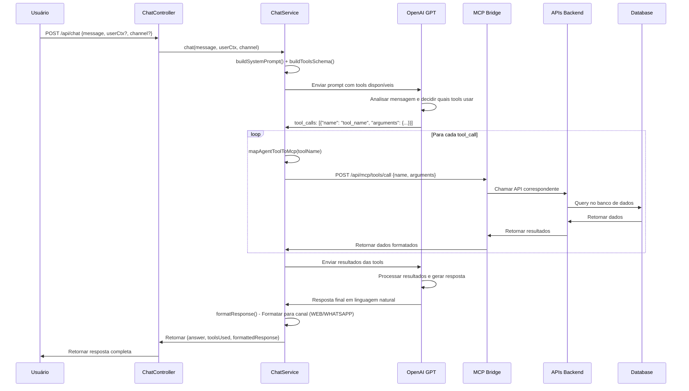
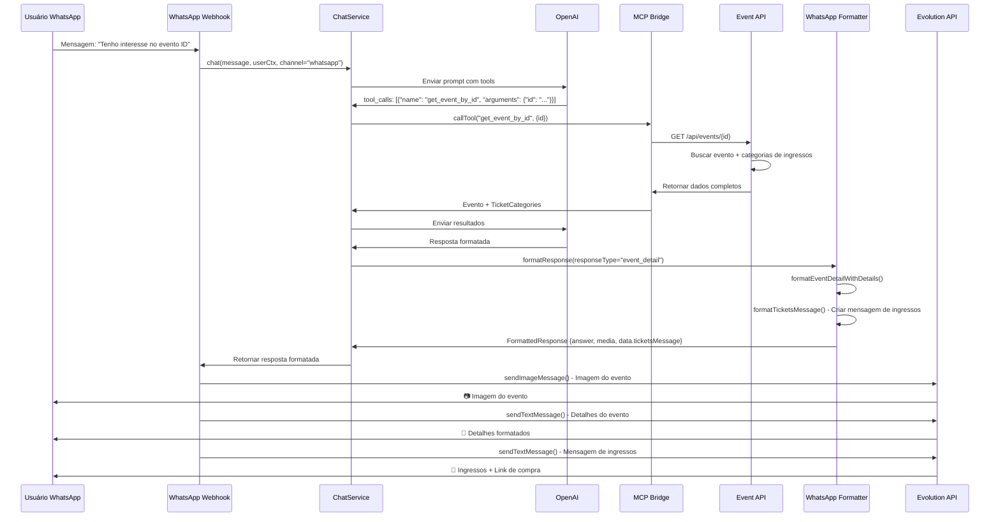

# 🤖 Fluxo de Chamadas do Chatbot - Gwan Events

## 📋 Visão Geral

O chatbot da plataforma Gwan Events utiliza **OpenAI GPT** com integração **MCP (Model Context Protocol)** para fornecer respostas inteligentes sobre eventos e artistas. O sistema processa mensagens em linguagem natural e determina automaticamente quais ferramentas usar para buscar informações atualizadas.

## 🎯 Funcionalidades Principais

### 1. Busca de Eventos

O chatbot oferece múltiplas formas de buscar eventos:

#### 1.1. Listagem Geral (`events.search`)
- **Uso**: Listar todos os eventos ou filtrar por categoria/cidade
- **Parâmetros opcionais**:
  - `category`: Categoria do evento (ex: "Música", "Cultura")
  - `city`: Cidade (ex: "São Paulo")
- **Exemplo de mensagem**: "Liste todos os eventos" ou "Mostre eventos de Música em São Paulo"

#### 1.2. Busca Exata por Nome/Código (`search_events_by_query`)
- **Uso**: Buscar eventos por nome específico ou código amigável
- **Quando usar**:
  - Query contém código no formato `EVT-XXXXXX`
  - Query é nome específico de evento (1-4 palavras)
  - Query menciona nome próprio de artista/banda específica
  - Query parece ser título formal de evento
- **Exemplos**:
  - "Culto"
  - "EVT-ABC123"
  - "Festival de Rock"
  - "Show do Artista X"
  - "Culto de Ação de Graças"

#### 1.3. Busca Semântica (`search_events_rag`)
- **Uso**: Buscar eventos por significado/conceito/categoria
- **Quando usar**:
  - Query é descrição genérica sem nome específico
  - Query combina múltiplos critérios (categoria + localização + data)
  - Query é frase natural/conversacional
  - Query busca por conceito/categoria/estilo
  - Query contém preposições descritivas (de, para, com, em)
- **Exemplos**:
  - "eventos de música"
  - "shows infantis"
  - "festas para casais"
  - "música em são paulo"
  - "shows de rock este fim de semana"
  - "eventos culturais em rio"
  - "quero ver shows"
  - "preciso de eventos para família"
  - "eventos legais"
  - "quais eventos tem hoje?"

#### 1.4. Detalhes de Evento (`get_event_by_id`)
- **Uso**: Obter detalhes completos de um evento específico
- **Parâmetros obrigatórios**:
  - `id`: ID do evento (UUID)
- **Exemplo de mensagem**: "Mostre os detalhes do evento 08cb5dc9-9446-476c-a4b9-dfd887c6d80f" ou "Tenho interesse no evento EVT-ABC123"

#### 1.5. Preços de Ingressos (`get_event_ticket_categories`)
- **Uso**: Listar categorias de ingressos e preços de um evento
- **Parâmetros obrigatórios**:
  - `id`: ID do evento (UUID)
- **Exemplo de mensagem**: "Quais os preços dos ingressos do evento 08cb5dc9-9446-476c-a4b9-dfd887c6d80f?"

### 2. Busca de Artistas

O chatbot oferece múltiplas formas de buscar artistas:

#### 2.1. Listagem Geral (`list_artists`)
- **Uso**: Listar todos os artistas cadastrados
- **Exemplo de mensagem**: "Liste todos os artistas" ou "Mostre os artistas cadastrados"

#### 2.2. Busca Exata por Nome (`search_artists_by_query`)
- **Uso**: Buscar artista por nome específico usando filtros
- **Quando usar**:
  - Query é nome artístico específico conhecido
  - Query menciona nome completo específico
  - Query menciona username de rede social específico
  - Query curta (1-3 palavras) que parece nome próprio
- **Parâmetros opcionais**:
  - `artisticName`: Nome artístico do artista
  - `name`: Nome completo do artista
  - `instagramUsername`: Username do Instagram
  - `youtubeUsername`: Username do YouTube
  - `xUsername`: Username do X/Twitter
  - `spotifyUsername`: Username do Spotify
  - `tiktokUsername`: Username do TikTok
- **Exemplos**:
  - "Nome Artístico"
  - "João Silva"
  - "artistname" (username)

#### 2.3. Busca Semântica (`search_artists_rag`)
- **Uso**: Buscar artistas por significado/conceito/estilo
- **Quando usar**:
  - Query é descrição genérica sem nome específico
  - Query combina características/estilo
  - Query é frase conversacional
  - Query busca por conceito/categoria/estilo
- **Exemplos**:
  - "artista de música gospel"
  - "cantor sertanejo"
  - "banda de rock"
  - "músico cristão"
  - "quero encontrar artistas cristãos"
  - "preciso de artistas para evento"
  - "artistas que tocam rock"

#### 2.4. Detalhes de Artista (`get_artist_by_id`)
- **Uso**: Obter detalhes completos de um artista específico
- **Parâmetros obrigatórios**:
  - `id`: ID do artista (UUID)
- **Retorna**: Informações do artista incluindo eventos nos quais participa
- **Exemplo de mensagem**: "Mostre os detalhes do artista 6635f4d3-3e54-4cad-b97e-c86f7c6bbdf7"

## 🔄 Fluxo de Processamento

### Fluxo Geral



### Fluxo Específico: Detalhes de Evento (WhatsApp)



## 📊 Tipos de Resposta

O sistema retorna diferentes tipos de resposta formatados conforme o canal:

### Tipos de Resposta (`ResponseType`)

1. **`event_list`**: Lista de eventos
   - Retorna múltiplos eventos formatados
   - Inclui paginação
   - Sugestões contextuais para filtrar/buscar

2. **`event_detail`**: Detalhes de evento individual
   - Informações completas do evento
   - Imagem do evento
   - Categorias de ingressos (com preços)
   - Link para compra
   - No WhatsApp: imagem primeiro, depois texto, depois mensagem de ingressos

3. **`artist_list`**: Lista de artistas
   - Retorna múltiplos artistas formatados
   - Inclui paginação
   - Sugestões para ver detalhes

4. **`artist_detail`**: Detalhes de artista individual
   - Informações completas do artista
   - Imagem do artista
   - Redes sociais
   - Eventos vinculados
   - Link para página do artista

5. **`ticket_prices`**: Preços de ingressos
   - Lista de categorias de ingressos
   - Preços por categoria
   - Disponibilidade

6. **`generic`**: Resposta genérica
   - Resposta em linguagem natural
   - Sem formatação específica

## 🎨 Formatação por Canal

### Web (`WebFormatterService`)
- Formatação HTML/Markdown
- Links clicáveis
- Estrutura de dados JSON
- Sugestões como botões interativos

### WhatsApp (`WhatsAppFormatterService`)
- Formatação com emojis
- Mensagens sequenciais (imagem → texto → detalhes)
- Limite de caracteres respeitado
- Links formatados para WhatsApp
- Mensagens de ingressos com call-to-action

## 🔍 Estratégia de Busca: Query vs RAG

### Quando usar `search_events_by_query` (Busca Exata)
- ✅ Código no formato `EVT-XXXXXX`
- ✅ Nome específico de evento (1-4 palavras)
- ✅ Nome próprio de artista/banda
- ✅ Título formal de evento

**Exemplos**:
- "Culto" → busca exata
- "EVT-ABC123" → busca exata
- "Festival de Rock" → busca exata

### Quando usar `search_events_rag` (Busca Semântica)
- ✅ Descrição genérica
- ✅ Múltiplos critérios combinados
- ✅ Frase conversacional
- ✅ Conceito/categoria/estilo
- ✅ Preposições descritivas (de, para, com, em)

**Exemplos**:
- "eventos de música" → busca semântica
- "shows em são paulo" → busca semântica
- "quero ver shows" → busca semântica
- "festas para casais" → busca semântica

### Estratégia de Fallback
1. Se query é curta (1-3 palavras) e parece nome próprio → tentar `search_events_by_query` primeiro
2. Se não encontrar resultados → tentar `search_events_rag` como fallback
3. Se query é longa ou contém preposições/descrições → usar `search_events_rag` diretamente

## 💬 Exemplos de Interações

### Exemplo 1: Buscar Eventos por Categoria
```
Usuário: "Mostre eventos de música em São Paulo"
Bot: [usa events.search com category="Música" e city="São Paulo"]
Resposta: Lista formatada de eventos de música em São Paulo
```

### Exemplo 2: Detalhes de Evento (WhatsApp)
```
Usuário: "Tenho interesse no evento 08cb5dc9-9446-476c-a4b9-dfd887c6d80f"
Bot: [usa get_event_by_id com id="08cb5dc9-9446-476c-a4b9-dfd887c6d80f"]
Resposta WhatsApp:
  1. 📷 Imagem do evento
  2. 📝 Detalhes completos (título, categoria, local, data, ingressos, link)
  3. 🎫 Informações detalhadas de ingressos + link de compra
```

### Exemplo 3: Busca Semântica de Artistas
```
Usuário: "Quero encontrar artistas cristãos"
Bot: [usa search_artists_rag com query="artistas cristãos"]
Resposta: Lista formatada de artistas que correspondem ao conceito
```

### Exemplo 4: Busca por Nome Específico
```
Usuário: "Mostre o artista Junior Dread"
Bot: [usa search_artists_by_query com artisticName="Junior Dread"]
Resposta: Detalhes completos do artista incluindo eventos vinculados
```

## 🔧 Configuração

### Variáveis de Ambiente

```env
OPENAI_API_KEY=sua-chave-api-openai
OPENAI_MODEL=gpt-4o-mini
MCP_BRIDGE_BASE_URL=http://localhost:3001/api/mcp
MCP_SERVER_TOKEN=token-seguro-opcional
```

### Canais Suportados

- **`web`**: Formatação para interface web (HTML/Markdown)
- **`whatsapp`**: Formatação para WhatsApp (emojis, mensagens sequenciais)

## 📝 Notas Importantes

1. **Cache**: O sistema utiliza Redis para cache de dados frequentes (eventos, artistas, tokens Spotify)
2. **Rate Limiting**: Respeita limites da API OpenAI
3. **Timeout**: Timeout configurável para chamadas de API (padrão: 30 segundos)
4. **Error Handling**: Sistema robusto de tratamento de erros com fallbacks
5. **Contexto do Usuário**: Suporta contexto adicional (`userCtx`) para personalização
6. **Deduplicação**: Sistema de cache para evitar reprocessamento de mensagens duplicadas

## 🚀 Melhorias Futuras

- [ ] Suporte a conversas multi-turno com histórico
- [ ] Integração com sistema de recomendações
- [ ] Suporte a mais idiomas
- [ ] Análise de sentimento para personalização
- [ ] Integração com sistema de notificações push
- [ ] Analytics de uso do chatbot

