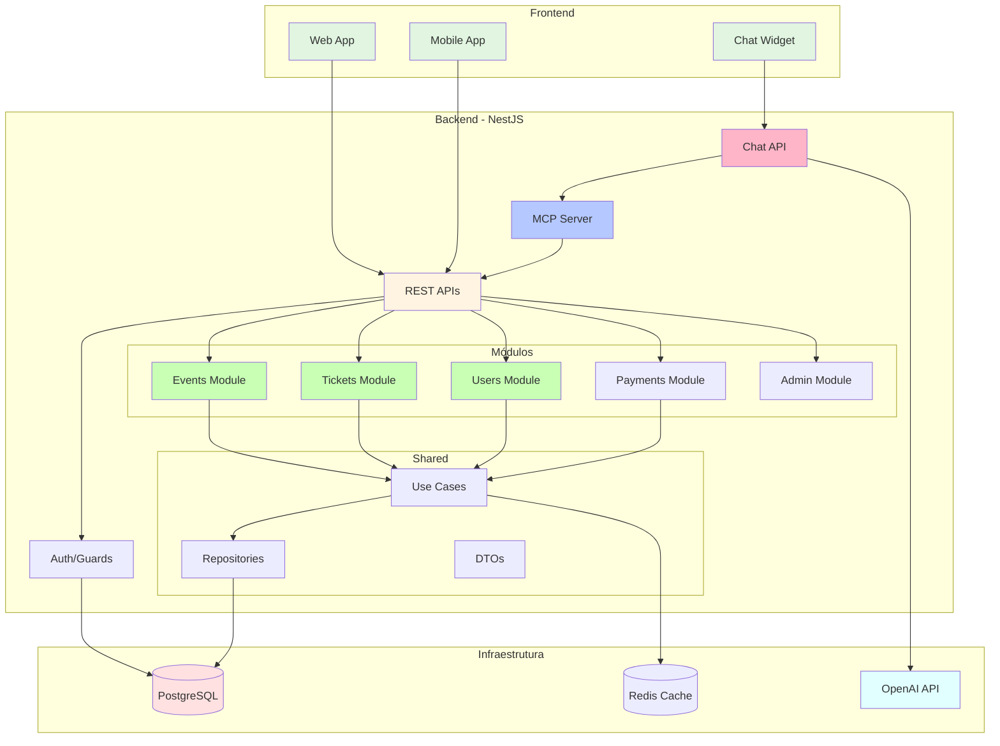
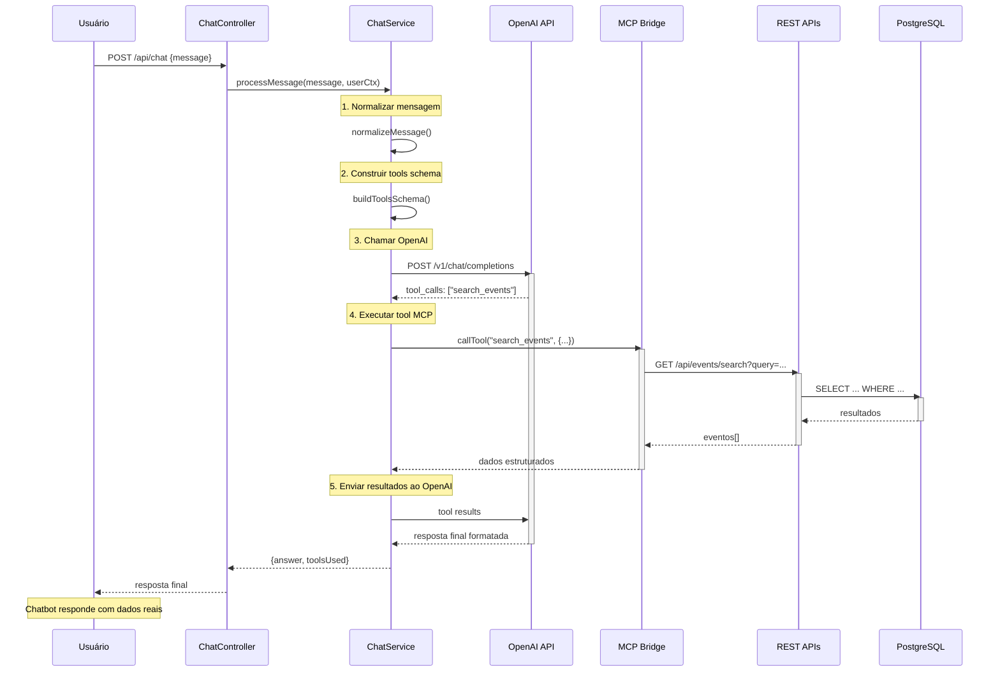
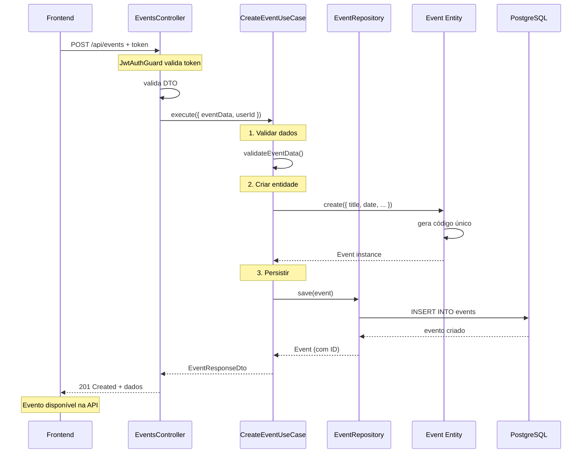
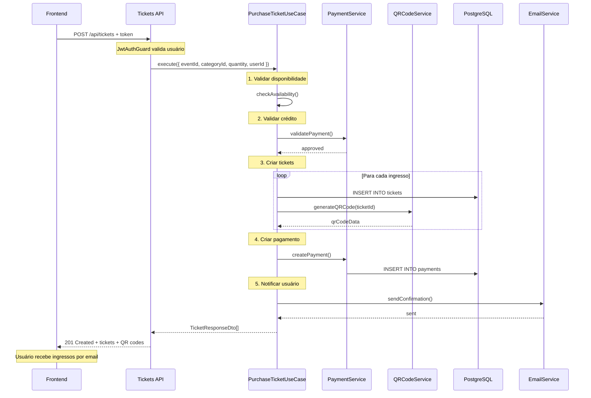
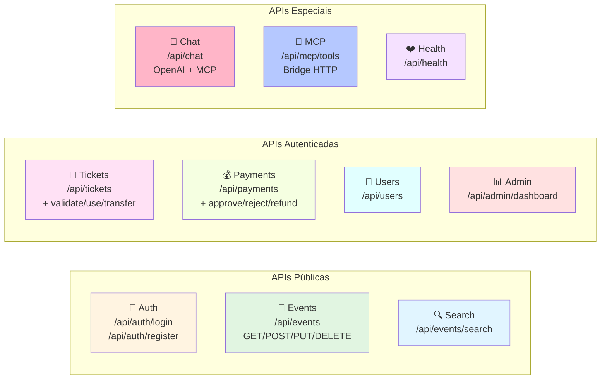
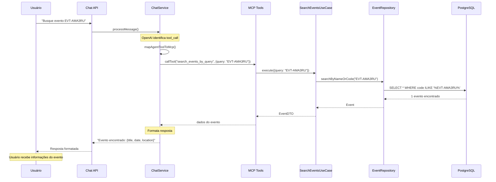
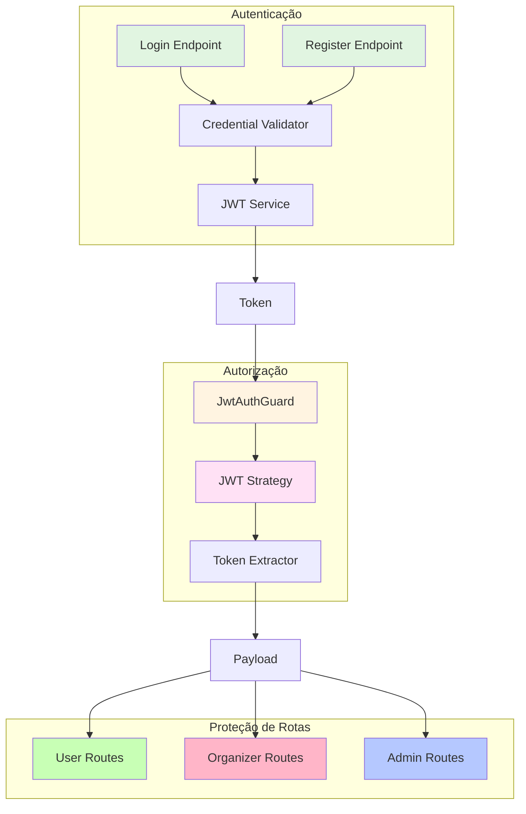
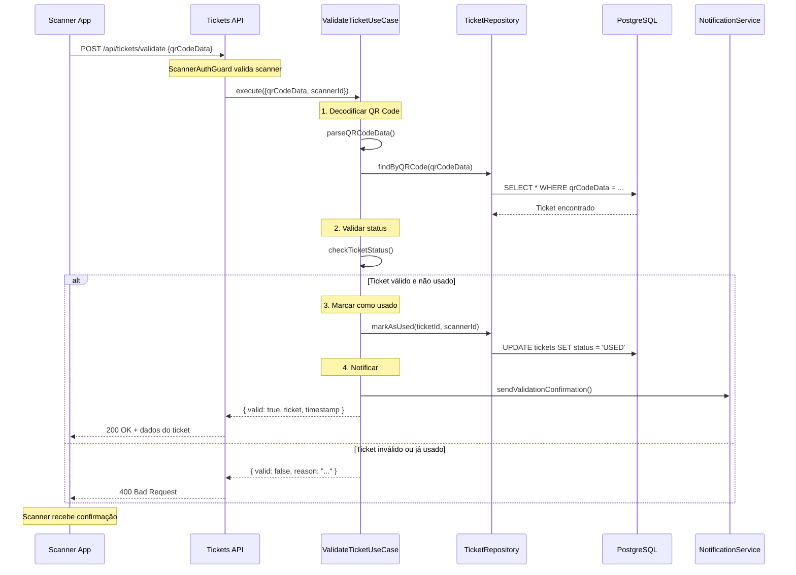

# Diagramas Mermaid - APIs e Fluxos

## Arquitetura do Sistema

## Fluxo de Chat com MCP

## Fluxo de Criação de Evento

## Fluxo de Compra de Ingresso

## APIs por Módulo - Resumo

## Fluxo de Busca com Código Amigável

## Estrutura de Autenticação

## Fluxo de Validação de Ingresso

