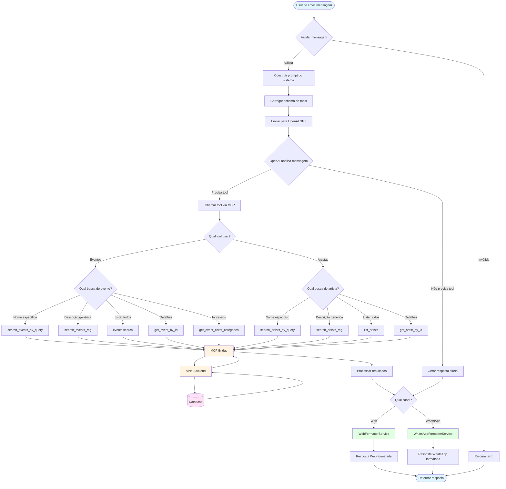
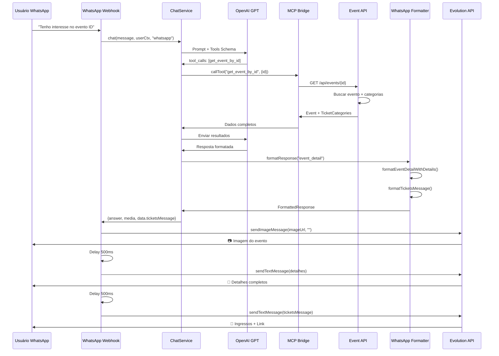
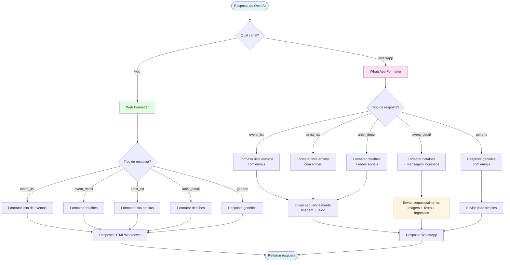
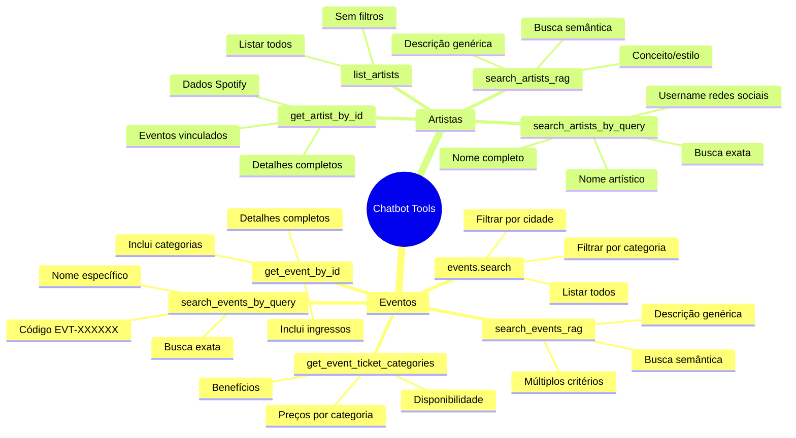
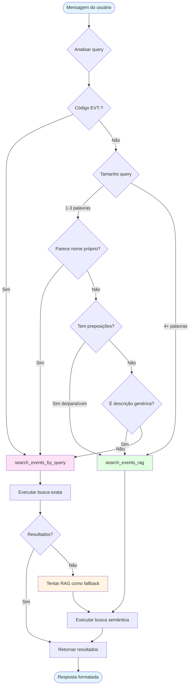

# 🔄 Fluxo Completo do Chatbot - Diagrama Mermaid

## Fluxo Principal de Processamento



## Fluxo de Busca de Eventos (Decisão)

```mermaid
flowchart TD
    Start([Usuário pergunta sobre eventos]) --> CheckQuery{Analisar query}
    
    CheckQuery -->|Contém código EVT-| QueryByCode[search_events_by_query]
    CheckQuery -->|Nome específico 1-4 palavras| QueryByName[search_events_by_query]
    CheckQuery -->|Descrição genérica| QueryRAG[search_events_rag]
    CheckQuery -->|Múltiplos critérios| QueryRAG
    CheckQuery -->|Frase conversacional| QueryRAG
    CheckQuery -->|Preposições de/para/com| QueryRAG
    
    QueryByCode --> Execute1[Executar busca]
    QueryByName --> Execute1
    QueryRAG --> Execute2[Executar busca semântica]
    
    Execute1 --> HasResults{Encontrou resultados?}
    HasResults -->|Sim| FormatResults[Formatar resultados]
    HasResults -->|Não| Fallback[Fallback: tentar search_events_rag]
    
    Fallback --> Execute2
    Execute2 --> FormatResults
    
    FormatResults --> Response([Retornar resposta formatada])
    
    style Start fill:#e1f5ff
    style Response fill:#e1f5ff
    style QueryByCode fill:#ffe1f5
    QueryByName fill:#ffe1f5
    style QueryRAG fill:#e1ffe1
    style Fallback fill:#fff4e1
```

## Fluxo WhatsApp: Detalhes de Evento



## Fluxo de Formatação por Canal



## Mapa de Tools Disponíveis



## Decisão de Tool: Query vs RAG



