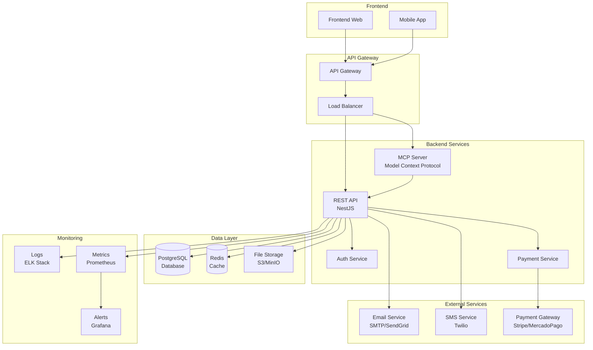
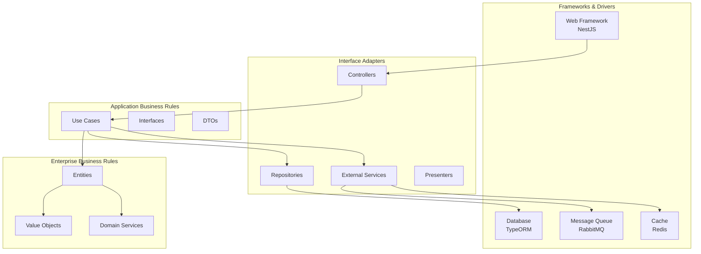
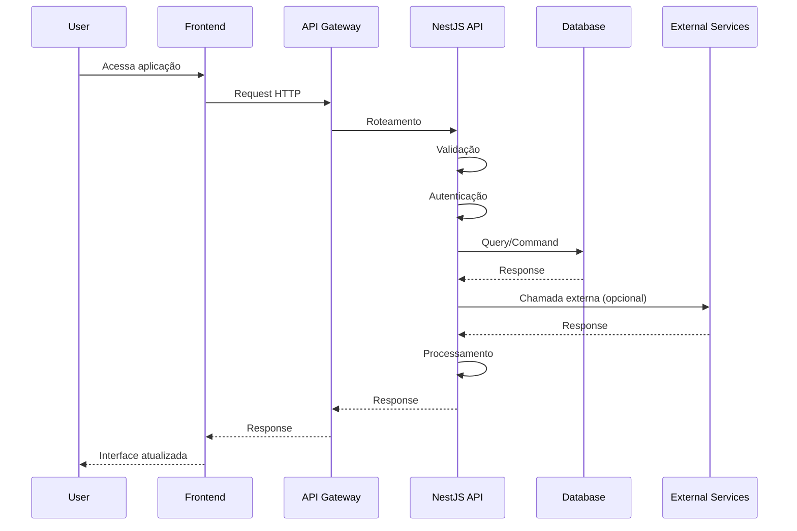
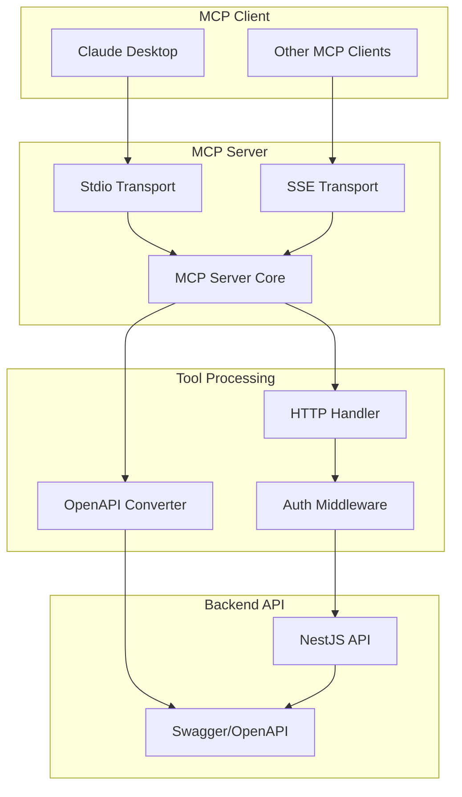
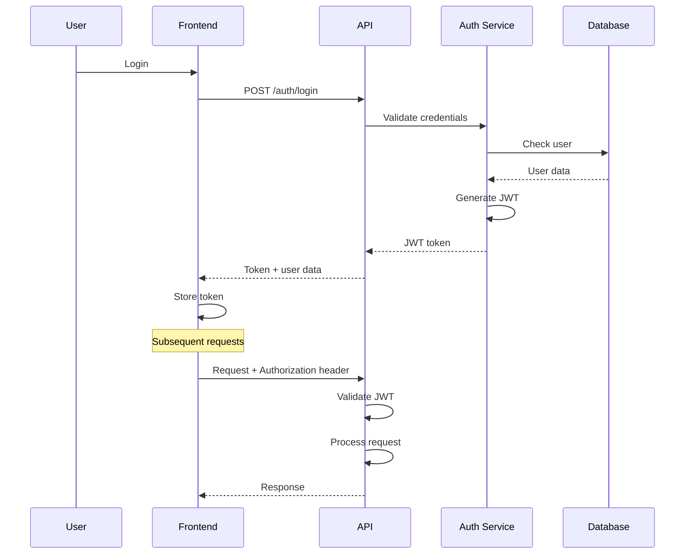
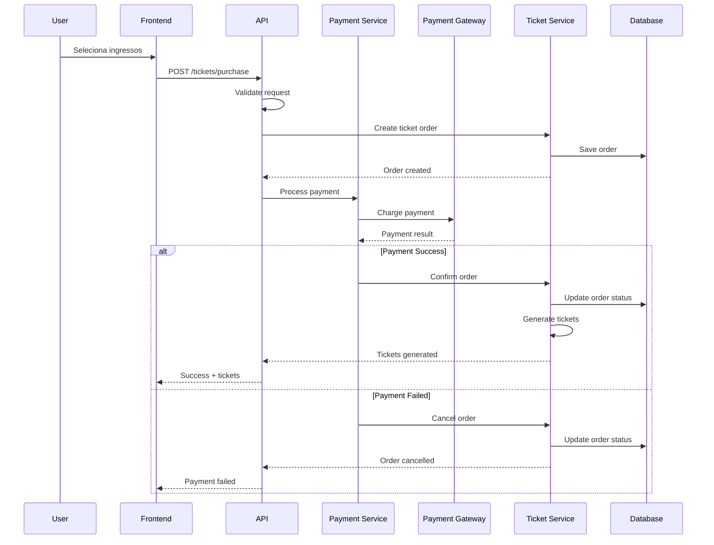

# 🏗️ Arquitetura do Sistema

## Visão Geral da Arquitetura

## Arquitetura Clean Architecture

## Fluxo de Dados Principal

## Arquitetura MCP

## Fluxo de Autenticação

## Fluxo de Compra de Ingressos

