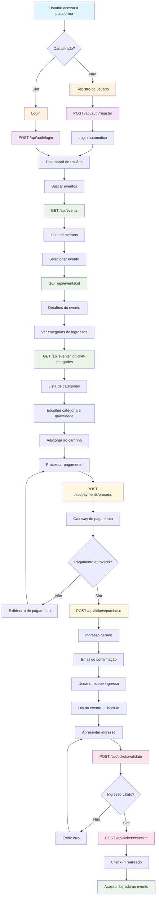

# Fluxo Completo do Usuário - Plataforma de Eventos

## Diagrama de Fluxo do Usuário

## Fluxo Detalhado por Etapas

### 1. Autenticação
- **Registro**: Usuário cria conta com email e senha
- **Login**: Usuário faz login com credenciais

### 2. Descoberta de Eventos
- **Listagem**: Usuário visualiza eventos disponíveis
- **Filtros**: Pode filtrar por data, localização, categoria
- **Detalhes**: Visualiza informações completas do evento

### 3. Seleção de Ingressos
- **Categorias**: Visualiza tipos de ingressos disponíveis
- **Preços**: Compara preços e benefícios
- **Quantidade**: Escolhe quantidade desejada

### 4. Processo de Pagamento
- **Carrinho**: Adiciona ingressos ao carrinho
- **Checkout**: Processa pagamento via gateway
- **Confirmação**: Recebe confirmação e ingresso

### 5. Check-in no Evento
- **Apresentação**: Mostra ingresso no local
- **Validação**: Sistema valida ingresso
- **Acesso**: Libera entrada no evento

## APIs Necessárias para Implementação

### Autenticação
- `POST /api/auth/register` - Registro de usuário
- `POST /api/auth/login` - Login de usuário
- `GET /api/auth/profile` - Perfil do usuário
- `POST /api/auth/refresh` - Renovar token

### Eventos
- `GET /api/events` - Listar eventos
- `GET /api/events/:id` - Detalhes do evento
- `GET /api/events/:id/ticket-categories` - Categorias de ingressos
- `GET /api/events/search` - Buscar eventos

### Ingressos
- `POST /api/tickets/purchase` - Comprar ingresso
- `GET /api/tickets/my-tickets` - Meus ingressos
- `GET /api/tickets/:id` - Detalhes do ingresso
- `POST /api/tickets/validate` - Validar ingresso
- `POST /api/tickets/checkin` - Fazer check-in

### Pagamentos
- `POST /api/payments/process` - Processar pagamento
- `GET /api/payments/:id/status` - Status do pagamento
- `POST /api/payments/webhook` - Webhook do gateway

### Usuários
- `GET /api/users/profile` - Perfil do usuário
- `PUT /api/users/profile` - Atualizar perfil
- `GET /api/users/tickets` - Histórico de ingressos

### Administração
- `POST /api/admin/events` - Criar evento
- `PUT /api/admin/events/:id` - Atualizar evento
- `GET /api/admin/events/:id/stats` - Estatísticas do evento
- `GET /api/admin/tickets/checkins` - Relatório de check-ins
