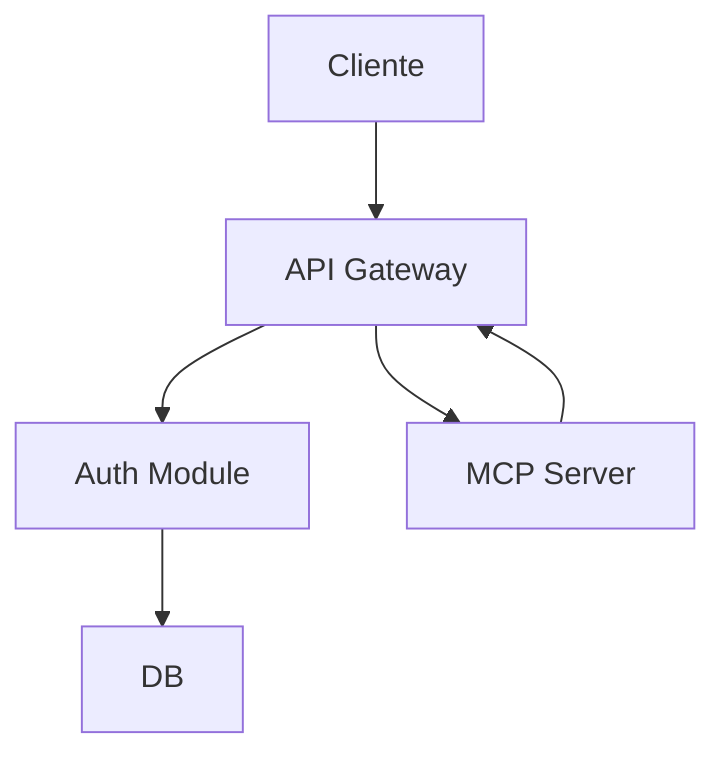

# Api Flow

Diagrama gerado automaticamente em 2025-10-10T23:37:23.535Z

```mermaid
graph TB
    Client[Cliente] --> Gateway[API Gateway]
    Gateway --> Auth[Auth Module]
    Auth --> DB
    Gateway --> MCP[MCP Server]
    MCP --> Gateway

```

## Descrição

Este diagrama foi gerado automaticamente a partir da análise do código fonte.
