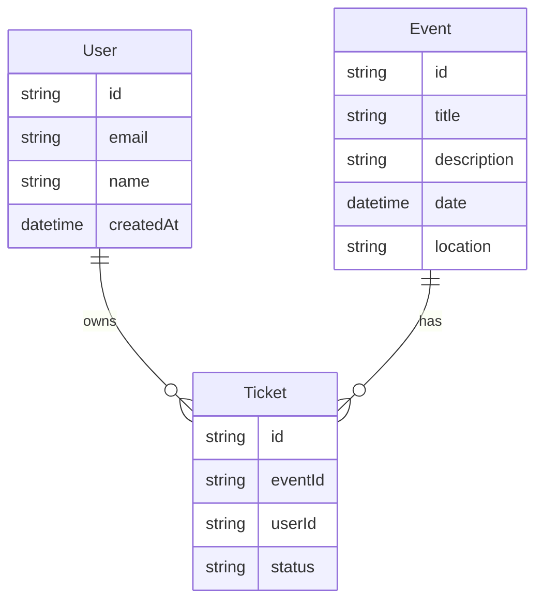

# Database Schema

Diagrama gerado automaticamente em 2025-10-10T23:37:23.536Z

```mermaid
erDiagram
    User {
        string id
        string email
        string name
        datetime createdAt
    }
    Event {
        string id
        string title
        string description
        datetime date
        string location
    }
    Ticket {
        string id
        string eventId
        string userId
        string status
    }
    User ||--o{ Ticket : owns
    Event ||--o{ Ticket : has

```

## Descrição

Este diagrama foi gerado automaticamente a partir da análise do código fonte.
