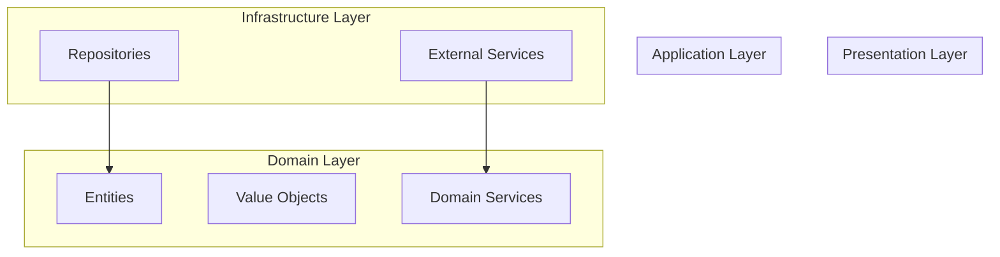

# Dependências entre Módulos

Diagrama gerado automaticamente em 2025-10-10T23:37:23.458Z

## Descrição

Este diagrama foi gerado automaticamente a partir da análise do código fonte.

## Como usar

1. Copie o código Mermaid acima
2. Cole em um editor que suporte Mermaid (GitHub, GitLab, etc.)
3. O diagrama será renderizado automaticamente

## Atualização

Este diagrama é atualizado automaticamente quando o código fonte é modificado.
