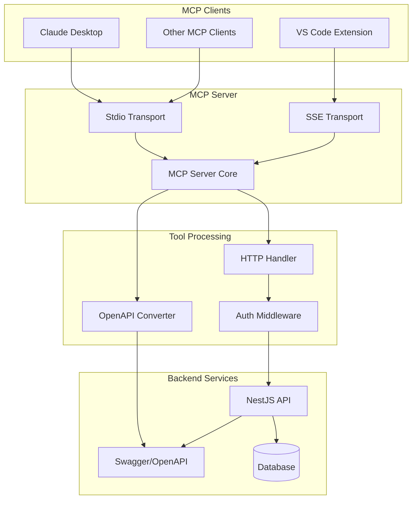
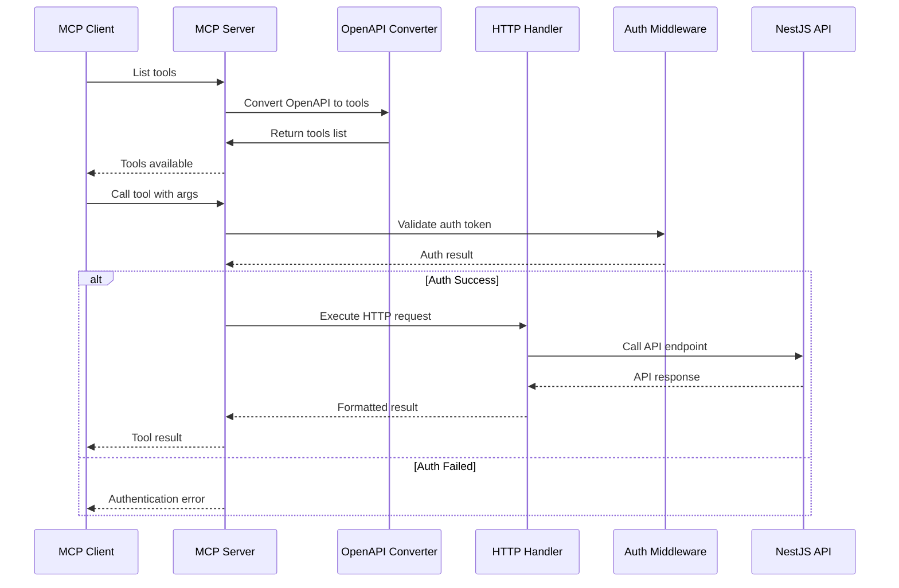

# 🔌 Model Context Protocol (MCP) - Visão Geral

> Consulte também o [Guia de Integração MCP](./integration.md) para passos práticos de configuração e exemplos de uso em clientes MCP.

## Introdução

O Model Context Protocol (MCP) é um protocolo que permite que modelos de IA acessem dados e ferramentas externas de forma padronizada. No Gwan Events Backend, implementamos um servidor MCP que expõe as APIs de eventos como tools para clientes MCP.

## Arquitetura MCP



## Fluxo de Funcionamento



## Tools Disponíveis

### 1. list_events
**Descrição**: Lista todos os eventos disponíveis com filtros opcionais.

**Parâmetros**:
- `category` (opcional): Filtrar por categoria
- `city` (opcional): Filtrar por cidade
- `_authToken` (opcional): Token de autenticação

**Exemplo de uso**:
```json
{
  "jsonrpc": "2.0",
  "id": 1,
  "method": "tools/call",
  "params": {
    "name": "list_events",
    "arguments": {
      "category": "Música",
      "city": "São Paulo",
      "_authToken": "seu-token-aqui"
    }
  }
}
```

### 2. get_event_by_id
**Descrição**: Obter detalhes de um evento específico pelo ID.

**Parâmetros**:
- `id` (obrigatório): ID do evento
- `_authToken` (opcional): Token de autenticação

**Exemplo de uso**:
```json
{
  "jsonrpc": "2.0",
  "id": 2,
  "method": "tools/call",
  "params": {
    "name": "get_event_by_id",
    "arguments": {
      "id": "1",
      "_authToken": "seu-token-aqui"
    }
  }
}
```

### 3. get_event_ticket_categories
**Descrição**: Listar categorias de ingressos disponíveis para um evento específico.

**Parâmetros**:
- `id` (obrigatório): ID do evento
- `_authToken` (opcional): Token de autenticação

**Exemplo de uso**:
```json
{
  "jsonrpc": "2.0",
  "id": 3,
  "method": "tools/call",
  "params": {
    "name": "get_event_ticket_categories",
    "arguments": {
      "id": "1",
      "_authToken": "seu-token-aqui"
    }
  }
}
```

## Configuração

### Variáveis de Ambiente

```env
# MCP Server Configuration
MCP_BASE_URL=http://localhost:3001
MCP_PORT_SSE=3002
MCP_AUTH_TOKEN=seu-token-secreto-aqui
```

### Scripts Disponíveis

```json
{
  "scripts": {
    "start:mcp:stdio": "ts-node src/mcp/server-stdio.ts",
    "start:mcp:sse": "ts-node src/mcp/server-sse.ts",
    "build:mcp": "tsc -p tsconfig.json"
  }
}
```

## Autenticação

### Sem Autenticação
Quando `MCP_AUTH_TOKEN` não está configurado, todos os tools funcionam sem autenticação:

```bash
# Funciona sem token
echo '{"jsonrpc": "2.0", "id": 1, "method": "tools/call", "params": {"name": "list_events", "arguments": {}}}' | npm run start:mcp:stdio
```

### Com Autenticação
Quando `MCP_AUTH_TOKEN` está configurado, todos os tools requerem autenticação:

```bash
# Configurar token
export MCP_AUTH_TOKEN="seu-token-secreto"

# Usar com token
echo '{"jsonrpc": "2.0", "id": 1, "method": "tools/call", "params": {"name": "list_events", "arguments": {"_authToken": "seu-token-secreto"}}}' | npm run start:mcp:stdio
```

## Integração com Clientes MCP

### Claude Desktop

**Configuração sem autenticação**:
```json
{
  "mcpServers": {
    "gwan-events": {
      "command": "npm",
      "args": ["run", "start:mcp:stdio"],
      "cwd": "/caminho/para/gwan-events-backend"
    }
  }
}
```

**Configuração com autenticação**:
```json
{
  "mcpServers": {
    "gwan-events": {
      "command": "npm",
      "args": ["run", "start:mcp:stdio"],
      "cwd": "/caminho/para/gwan-events-backend",
      "env": {
        "MCP_AUTH_TOKEN": "seu-token-secreto-aqui"
      }
    }
  }
}
```

### VS Code Extension

```json
{
  "mcp.servers": {
    "gwan-events": {
      "command": "npm",
      "args": ["run", "start:mcp:stdio"],
      "cwd": "/caminho/para/gwan-events-backend"
    }
  }
}
```

## Estrutura do Código

### Conversor OpenAPI → MCP Tools

```typescript
// src/mcp/converters/openapi-to-mcp.ts
export function openapiToMcpTools(document: OpenAPIObject, baseUrl: string): ToolWithMetadata[] {
  const tools: ToolWithMetadata[] = [];

  for (const [path, pathItem] of Object.entries(document.paths)) {
    for (const [method, operation] of Object.entries(pathItem)) {
      const mcpExtension = operation['x-mcp'];
      
      // Só incluir operações marcadas com x-mcp.enabled = true
      if (!mcpExtension?.enabled) {
        continue;
      }

      tools.push({
        name: mcpExtension.toolName,
        description: mcpExtension.description,
        inputSchema: buildInputSchema(operation),
        httpMethod: method.toUpperCase(),
        httpPath: path,
        baseUrl,
      });
    }
  }

  return tools;
}
```

### Handler HTTP

```typescript
// src/mcp/handlers/http-tool-handler.ts
export async function executeHttpTool(
  tool: ToolWithMetadata,
  args: any,
  options: HttpToolOptions
): Promise<HttpToolResult> {
  // Validar autenticação
  if (options.authToken) {
    const providedToken = args._authToken || args.authToken;
    if (!validateToken(providedToken, options.authToken)) {
      return { success: false, error: 'Invalid authentication token' };
    }
  }

  // Executar chamada HTTP
  const response = await request(url, {
    method: tool.httpMethod,
    headers: buildHeaders(options),
    body: buildBody(args),
  });

  return formatResponse(response);
}
```

## Adicionando Novos Tools

Para adicionar um novo tool MCP:

1. **Marque o endpoint no controller**:
```typescript
@Get(':id/tickets')
@ApiExtension('x-mcp', {
  enabled: true,
  toolName: 'get_event_tickets',
  description: 'Listar ingressos de um evento específico.',
})
async getEventTickets(@Param('id') id: string) {
  // implementação
}
```

2. **Reinicie o servidor MCP**:
```bash
npm run start:mcp:stdio
```

3. **O tool será automaticamente disponibilizado**:
```json
{
  "name": "get_event_tickets",
  "description": "Listar ingressos de um evento específico.",
  "inputSchema": {
    "type": "object",
    "properties": {
      "id": {
        "type": "string",
        "description": "Path parameter: id"
      }
    },
    "required": ["id"]
  }
}
```

## Troubleshooting

### Erro: "Authentication required"
- Verifique se `MCP_AUTH_TOKEN` está configurado
- Forneça o token via `_authToken` ou `authToken` parameter
- Confirme se o token está correto

### Erro: "Tool not found"
- Verifique se o endpoint está marcado com `@ApiExtension('x-mcp', {enabled: true})`
- Confirme se o servidor MCP foi reiniciado após adicionar o endpoint
- Verifique se o nome do tool está correto

### Erro: "Cannot connect to API"
- Confirme se o servidor NestJS está rodando na porta 3001
- Verifique se `MCP_BASE_URL` está correto
- Teste a API diretamente via Swagger UI

## Próximos Passos

1. Implementar mais endpoints MCP conforme necessário
2. Adicionar autenticação avançada
3. Criar documentação específica para cada tool
