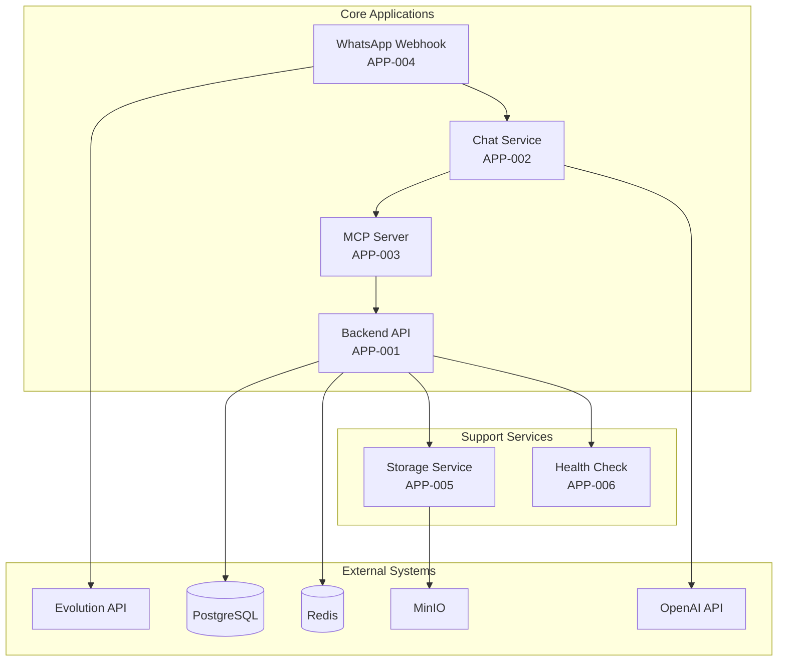
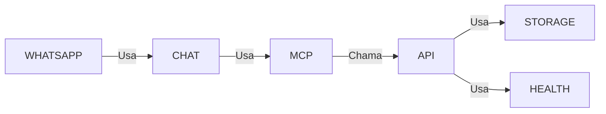

# Application Catalog - Catálogo de Aplicações

## Visão Geral

Este documento cataloga todas as **aplicações** que compõem a plataforma Litoral Imóveis Backend, descrevendo suas responsabilidades, tecnologias e relacionamentos.

## Aplicações Principais

### 1. Backend API (REST API)

**ID**: APP-001  
**Nome**: Litoral Imóveis Backend API  
**Tipo**: Aplicação Backend  
**Tecnologia**: NestJS, TypeScript, Node.js  
**Status**: Produção  

**Descrição**: API REST principal que expõe todos os endpoints de negócio da plataforma.

**Responsabilidades**:
- Gestão de propriedades (CRUD)
- Gestão de usuários e autenticação
- Gestão de perfis de corretores
- Exposição de dados via REST
- Validação e autorização de requisições

**Módulos Principais**:
- Properties Module
- Auth Module
- Users Module
- Realtors Module
- Admin Module
- Health Module

**Interfaces**:
- REST API (`/api/*`)
- Swagger/OpenAPI (`/api`)
- Health Check (`/api/health`)

**Dependências**:
- PostgreSQL (banco de dados)
- Redis (cache)
- MinIO (armazenamento)
- OpenAI (via MCP)

**Localização**: `src/`

### 2. Chat Service (Chatbot Inteligente)

**ID**: APP-002  
**Nome**: Chat Service  
**Tipo**: Serviço de Aplicação  
**Tecnologia**: NestJS, OpenAI API, MCP  
**Status**: Produção  

**Descrição**: Serviço de chatbot inteligente que utiliza OpenAI GPT para fornecer atendimento conversacional aos clientes.

**Responsabilidades**:
- Processamento de linguagem natural
- Integração com OpenAI
- Chamada de ferramentas MCP
- Formatação de respostas (Web, WhatsApp)
- Manutenção de contexto de conversa

**Interfaces**:
- REST API (`/api/chat`)
- Integração com MCP Server

**Dependências**:
- OpenAI API
- MCP Server
- Properties Module (via MCP)

**Localização**: `src/chat/`

### 3. MCP Server (Model Context Protocol)

**ID**: APP-003  
**Nome**: MCP Server  
**Tipo**: Servidor de Protocolo  
**Tecnologia**: NestJS, MCP SDK  
**Status**: Produção  

**Descrição**: Servidor que implementa o Model Context Protocol, expondo ferramentas da API como tools para agentes de IA.

**Responsabilidades**:
- Conversão de OpenAPI para MCP Tools
- Exposição de tools via MCP (SSE ou STDIO)
- Autenticação de clientes MCP
- Execução de ferramentas HTTP

**Interfaces**:
- MCP Server (SSE) - `/api/mcp/sse`
- MCP Server (STDIO) - Processo standalone
- REST Bridge (`/api/mcp/tools`, `/api/mcp/tools/call`)

**Tools Expostos**:
- `list_properties`: Listar imóveis com filtros
- `get_property_by_id`: Obter detalhes de imóvel

**Dependências**:
- Backend API (para executar tools)
- OpenAPI Specification

**Localização**: `src/mcp/`

### 4. WhatsApp Webhook Service

**ID**: APP-004  
**Nome**: WhatsApp Webhook Service  
**Tipo**: Serviço de Integração  
**Tecnologia**: NestJS, Evolution API SDK  
**Status**: Produção  

**Descrição**: Serviço que recebe mensagens do WhatsApp via Evolution API e processa atendimento automatizado.

**Responsabilidades**:
- Receber webhooks do Evolution API
- Registrar usuários automaticamente
- Processar mensagens do WhatsApp
- Integrar com Chat Service
- Enviar respostas via Evolution API

**Interfaces**:
- Webhook (`/api/whatsapp-webhook`)
- Evolution API (cliente)

**Dependências**:
- Evolution API
- Chat Service
- Auth Module

**Localização**: `src/whatsapp-webhook/`

### 5. Storage Service

**ID**: APP-005  
**Nome**: Storage Service  
**Tipo**: Serviço de Infraestrutura  
**Tecnologia**: MinIO Client, Sharp  
**Status**: Produção  

**Descrição**: Serviço para gerenciar upload, processamento e armazenamento de imagens de imóveis.

**Responsabilidades**:
- Upload de imagens para MinIO
- Processamento de imagens (redimensionamento, thumbnails)
- Geração de URLs de acesso
- Gestão de arquivos

**Interfaces**:
- Internal Service (usado por Property Images Module)

**Dependências**:
- MinIO (armazenamento de objetos)
- Sharp (processamento de imagens)

**Localização**: `src/shared/infrastructure/services/`

## Aplicações de Suporte

### 6. Health Check Service

**ID**: APP-006  
**Nome**: Health Check Service  
**Tipo**: Serviço de Monitoramento  
**Tecnologia**: NestJS  
**Status**: Produção  

**Descrição**: Serviço que fornece endpoints de health check para monitoramento da aplicação.

**Interfaces**:
- REST API (`/api/health`)

**Localização**: `src/health/`

## Diagrama de Aplicações

## Matriz Aplicação-Módulo

| Aplicação | Módulos NestJS |
|-----------|---------------|
| Backend API | Properties, Auth, Users, Realtors, Admin, Health |
| Chat Service | Chat |
| MCP Server | MCP |
| WhatsApp Webhook | WhatsApp Webhook |
| Storage Service | Shared (infrastructure) |

## Tecnologias por Aplicação

| Aplicação | Tecnologias Principais |
|-----------|----------------------|
| Backend API | NestJS, TypeScript, TypeORM, PostgreSQL |
| Chat Service | NestJS, OpenAI API, MCP SDK |
| MCP Server | NestJS, MCP SDK, OpenAPI |
| WhatsApp Webhook | NestJS, Evolution API SDK |
| Storage Service | MinIO Client, Sharp |

## Status e Versão

| Aplicação | Status | Versão | Última Atualização |
|-----------|--------|--------|-------------------|
| Backend API | Produção | 1.0.0 | 2025-01-16 |
| Chat Service | Produção | 1.0.0 | 2025-01-16 |
| MCP Server | Produção | 1.0.0 | 2025-01-16 |
| WhatsApp Webhook | Produção | 1.0.0 | 2025-01-16 |
| Storage Service | Produção | 1.0.0 | 2025-01-16 |
| Health Check | Produção | 1.0.0 | 2025-01-16 |

## Dependências entre Aplicações

## Próximas Aplicações

- [ ] Notification Service (notificações push, email, SMS)
- [ ] Analytics Service (métricas e relatórios)
- [ ] Payment Service (integração com gateways de pagamento)
- [ ] Report Service (geração de relatórios)

