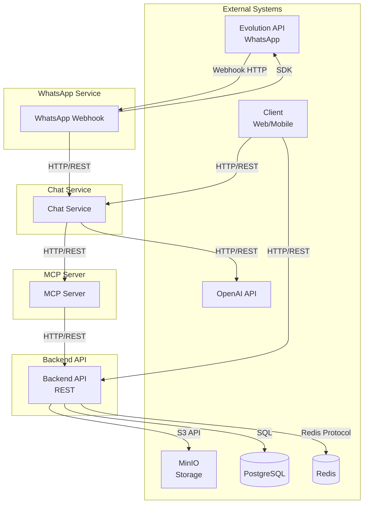
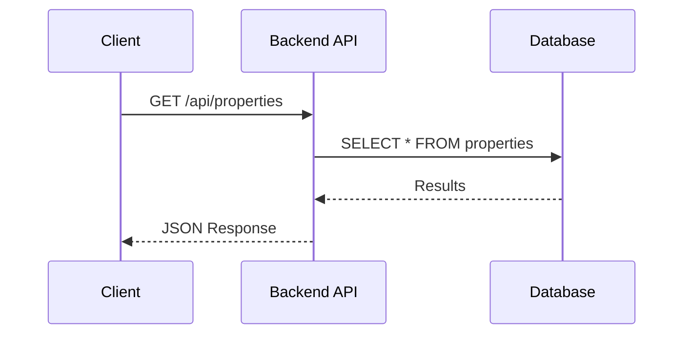
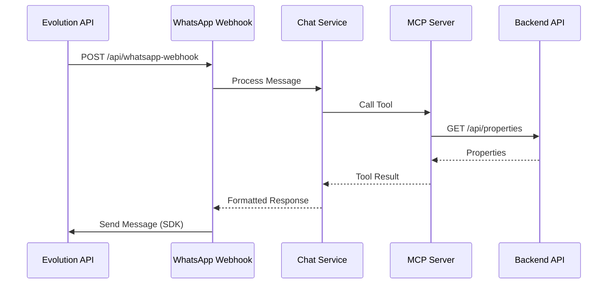
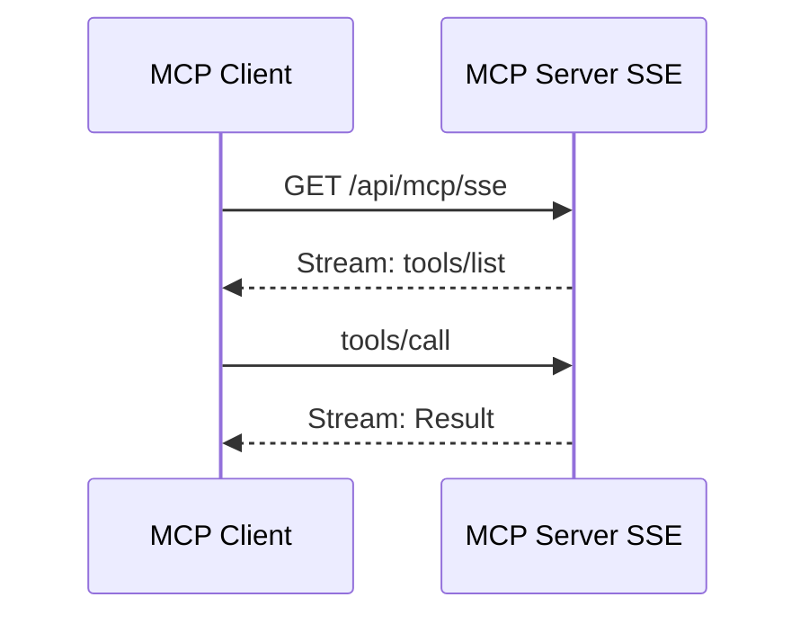
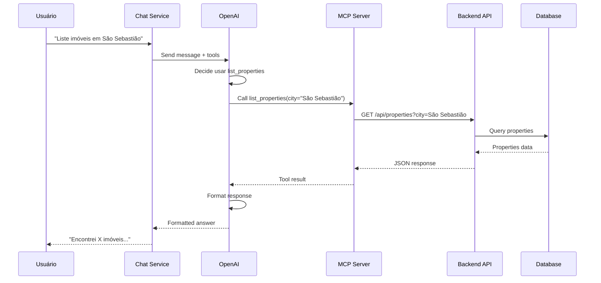
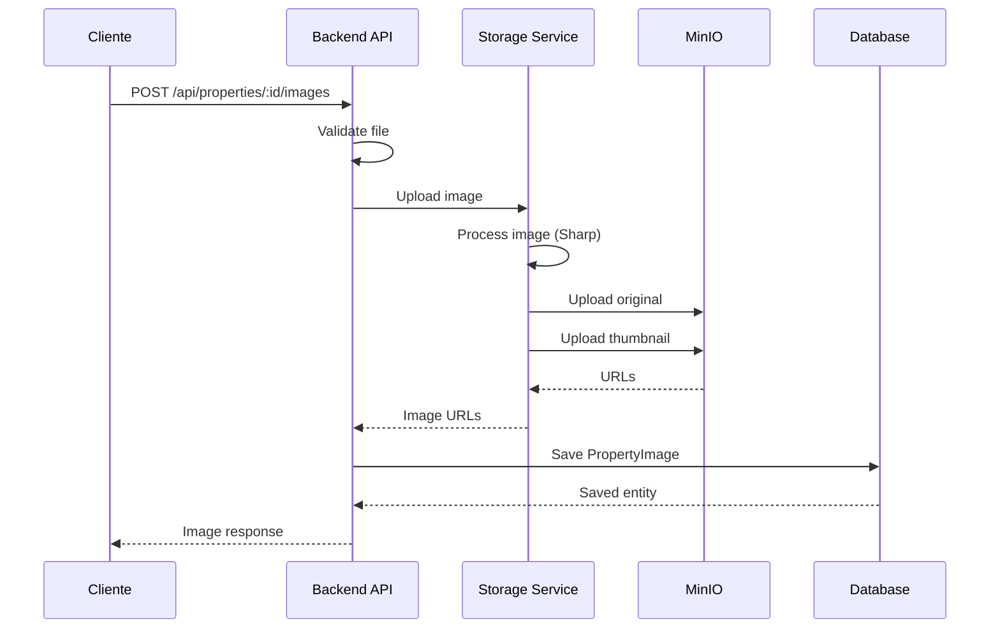
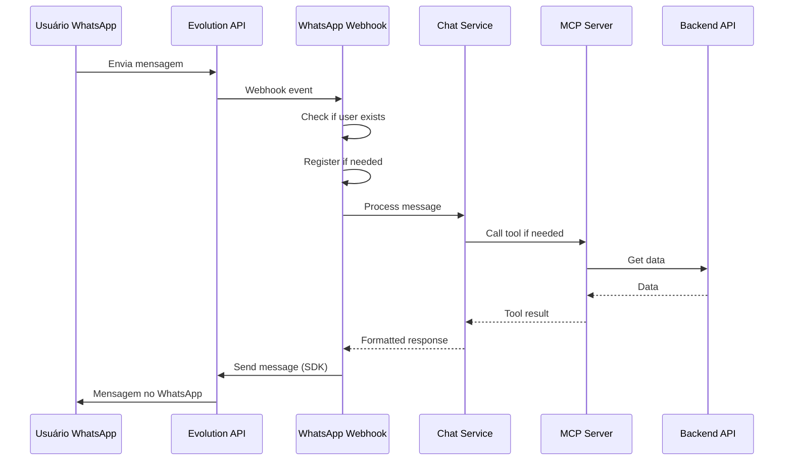

# Application Communication Diagram

## Visão Geral

Este documento apresenta o **diagrama de comunicação entre aplicações**, mostrando como as diferentes aplicações e serviços se comunicam na plataforma Litoral Imóveis.

## Diagrama de Comunicação Principal

## Padrões de Comunicação

### 1. Síncrona Request/Response

**Aplicações**: Backend API, Chat Service, MCP Server

**Protocolo**: HTTP/HTTPS REST

**Exemplo**: Cliente → Backend API → Database → Backend API → Cliente

### 2. Assíncrona Event-Driven

**Aplicações**: WhatsApp Webhook

**Protocolo**: HTTP Webhook

**Exemplo**: Evolution API → WhatsApp Webhook → Chat Service → Evolution API

### 3. Streaming (Server-Sent Events)

**Aplicações**: MCP Server SSE

**Protocolo**: HTTP SSE

**Exemplo**: Cliente MCP → MCP Server SSE → Stream de eventos

### 4. Standard I/O

**Aplicações**: MCP Server STDIO

**Protocolo**: STDIN/STDOUT

**Exemplo**: Processo MCP → STDIO → Agente de IA

## Fluxos de Comunicação Detalhados

### Fluxo: Busca de Imóveis via Chat

### Fluxo: Upload de Imagem de Imóvel

### Fluxo: Atendimento via WhatsApp

## Matriz de Comunicação

| Origem | Destino | Protocolo | Autenticação | Frequência |
|--------|---------|-----------|--------------|------------|
| Client | Backend API | HTTP REST | JWT (quando necessário) | Alta |
| Client | Chat Service | HTTP REST | Opcional | Média |
| Chat Service | MCP Server | HTTP REST | Token (opcional) | Alta |
| Chat Service | OpenAI | HTTP REST | API Key | Alta |
| MCP Server | Backend API | HTTP REST | JWT (quando necessário) | Alta |
| WhatsApp Webhook | Chat Service | Internal | - | Média |
| Evolution API | WhatsApp Webhook | HTTP Webhook | Validação origem | Média |
| WhatsApp Webhook | Evolution API | HTTP SDK | API Key | Média |
| Backend API | PostgreSQL | SQL | Credenciais | Muito Alta |
| Backend API | Redis | Redis Protocol | Credenciais | Média |
| Backend API | MinIO | S3 API | Access/Secret Key | Baixa |

## Padrões de Integração

### 1. API Gateway Pattern (Futuro)
- Traefik atua como reverse proxy
- Roteamento baseado em host
- SSL/TLS termination
- Load balancing

### 2. Service-to-Service Communication
- Comunicação direta via HTTP
- Autenticação via JWT ou tokens
- Timeout e retry policies

### 3. Event-Driven Architecture (Futuro)
- Message queues para eventos assíncronos
- Pub/Sub para notificações
- Event sourcing para auditoria

## Segurança na Comunicação

### Comunicação Externa
- **HTTPS**: Todas as comunicações externas usam HTTPS
- **JWT**: Autenticação para APIs protegidas
- **API Keys**: Para serviços externos (OpenAI, Evolution API)

### Comunicação Interna
- **Network Isolation**: Serviços em mesma rede Docker
- **Service Mesh** (Futuro): mTLS entre serviços

## Monitoramento de Comunicação

### Métricas
- Latência de requisições
- Taxa de erro
- Throughput
- Disponibilidade de serviços

### Logs
- Todas as requisições HTTP logadas
- Erros de comunicação registrados
- Traces de requisições (futuro)

## Próximas Melhorias

- [ ] Implementar circuit breaker para resiliência
- [ ] Adicionar retry policies
- [ ] Implementar service mesh
- [ ] Adicionar message queue para eventos
- [ ] Implementar API Gateway completo
- [ ] Adicionar rate limiting
- [ ] Implementar caching distribuído

