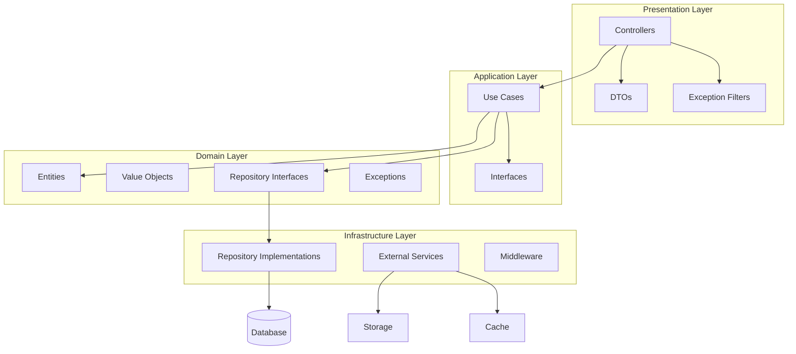
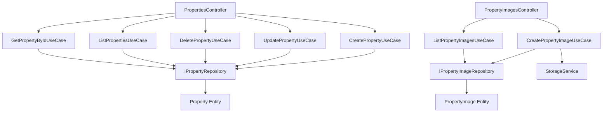
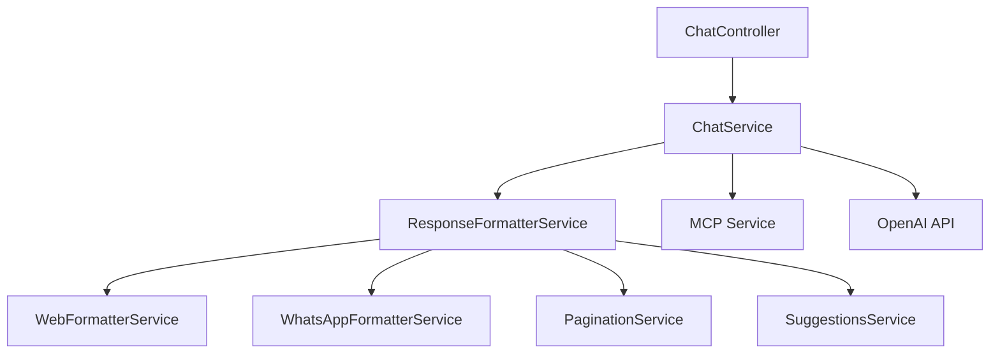
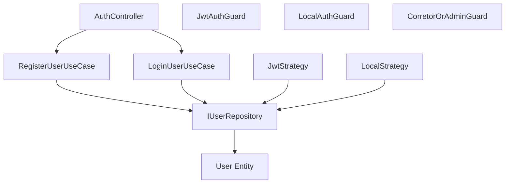
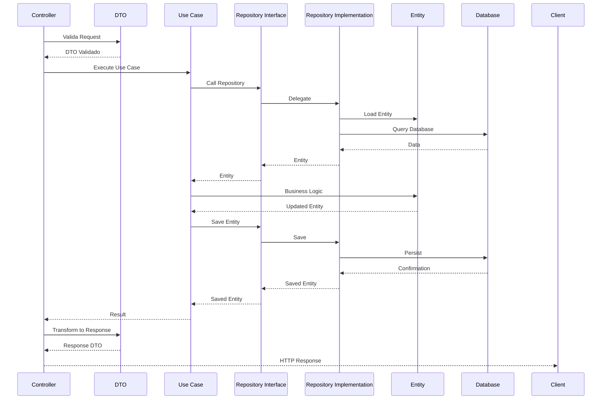

# Application Component Diagram

## Visão Geral

Este documento apresenta o **diagrama de componentes de aplicação**, mostrando a estrutura interna das aplicações e como os componentes se relacionam.

## Arquitetura de Componentes

### Backend API - Estrutura de Componentes

## Componentes por Camada

### 1. Presentation Layer (Camada de Apresentação)

**Componentes**:
- **Controllers**: Recebem requisições HTTP e delegam para Use Cases
  - PropertiesController
  - PropertyImagesController
  - AuthController
  - UsersController
  - RealtorsController
  - AdminController
  - ChatController
  - WhatsAppWebhookController
  - HealthController
  - McpBridgeController

- **DTOs**: Data Transfer Objects para validação e transformação
  - CreatePropertyDto
  - UpdatePropertyDto
  - PropertyResponseDto
  - ChatRequestDto
  - ChatResponseDto
  - LoginDto
  - RegisterDto

- **Exception Filters**: Tratamento global de exceções
  - DomainExceptionFilter
  - HttpExceptionFilter

**Localização**: `src/*/presentation/dtos/`, `src/*/*.controller.ts`

### 2. Application Layer (Camada de Aplicação)

**Componentes**:
- **Use Cases**: Lógica de negócio da aplicação
  - CreatePropertyUseCase
  - UpdatePropertyUseCase
  - DeletePropertyUseCase
  - ListPropertiesUseCase
  - GetPropertyByIdUseCase
  - CreatePropertyImageUseCase
  - RegisterUserUseCase
  - LoginUserUseCase
  - PromoteUserToCorretorUseCase
  - (23 use cases no total)

- **Interfaces**: Contratos para serviços externos
  - ILogger
  - IEmailService (futuro)
  - IStorageService

**Localização**: `src/shared/application/use-cases/`, `src/shared/application/interfaces/`

### 3. Domain Layer (Camada de Domínio)

**Componentes**:
- **Entities**: Entidades de negócio
  - Property
  - PropertyImage
  - User
  - RealtorProfile
  - Conversation
  - Message
  - Agent
  - UserCredit

- **Value Objects**: Objetos de valor imutáveis
  - PropertyType
  - PropertyPurpose
  - UserRole
  - MessageDirection
  - MessageChannel

- **Repository Interfaces**: Contratos para persistência
  - IPropertyRepository
  - IPropertyImageRepository
  - IUserRepository
  - IRealtorProfileRepository
  - IConversationRepository
  - IMessageRepository

- **Exceptions**: Exceções de domínio
  - DomainException
  - PropertyNotFoundException
  - UserNotFoundException
  - (11 exceções no total)

**Localização**: `src/shared/domain/`

### 4. Infrastructure Layer (Camada de Infraestrutura)

**Componentes**:
- **Repository Implementations**: Implementações TypeORM
  - PropertyTypeOrmRepository
  - PropertyImageTypeOrmRepository
  - UserTypeOrmRepository
  - RealtorProfileTypeOrmRepository
  - ConversationTypeOrmRepository
  - MessageTypeOrmRepository

- **External Services**: Serviços externos
  - StorageService (MinIO)
  - LoggerService (NestJS Logger)
  - (Futuro: EmailService, SMSService)

- **Middleware**: Middleware de aplicação
  - LoggingMiddleware

**Localização**: `src/shared/infrastructure/`

## Diagrama de Componentes por Módulo

### Properties Module

### Chat Module

### Auth Module

## Fluxo de Dados entre Componentes

## Princípios de Design Aplicados

### Dependency Inversion
- Controllers dependem de Use Cases (interfaces)
- Use Cases dependem de Repository Interfaces
- Implementações concretas injetadas via DI

### Single Responsibility
- Cada Use Case tem uma responsabilidade única
- Controllers apenas orquestram
- Repositories apenas acessam dados

### Open/Closed
- Novos Use Cases podem ser adicionados sem modificar existentes
- Novos formatadores podem ser adicionados sem modificar ChatService

## Tecnologias por Camada

| Camada | Tecnologias |
|--------|------------|
| Presentation | NestJS Controllers, class-validator, class-transformer, Swagger |
| Application | TypeScript, NestJS Injectable |
| Domain | TypeScript, TypeORM Decorators |
| Infrastructure | TypeORM, MinIO Client, Sharp, NestJS Logger |

## Próximos Componentes

- [ ] Notification Component (notificações)
- [ ] Analytics Component (métricas)
- [ ] Payment Component (pagamentos)
- [ ] Search Component (busca avançada)
- [ ] Report Component (relatórios)

