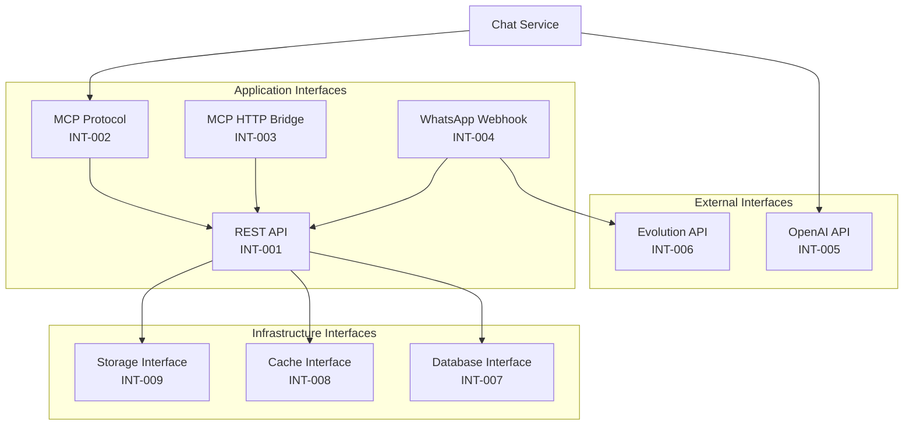

# Application Interfaces - Interfaces entre Aplicações

## Visão Geral

Este documento descreve as **interfaces** entre as aplicações da plataforma Litoral Imóveis, definindo protocolos, formatos de dados e padrões de comunicação.

## Interfaces Principais

### 1. REST API Interface

**ID**: INT-001  
**Tipo**: REST API  
**Protocolo**: HTTP/HTTPS  
**Formato**: JSON  
**Autenticação**: JWT Bearer Token  

**Descrição**: Interface REST principal exposta pelo Backend API.

**Endpoints Principais**:
- `/api/properties` - Gestão de imóveis
- `/api/properties/:id/images` - Gestão de imagens
- `/api/auth` - Autenticação
- `/api/users` - Gestão de usuários
- `/api/realtors` - Gestão de perfis
- `/api/admin` - Administração
- `/api/chat` - Chat inteligente
- `/api/health` - Health check

**Métodos HTTP**:
- GET: Consulta de dados
- POST: Criação de recursos
- PUT: Atualização completa
- PATCH: Atualização parcial
- DELETE: Remoção de recursos

**Padrões**:
- Status codes HTTP padrão (200, 201, 400, 401, 403, 404, 500)
- Validação via class-validator
- Transformação via class-transformer
- Documentação Swagger/OpenAPI

**Consumidores**: Frontend Web, Mobile App, MCP Server

### 2. MCP Protocol Interface

**ID**: INT-002  
**Tipo**: Model Context Protocol  
**Protocolo**: MCP (SSE ou STDIO)  
**Formato**: JSON-RPC  
**Autenticação**: Token (opcional)  

**Descrição**: Interface que implementa o Model Context Protocol para expor ferramentas para agentes de IA.

**Transportes**:
- Server-Sent Events (SSE) - `/api/mcp/sse`
- Standard I/O (STDIO) - Processo standalone

**Operações MCP**:
- `tools/list` - Listar tools disponíveis
- `tools/call` - Executar tool
- `resources/list` - Listar recursos (futuro)
- `prompts/list` - Listar prompts (futuro)

**Tools Expostos**:
- `list_properties`: Listar imóveis com filtros
- `get_property_by_id`: Obter imóvel por ID

**Consumidores**: Chat Service, Agentes de IA externos

**Localização**: `src/mcp/`

### 3. MCP HTTP Bridge Interface

**ID**: INT-003  
**Tipo**: REST Bridge para MCP  
**Protocolo**: HTTP/HTTPS  
**Formato**: JSON  
**Autenticação**: Token (para tools privadas)  

**Descrição**: Interface REST que expõe funcionalidades MCP via HTTP para facilitar testes e integração.

**Endpoints**:
- `GET /api/mcp/tools` - Listar tools disponíveis
- `POST /api/mcp/tools/call` - Executar tool

**Consumidores**: Testes, Debug, Integração externa

**Localização**: `src/mcp/mcp.controller.ts`

### 4. WhatsApp Webhook Interface

**ID**: INT-004  
**Tipo**: Webhook  
**Protocolo**: HTTP/HTTPS  
**Formato**: JSON  
**Autenticação**: Validação de origem (Evolution API)  

**Descrição**: Interface que recebe eventos do WhatsApp via Evolution API.

**Eventos Recebidos**:
- `messages.upsert` - Nova mensagem recebida
- `messages.update` - Atualização de mensagem
- `connection.update` - Atualização de conexão

**Payload**:
```json
{
  "event": "messages.upsert",
  "instance": "instance-name",
  "data": {
    "key": {...},
    "message": {...}
  }
}
```

**Respostas**:
- Envio via Evolution API SDK
- Integração com Chat Service

**Consumidores**: Evolution API (WhatsApp)

**Localização**: `src/whatsapp-webhook/`

### 5. OpenAI API Interface

**ID**: INT-005  
**Tipo**: REST API Externa  
**Protocolo**: HTTP/HTTPS  
**Formato**: JSON  
**Autenticação**: API Key  

**Descrição**: Interface com OpenAI para processamento de linguagem natural.

**Endpoints Utilizados**:
- `/v1/chat/completions` - Chat completions

**Uso**:
- Chat Service envia mensagens do usuário
- OpenAI processa e retorna resposta
- OpenAI pode chamar tools MCP via function calling

**Consumidores**: Chat Service

**Configuração**: Variáveis de ambiente (OPENAI_API_KEY, OPENAI_MODEL)

### 6. Evolution API Interface

**ID**: INT-006  
**Tipo**: REST API Externa  
**Protocolo**: HTTP/HTTPS  
**Formato**: JSON  
**Autenticação**: API Key  

**Descrição**: Interface com Evolution API para integração WhatsApp.

**Operações**:
- Receber webhooks de mensagens
- Enviar mensagens via SDK
- Gerenciar instâncias

**Consumidores**: WhatsApp Webhook Service

**Configuração**: Variáveis de ambiente (EVOLUTION_API_KEY, EVOLUTION_INSTANCE_URL)

### 7. Database Interface

**ID**: INT-007  
**Tipo**: Database Connection  
**Protocolo**: PostgreSQL  
**Formato**: SQL  
**Autenticação**: Credenciais de banco  

**Descrição**: Interface com banco de dados PostgreSQL via TypeORM.

**Operações**:
- CRUD de entidades
- Queries customizadas
- Migrations
- Transactions

**Consumidores**: Todos os módulos que precisam persistir dados

**ORM**: TypeORM

**Localização**: `src/config/typeorm.config.ts`

### 8. Cache Interface

**ID**: INT-008  
**Tipo**: Cache Service  
**Protocolo**: Redis  
**Formato**: Key-Value  
**Autenticação**: Credenciais Redis  

**Descrição**: Interface com Redis para cache e sessões.

**Uso**:
- Cache de dados frequentes
- Sessões de usuário (futuro)
- Rate limiting (futuro)

**Consumidores**: Módulos que precisam de cache

**Localização**: `src/shared/cache/`

### 9. Storage Interface

**ID**: INT-009  
**Tipo**: Object Storage  
**Protocolo**: MinIO/S3  
**Formato**: Binary (imagens)  
**Autenticação**: Access Key / Secret Key  

**Descrição**: Interface com MinIO para armazenamento de imagens.

**Operações**:
- Upload de arquivos
- Download de arquivos
- Geração de URLs
- Deleção de arquivos

**Consumidores**: Property Images Module

**Localização**: `src/shared/infrastructure/services/`

## Diagrama de Interfaces



## Especificação de Interfaces

### REST API (INT-001)

**Base URL**: `https://api-imoveis.gwan.com.br/api`

**Headers Padrão**:
```
Content-Type: application/json
Authorization: Bearer {token}  # Quando autenticação requerida
```

**Exemplo de Request**:
```http
GET /api/properties?city=São Sebastião&type=CASA HTTP/1.1
Host: api-imoveis.gwan.com.br
Content-Type: application/json
```

**Exemplo de Response**:
```json
[
  {
    "id": "uuid",
    "title": "Casa de Praia",
    "type": "CASA",
    "price": 850000,
    "city": "São Sebastião",
    "coverImageUrl": "https://..."
  }
]
```

### MCP Protocol (INT-002)

**Exemplo de Tool Call**:
```json
{
  "jsonrpc": "2.0",
  "id": 1,
  "method": "tools/call",
  "params": {
    "name": "list_properties",
    "arguments": {
      "city": "São Sebastião",
      "type": "CASA"
    }
  }
}
```

**Exemplo de Response**:
```json
{
  "jsonrpc": "2.0",
  "id": 1,
  "result": {
    "content": [
      {
        "id": "uuid",
        "title": "Casa de Praia",
        ...
      }
    ]
  }
}
```

## Padrões de Comunicação

### Síncrona
- REST API (request/response)
- MCP HTTP Bridge (request/response)
- Database queries (síncrono via TypeORM)

### Assíncrona
- MCP Protocol SSE (streaming)
- WhatsApp Webhooks (event-driven)

### Polling
- Health checks
- Status de instâncias WhatsApp

## Segurança das Interfaces

| Interface | Autenticação | Autorização | Criptografia |
|-----------|-------------|-------------|--------------|
| REST API | JWT | Role-based | HTTPS |
| MCP Protocol | Token (opcional) | Tool-based | HTTPS/STDIO |
| MCP HTTP Bridge | Token (tools privadas) | Tool-based | HTTPS |
| WhatsApp Webhook | Validação origem | - | HTTPS |
| OpenAI API | API Key | - | HTTPS |
| Evolution API | API Key | - | HTTPS |
| Database | Credenciais | - | SSL/TLS |
| Cache | Credenciais | - | - |
| Storage | Access/Secret Key | - | HTTPS |

## Versionamento

- **REST API**: Atualmente v1 (implícito), futuro `/api/v1`, `/api/v2`
- **MCP Protocol**: Segue especificação MCP
- **OpenAPI**: Gerado automaticamente via Swagger

## Próximas Interfaces

- [ ] WebSocket Interface (notificações em tempo real)
- [ ] GraphQL Interface (alternativa ao REST)
- [ ] gRPC Interface (comunicação entre serviços)
- [ ] Message Queue Interface (eventos assíncronos)

