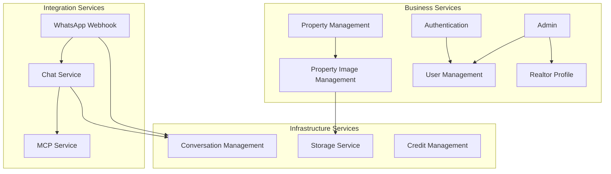

# Application Services - Serviços de Aplicação

## Visão Geral

Este documento cataloga os **serviços de aplicação** da plataforma Litoral Imóveis, descrevendo serviços internos que suportam as funcionalidades de negócio.

## Serviços Principais

### 1. Property Management Service

**ID**: SVC-001  
**Módulo**: Properties Module  
**Localização**: `src/properties/`  

**Descrição**: Serviço responsável por gerenciar o ciclo de vida completo de propriedades (imóveis).

**Use Cases**:
- CreatePropertyUseCase
- UpdatePropertyUseCase
- DeletePropertyUseCase
- GetPropertyByIdUseCase
- ListPropertiesUseCase
- ListMyPropertiesUseCase

**Repositories**:
- IPropertyRepository
- PropertyTypeOrmRepository

**Controllers**:
- PropertiesController

**Endpoints**:
- `POST /api/properties` - Criar imóvel
- `GET /api/properties` - Listar imóveis
- `GET /api/properties/:id` - Obter imóvel
- `PUT /api/properties/:id` - Atualizar imóvel
- `DELETE /api/properties/:id` - Deletar imóvel
- `GET /api/properties/my-properties` - Listar meus imóveis

### 2. Property Image Management Service

**ID**: SVC-002  
**Módulo**: Properties Module  
**Localização**: `src/properties/`  

**Descrição**: Serviço para gerenciar imagens associadas a propriedades.

**Use Cases**:
- CreatePropertyImageUseCase
- DeletePropertyImageUseCase
- ListPropertyImagesUseCase
- SetCoverImageUseCase
- ReorderPropertyImagesUseCase

**Repositories**:
- IPropertyImageRepository
- PropertyImageTypeOrmRepository

**Services**:
- StorageService (MinIO)

**Controllers**:
- PropertyImagesController

**Endpoints**:
- `POST /api/properties/:id/images` - Upload imagem
- `GET /api/properties/:id/images` - Listar imagens
- `PUT /api/properties/:id/images/:imageId/cover` - Definir capa
- `DELETE /api/properties/:id/images/:imageId` - Deletar imagem
- `PUT /api/properties/:id/images/reorder` - Reordenar imagens

### 3. Authentication Service

**ID**: SVC-003  
**Módulo**: Auth Module  
**Localização**: `src/auth/`  

**Descrição**: Serviço de autenticação e autorização de usuários.

**Use Cases**:
- RegisterUserUseCase
- LoginUserUseCase

**Strategies**:
- JwtStrategy
- LocalStrategy

**Guards**:
- JwtAuthGuard
- LocalAuthGuard
- CorretorOrAdminGuard

**Controllers**:
- AuthController

**Endpoints**:
- `POST /api/auth/register` - Registrar usuário
- `POST /api/auth/login` - Login

**Funcionalidades**:
- Geração de tokens JWT
- Validação de credenciais
- Hash de senhas (bcrypt)
- Controle de acesso baseado em roles

### 4. User Management Service

**ID**: SVC-004  
**Módulo**: Users Module  
**Localização**: `src/users/`  

**Descrição**: Serviço para gerenciar contas de usuários.

**Use Cases**:
- (Usado indiretamente via Auth e Admin)

**Repositories**:
- IUserRepository
- UserTypeOrmRepository

**Controllers**:
- UsersController

**Endpoints**:
- `GET /api/users/:id` - Obter usuário
- `GET /api/users` - Listar usuários (ADMIN)

### 5. Realtor Profile Service

**ID**: SVC-005  
**Módulo**: Realtors Module  
**Localização**: `src/realtors/`  

**Descrição**: Serviço para gerenciar perfis profissionais de corretores.

**Use Cases**:
- GetMyRealtorProfileUseCase
- UpdateMyRealtorProfileUseCase

**Repositories**:
- IRealtorProfileRepository
- RealtorProfileTypeOrmRepository

**Controllers**:
- RealtorsController

**Endpoints**:
- `GET /api/realtors/my-profile` - Obter meu perfil
- `PUT /api/realtors/my-profile` - Atualizar meu perfil

### 6. Admin Service

**ID**: SVC-006  
**Módulo**: Admin Module  
**Localização**: `src/admin/`  

**Descrição**: Serviço de administração geral da plataforma.

**Use Cases**:
- PromoteUserToCorretorUseCase

**Controllers**:
- AdminController

**Endpoints**:
- `POST /api/admin/users/:id/promote-to-corretor` - Promover para corretor
- `GET /api/admin/stats` - Estatísticas (futuro)

### 7. Chat Service

**ID**: SVC-007  
**Módulo**: Chat Module  
**Localização**: `src/chat/`  

**Descrição**: Serviço de chatbot inteligente com integração OpenAI e MCP.

**Funcionalidades**:
- Processamento de linguagem natural
- Integração com OpenAI GPT
- Chamada de tools MCP
- Formatação de respostas (Web, WhatsApp)
- Manutenção de contexto

**Services**:
- ChatService
- ResponseFormatterService
- WebFormatterService
- WhatsAppFormatterService
- PaginationService
- SuggestionsService

**Controllers**:
- ChatController

**Endpoints**:
- `POST /api/chat` - Enviar mensagem

**Dependências**:
- OpenAI API
- MCP Server

### 8. MCP Service

**ID**: SVC-008  
**Módulo**: MCP Module  
**Localização**: `src/mcp/`  

**Descrição**: Serviço que implementa o Model Context Protocol.

**Funcionalidades**:
- Conversão OpenAPI para MCP Tools
- Exposição de tools via MCP
- Execução de ferramentas HTTP
- Autenticação MCP

**Services**:
- openapiToMcpTools (converter)
- executeHttpTool (handler)

**Controllers**:
- McpBridgeController

**Endpoints**:
- `GET /api/mcp/tools` - Listar tools
- `POST /api/mcp/tools/call` - Executar tool

**Servers**:
- MCP Server SSE (`src/mcp/server-sse.ts`)
- MCP Server STDIO (`src/mcp/server-stdio.ts`)

### 9. WhatsApp Webhook Service

**ID**: SVC-009  
**Módulo**: WhatsApp Webhook Module  
**Localização**: `src/whatsapp-webhook/`  

**Descrição**: Serviço que processa webhooks do WhatsApp via Evolution API.

**Funcionalidades**:
- Receber mensagens do WhatsApp
- Registrar usuários automaticamente
- Processar mensagens via Chat Service
- Enviar respostas via Evolution API

**Services**:
- WhatsAppWebhookService
- EvolutionApiService
- RegistrationService
- RegistrationMessagesService

**Controllers**:
- WhatsAppWebhookController

**Endpoints**:
- `POST /api/whatsapp-webhook` - Receber webhook

**Dependências**:
- Evolution API
- Chat Service

### 10. Storage Service

**ID**: SVC-010  
**Módulo**: Shared Infrastructure  
**Localização**: `src/shared/infrastructure/services/`  

**Descrição**: Serviço para gerenciar armazenamento de arquivos no MinIO.

**Funcionalidades**:
- Upload de arquivos
- Processamento de imagens (Sharp)
- Geração de thumbnails
- Geração de URLs de acesso
- Deleção de arquivos

**Dependências**:
- MinIO
- Sharp (processamento de imagens)

**Uso**: Usado por Property Image Management Service

### 11. Conversation Management Service

**ID**: SVC-011  
**Módulo**: Shared Application  
**Localização**: `src/shared/application/use-cases/`  

**Descrição**: Serviço para gerenciar conversas e mensagens.

**Use Cases**:
- CreateOrFindConversationUseCase
- SaveMessageUseCase
- ResolveConversationAgentUseCase
- GetOrSetUserPreferredAgentUseCase

**Repositories**:
- IConversationRepository
- IMessageRepository

**Uso**: Usado por Chat Service e WhatsApp Webhook Service

### 12. Credit Management Service

**ID**: SVC-012  
**Módulo**: Shared Application  
**Localização**: `src/shared/application/use-cases/`  

**Descrição**: Serviço para gerenciar créditos de usuários (futuro uso).

**Use Cases**:
- GetUserBalanceUseCase
- AddCreditUseCase

**Repositories**:
- IUserCreditRepository

**Status**: Implementado, aguardando uso

## Diagrama de Serviços

## Matriz Serviço-Use Case

| Serviço | Use Cases |
|---------|-----------|
| Property Management | CreateProperty, UpdateProperty, DeleteProperty, GetPropertyById, ListProperties, ListMyProperties |
| Property Image Management | CreatePropertyImage, DeletePropertyImage, ListPropertyImages, SetCoverImage, ReorderPropertyImages |
| Authentication | RegisterUser, LoginUser |
| User Management | (Indireto via Auth/Admin) |
| Realtor Profile | GetMyRealtorProfile, UpdateMyRealtorProfile |
| Admin | PromoteUserToCorretor |
| Chat | (Lógica no ChatService) |
| MCP | (Lógica no MCP Server) |
| WhatsApp Webhook | (Lógica no WebhookService) |
| Storage | (Interno) |
| Conversation Management | CreateOrFindConversation, SaveMessage, ResolveConversationAgent |
| Credit Management | GetUserBalance, AddCredit |

## Dependências entre Serviços

| Serviço | Depende de |
|---------|-----------|
| Property Image Management | Storage Service |
| Chat Service | MCP Service, OpenAI API |
| MCP Service | Backend API (via HTTP) |
| WhatsApp Webhook | Chat Service, Auth Service |
| Admin | User Management, Realtor Profile |
| Conversation Management | User Repository |

## Próximos Serviços

- [ ] Notification Service (notificações push, email, SMS)
- [ ] Analytics Service (coleta e análise de métricas)
- [ ] Payment Service (integração com gateways)
- [ ] Report Service (geração de relatórios)
- [ ] Search Service (busca avançada e indexação)

