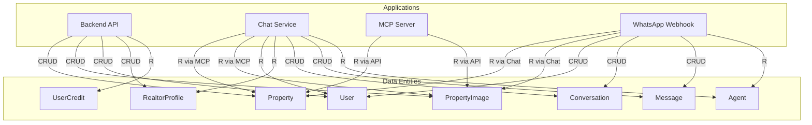

# Application-Data Matrix - Matriz Aplicação/Dados

## Visão Geral

Este documento apresenta a **matriz de relacionamento** entre aplicações e entidades de dados, mostrando quais aplicações acessam quais dados.

## Matriz Aplicação/Dados

| Aplicação | Property | PropertyImage | User | RealtorProfile | Conversation | Message | Agent | UserCredit |
|-----------|----------|---------------|------|----------------|--------------|---------|-------|------------|
| **Backend API** | ✅ CRUD | ✅ CRUD | ✅ CRUD | ✅ CRUD | ❌ | ❌ | ❌ | ✅ R |
| **Chat Service** | ✅ R | ✅ R | ✅ R | ✅ R | ✅ CRUD | ✅ CRUD | ✅ R | ❌ |
| **MCP Server** | ✅ R | ✅ R | ❌ | ❌ | ❌ | ❌ | ❌ | ❌ |
| **WhatsApp Webhook** | ✅ R | ✅ R | ✅ CRUD | ❌ | ✅ CRUD | ✅ CRUD | ✅ R | ❌ |

**Legenda**:
- ✅ CRUD: Create, Read, Update, Delete
- ✅ R: Read (apenas leitura)
- ❌: Sem acesso

## Detalhamento por Aplicação

### Backend API

**Acesso a Dados**:
- **Property**: CRUD completo
  - Create: `CreatePropertyUseCase`
  - Read: `ListPropertiesUseCase`, `GetPropertyByIdUseCase`
  - Update: `UpdatePropertyUseCase`
  - Delete: `DeletePropertyUseCase`

- **PropertyImage**: CRUD completo
  - Create: `CreatePropertyImageUseCase`
  - Read: `ListPropertyImagesUseCase`
  - Update: `SetCoverImageUseCase`, `ReorderPropertyImagesUseCase`
  - Delete: `DeletePropertyImageUseCase`

- **User**: CRUD completo
  - Create: `RegisterUserUseCase`
  - Read: `GetUserByIdUseCase` (via Users/Admin modules)
  - Update: (via Admin module)
  - Delete: (futuro)

- **RealtorProfile**: CRUD completo
  - Create: Automático ao promover para corretor
  - Read: `GetMyRealtorProfileUseCase`
  - Update: `UpdateMyRealtorProfileUseCase`
  - Delete: (futuro)

- **UserCredit**: Read apenas
  - Read: `GetUserBalanceUseCase`
  - (Create/Update via `AddCreditUseCase` - uso futuro)

**Módulos Envolvidos**:
- Properties Module
- Property Images Module
- Auth Module
- Users Module
- Realtors Module
- Admin Module

### Chat Service

**Acesso a Dados**:
- **Property**: Read apenas
  - Via MCP Tools: `list_properties`, `get_property_by_id`
  - Não acessa diretamente o banco

- **PropertyImage**: Read apenas
  - Via Property entity (relacionamento)
  - Não acessa diretamente o banco

- **User**: Read apenas
  - Para contexto do usuário (opcional)
  - Não modifica dados

- **RealtorProfile**: Read apenas
  - Para exibir informações do corretor
  - Via Property → User → RealtorProfile

- **Conversation**: CRUD completo
  - Create: `CreateOrFindConversationUseCase`
  - Read: Para manter contexto
  - Update: Atualizar status, metadata
  - Delete: (futuro - retenção)

- **Message**: CRUD completo
  - Create: `SaveMessageUseCase` (incoming e outgoing)
  - Read: Para histórico de conversa
  - Update: Atualizar response, toolsUsed
  - Delete: (futuro - retenção)

- **Agent**: Read apenas
  - Para roteamento de conversas
  - Não modifica

**Observação**: Chat Service não acessa diretamente o banco, usa MCP Tools ou Use Cases.

### MCP Server

**Acesso a Dados**:
- **Property**: Read apenas
  - Via Backend API: `GET /api/properties`
  - Tool: `list_properties`
  - Tool: `get_property_by_id`

- **PropertyImage**: Read apenas
  - Via Property entity (relacionamento)
  - Não acessa diretamente

**Observação**: MCP Server não acessa diretamente o banco, apenas expõe ferramentas que chamam Backend API.

### WhatsApp Webhook

**Acesso a Dados**:
- **Property**: Read apenas
  - Via Chat Service (que usa MCP Tools)
  - Não acessa diretamente

- **PropertyImage**: Read apenas
  - Via Property entity
  - Não acessa diretamente

- **User**: CRUD completo
  - Create: `RegisterUserViaWhatsAppUseCase` (automático)
  - Read: Para identificar usuário
  - Update: (futuro)
  - Delete: (futuro)

- **Conversation**: CRUD completo
  - Create: `CreateOrFindConversationUseCase`
  - Read: Para manter contexto
  - Update: Atualizar status
  - Delete: (futuro)

- **Message**: CRUD completo
  - Create: `SaveMessageUseCase` (incoming e outgoing)
  - Read: Para histórico
  - Update: Atualizar response
  - Delete: (futuro)

- **Agent**: Read apenas
  - Para roteamento
  - Não modifica

**Observação**: WhatsApp Webhook usa Chat Service para processar mensagens, que por sua vez usa MCP Tools.

## Diagrama de Acesso

## Padrões de Acesso

### Read-Only Access
- **Chat Service**: Apenas leitura de Property, PropertyImage, User, RealtorProfile
- **MCP Server**: Apenas leitura de Property, PropertyImage

### Full CRUD Access
- **Backend API**: CRUD completo em todas as entidades principais
- **Chat Service**: CRUD em Conversation e Message
- **WhatsApp Webhook**: CRUD em User, Conversation, Message

### Indirect Access
- **Chat Service**: Acessa Property via MCP Tools (não diretamente)
- **WhatsApp Webhook**: Acessa Property via Chat Service (não diretamente)
- **MCP Server**: Acessa Property via Backend API (não diretamente)

## Segurança e Autorização

### Controle de Acesso

**Backend API**:
- Autenticação JWT para operações de escrita
- Roles: ADMIN, CORRETOR, USER
- Validação de permissões por operação

**Chat Service**:
- Acesso público (sem autenticação obrigatória)
- Contexto de usuário opcional
- Limites de rate (futuro)

**MCP Server**:
- Token de autenticação para tools privadas
- Tools públicas: `list_properties`, `get_property_by_id`

**WhatsApp Webhook**:
- Validação de origem (Evolution API)
- Registro automático de usuários

## Impacto de Mudanças

### Se Property Entity Mudar

**Impactados**:
- Backend API: ✅ (acesso direto)
- Chat Service: ⚠️ (via MCP, impacto indireto)
- MCP Server: ⚠️ (expõe via tools)
- WhatsApp Webhook: ⚠️ (via Chat Service)

**Ações Necessárias**:
- Atualizar Backend API
- Atualizar MCP Tools
- Testar integração Chat Service
- Testar integração WhatsApp Webhook

### Se Conversation Entity Mudar

**Impactados**:
- Chat Service: ✅ (acesso direto)
- WhatsApp Webhook: ✅ (acesso direto)
- Backend API: ❌ (não acessa)

**Ações Necessárias**:
- Atualizar Chat Service
- Atualizar WhatsApp Webhook
- Migração de dados se necessário

## Próximas Melhorias

- [ ] Adicionar auditoria de acesso (quem acessa o quê)
- [ ] Implementar data access layer unificado
- [ ] Adicionar cache de acesso
- [ ] Implementar data masking para logs
- [ ] Adicionar métricas de acesso por aplicação

