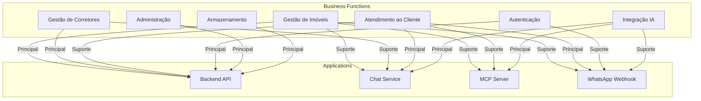

# Application-Function Matrix - Matriz Aplicação/Função de Negócio

## Visão Geral

Este documento apresenta a **matriz de relacionamento** entre aplicações e funções de negócio, mostrando quais aplicações suportam quais capacidades de negócio.

## Matriz Aplicação-Função

| Aplicação | Gestão de Imóveis | Gestão de Corretores | Atendimento ao Cliente | Autenticação | Administração | Integração IA | Armazenamento |
|-----------|------------------|---------------------|----------------------|--------------|---------------|---------------|---------------|
| **Backend API** | ✅ Principal | ✅ Principal | ⚠️ Suporte | ✅ Principal | ✅ Principal | ❌ | ✅ Principal |
| **Chat Service** | ⚠️ Consulta | ⚠️ Consulta | ✅ Principal | ❌ | ❌ | ✅ Principal | ❌ |
| **MCP Server** | ⚠️ Consulta | ❌ | ⚠️ Suporte | ❌ | ❌ | ✅ Principal | ❌ |
| **WhatsApp Webhook** | ⚠️ Consulta | ❌ | ✅ Principal | ⚠️ Registro | ❌ | ⚠️ Suporte | ❌ |

**Legenda**:
- ✅ Principal: Aplicação principal para esta função
- ⚠️ Suporte: Aplicação suporta mas não é principal
- ❌: Aplicação não suporta esta função

## Detalhamento por Função de Negócio

### 1. Gestão de Imóveis

**Aplicação Principal**: Backend API

**Módulos Envolvidos**:
- Properties Module
- Property Images Module

**Funcionalidades**:
- Cadastro de imóveis
- Atualização de imóveis
- Exclusão de imóveis
- Listagem e busca
- Upload de imagens
- Gestão de imagens de capa

**Aplicações de Suporte**:
- **Chat Service**: Consulta de imóveis via chat
- **MCP Server**: Expõe ferramentas de consulta
- **WhatsApp Webhook**: Consulta via WhatsApp

### 2. Gestão de Corretores

**Aplicação Principal**: Backend API

**Módulos Envolvidos**:
- Realtors Module
- Admin Module

**Funcionalidades**:
- Criação de perfil profissional
- Atualização de perfil
- Visualização de perfil
- Promoção de usuário para corretor

**Aplicações de Suporte**:
- **Chat Service**: Consulta de informações de corretores (via Property)

### 3. Atendimento ao Cliente

**Aplicações Principais**: Chat Service, WhatsApp Webhook

**Funcionalidades**:
- Atendimento via chat inteligente
- Atendimento via WhatsApp
- Busca conversacional de imóveis
- Resolução de dúvidas
- Manutenção de contexto

**Aplicações de Suporte**:
- **MCP Server**: Fornece ferramentas para busca
- **Backend API**: Fornece dados de imóveis

### 4. Autenticação e Autorização

**Aplicação Principal**: Backend API

**Módulos Envolvidos**:
- Auth Module

**Funcionalidades**:
- Registro de usuários
- Login de usuários
- Geração de tokens JWT
- Validação de tokens
- Controle de acesso baseado em roles

**Aplicações de Suporte**:
- **WhatsApp Webhook**: Registro automático de usuários

### 5. Administração

**Aplicação Principal**: Backend API

**Módulos Envolvidos**:
- Admin Module
- Users Module

**Funcionalidades**:
- Gestão de usuários
- Promoção para corretor
- Visualização de estatísticas (futuro)
- Configurações do sistema (futuro)

### 6. Integração com IA

**Aplicações Principais**: Chat Service, MCP Server

**Funcionalidades**:
- Processamento de linguagem natural
- Integração com OpenAI
- Exposição de ferramentas via MCP
- Geração de respostas contextuais

**Aplicações de Suporte**:
- **WhatsApp Webhook**: Usa Chat Service para processar mensagens

### 7. Armazenamento de Arquivos

**Aplicação Principal**: Backend API

**Módulos Envolvidos**:
- Property Images Module
- Storage Service (infrastructure)

**Funcionalidades**:
- Upload de imagens
- Processamento de imagens
- Armazenamento em MinIO
- Geração de URLs

## Diagrama de Relacionamento

## Processos de Negócio por Aplicação

### Backend API

**Processos Suportados**:
- Cadastro de Imóvel
- Atualização de Imóvel
- Busca de Imóveis (API)
- Visualização de Detalhes (API)
- Gestão de Perfil Corretor
- Registro de Usuário
- Login de Usuário

### Chat Service

**Processos Suportados**:
- Atendimento via Chat
- Busca de Imóveis (via chat)
- Visualização de Detalhes (via chat)

### MCP Server

**Processos Suportados**:
- Busca de Imóveis (ferramenta)
- Visualização de Detalhes (ferramenta)

### WhatsApp Webhook

**Processos Suportados**:
- Atendimento via WhatsApp
- Registro Automático de Usuário
- Busca de Imóveis (via WhatsApp)
- Visualização de Detalhes (via WhatsApp)

## Dependências entre Aplicações

### Chat Service depende de:
- **MCP Server**: Para ferramentas de busca
- **Backend API**: Para dados de imóveis (via MCP)

### WhatsApp Webhook depende de:
- **Chat Service**: Para processar mensagens
- **Backend API**: Para registro de usuários

### MCP Server depende de:
- **Backend API**: Para executar ferramentas

## Impacto de Mudanças

### Se função "Gestão de Imóveis" mudar

**Aplicações Impactadas**:
- Backend API: ✅ Impacto direto
- Chat Service: ⚠️ Impacto indireto (via MCP)
- MCP Server: ⚠️ Impacto (tools expostas)
- WhatsApp Webhook: ⚠️ Impacto indireto (via Chat)

### Se função "Atendimento ao Cliente" mudar

**Aplicações Impactadas**:
- Chat Service: ✅ Impacto direto
- WhatsApp Webhook: ✅ Impacto direto
- MCP Server: ⚠️ Impacto (ferramentas)
- Backend API: ⚠️ Impacto (dados)

## Métricas por Aplicação

### Backend API

**Funções Suportadas**: 5 principais, 2 suporte
**Processos Suportados**: 7
**Volume de Requisições**: Alto

### Chat Service

**Funções Suportadas**: 1 principal, 3 suporte
**Processos Suportados**: 3
**Volume de Requisições**: Médio

### MCP Server

**Funções Suportadas**: 1 principal, 1 suporte
**Processos Suportados**: 2
**Volume de Requisições**: Médio

### WhatsApp Webhook

**Funções Suportadas**: 1 principal, 3 suporte
**Processos Suportados**: 4
**Volume de Requisições**: Médio

## Próximas Melhorias

- [ ] Adicionar métricas de uso por função
- [ ] Implementar dashboards de funções
- [ ] Adicionar alertas por função
- [ ] Documentar SLAs por função
- [ ] Implementar circuit breakers por função

