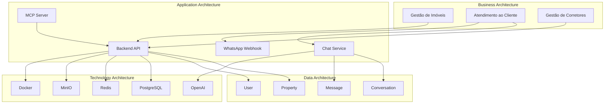
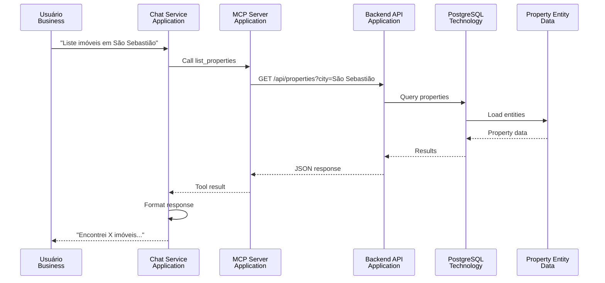

# Architecture Overview - Visão Geral da Arquitetura

## Visão Geral

Este documento apresenta uma **visão integrada** das 4 dimensões arquiteturais da plataforma Litoral Imóveis, mostrando como Business, Application, Data e Technology se relacionam.

## Visão Integrada das 4 Dimensões

## Relacionamentos entre Dimensões

### Business → Application

| Capacidade de Negócio | Aplicação de Suporte |
|----------------------|---------------------|
| Gestão de Imóveis | Backend API (Properties Module) |
| Atendimento ao Cliente | Chat Service, WhatsApp Webhook |
| Gestão de Corretores | Backend API (Realtors Module) |
| Autenticação | Backend API (Auth Module) |
| Integração com IA | Chat Service, MCP Server |

### Application → Data

| Aplicação | Entidades de Dados |
|-----------|-------------------|
| Backend API | Property, PropertyImage, User, RealtorProfile |
| Chat Service | Conversation, Message |
| WhatsApp Webhook | User, Conversation, Message |

### Application → Technology

| Aplicação | Tecnologias |
|-----------|------------|
| Backend API | NestJS, PostgreSQL, Redis, MinIO |
| Chat Service | NestJS, OpenAI API, MCP SDK |
| MCP Server | NestJS, MCP SDK |
| WhatsApp Webhook | NestJS, Evolution API SDK |

### Data → Technology

| Entidade | Armazenamento |
|----------|--------------|
| Property, User, etc. | PostgreSQL |
| Imagens | MinIO |
| Cache | Redis |

## Fluxo Integrado: Busca de Imóveis via Chat

## Princípios Arquiteturais Aplicados

### 1. Clean Architecture

**Separação de Camadas**:
- Domain: Independente de frameworks
- Application: Casos de uso
- Infrastructure: Implementações concretas
- Presentation: Controllers e DTOs

### 2. SOLID

**Aplicação**:
- Single Responsibility: Cada classe tem uma responsabilidade
- Open/Closed: Extensível sem modificação
- Liskov Substitution: Interfaces substituíveis
- Interface Segregation: Interfaces específicas
- Dependency Inversion: Dependências via interfaces

### 3. Domain-Driven Design

**Conceitos**:
- Entities: Property, User, Conversation
- Value Objects: PropertyType, UserRole
- Aggregates: Property + PropertyImage
- Repositories: Abstrações de persistência
- Domain Services: Lógica de domínio

## Alinhamento Estratégico

### Objetivos de Negócio → Arquitetura

| Objetivo de Negócio | Suporte Arquitetural |
|---------------------|---------------------|
| Aumentar Base de Imóveis | Properties Module, Storage Service |
| Melhorar Atendimento | Chat Service, OpenAI Integration |
| Aumentar Conversão | Busca Inteligente, MCP Tools |
| Escalar Operações | Docker, Horizontal Scaling |
| Melhorar Experiência | Clean Architecture, APIs RESTful |

## Evolução da Arquitetura

### Estado Atual

**Forças**:
- Arquitetura limpa e escalável
- Separação de responsabilidades
- Tecnologias modernas
- Documentação completa

**Desafios**:
- Escalabilidade horizontal (futuro)
- Monitoramento completo (futuro)
- High availability (futuro)

### Estado Futuro

**Melhorias Planejadas**:
- Múltiplos containers (HA)
- Database replicação
- Monitoring completo
- CDN para assets
- Message queue
- Search engine

## Métricas de Arquitetura

### Qualidade

| Métrica | Objetivo | Status |
|---------|----------|--------|
| Cobertura de testes | > 80% | Em progresso |
| Tempo de build | < 5 min | ✅ |
| Tempo de deploy | < 10 min | ✅ |
| Disponibilidade | 99.9% | ✅ |

### Performance

| Métrica | Objetivo | Status |
|---------|----------|--------|
| Latência API | < 500ms | ✅ |
| Throughput | 100 req/s | ✅ |
| Tempo de resposta Chat | < 5s | ✅ |

## Governança Arquitetural

### Decisões Arquiteturais

**Registro**: ADRs (Architecture Decision Records) - Futuro

**Processo**:
1. Identificar necessidade
2. Avaliar alternativas
3. Decidir e documentar
4. Implementar
5. Revisar periodicamente

### Revisões Arquiteturais

**Frequência**: Trimestral

**Escopo**:
- Alinhamento com objetivos de negócio
- Avaliação de tecnologias
- Identificação de melhorias
- Planejamento de evolução

## Próximos Passos

- [ ] Implementar ADRs
- [ ] Estabelecer processo de revisão arquitetural
- [ ] Definir KPIs arquiteturais
- [ ] Criar dashboards de métricas
- [ ] Implementar melhorias de escalabilidade
- [ ] Adicionar monitoring completo

