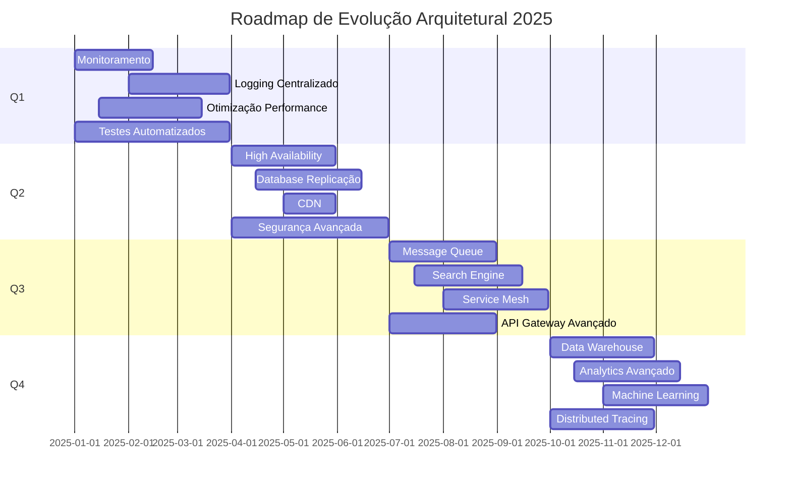
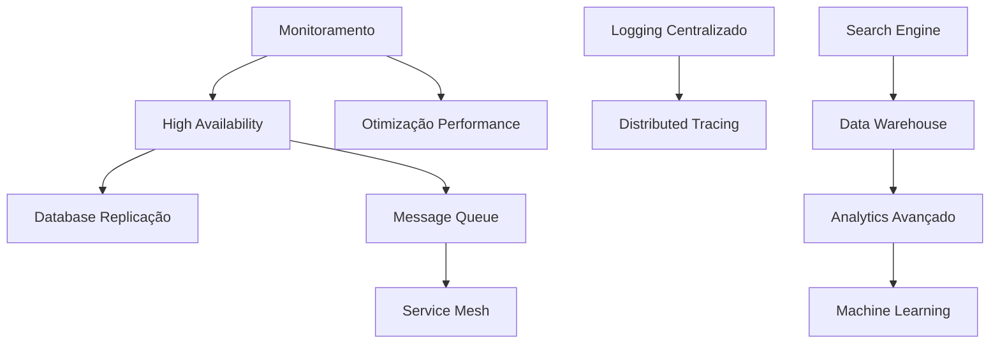

# Architecture Roadmap - Roadmap de Evolução Arquitetural

## Visão Geral

Este documento apresenta o **roadmap de evolução arquitetural** da plataforma Litoral Imóveis, definindo melhorias planejadas, prioridades e prazos.

## Roadmap por Período

### Q1 2025 (Janeiro - Março)

#### Objetivos
- Estabilização da arquitetura atual
- Melhorias de performance
- Monitoramento básico

#### Melhorias Planejadas

**1. Monitoramento e Observabilidade**
- **Prioridade**: Alta
- **Descrição**: Implementar monitoramento básico
- **Tecnologias**: Prometheus, Grafana
- **Benefícios**: Visibilidade, troubleshooting
- **Esforço**: Médio

**2. Logging Centralizado**
- **Prioridade**: Média
- **Descrição**: Centralizar logs em ELK Stack
- **Tecnologias**: Elasticsearch, Logstash, Kibana
- **Benefícios**: Busca e análise de logs
- **Esforço**: Alto

**3. Otimização de Performance**
- **Prioridade**: Alta
- **Descrição**: Otimizar queries, cache, índices
- **Tecnologias**: PostgreSQL, Redis
- **Benefícios**: Melhor tempo de resposta
- **Esforço**: Médio

**4. Testes Automatizados**
- **Prioridade**: Alta
- **Descrição**: Aumentar cobertura de testes
- **Tecnologias**: Jest, Cucumber
- **Benefícios**: Qualidade, confiabilidade
- **Esforço**: Alto

### Q2 2025 (Abril - Junho)

#### Objetivos
- Alta disponibilidade
- Escalabilidade horizontal
- Melhorias de segurança

#### Melhorias Planejadas

**1. High Availability**
- **Prioridade**: Alta
- **Descrição**: Múltiplos containers, load balancing
- **Tecnologias**: Docker, Traefik
- **Benefícios**: Resiliência, uptime
- **Esforço**: Alto

**2. Database Replicação**
- **Prioridade**: Alta
- **Descrição**: Read replicas para PostgreSQL
- **Tecnologias**: PostgreSQL
- **Benefícios**: Performance, disponibilidade
- **Esforço**: Alto

**3. CDN para Assets**
- **Prioridade**: Média
- **Descrição**: CDN para imagens e assets estáticos
- **Tecnologias**: CloudFlare ou similar
- **Benefícios**: Performance global
- **Esforço**: Baixo

**4. Segurança Avançada**
- **Prioridade**: Alta
- **Descrição**: Rate limiting, WAF, secrets management
- **Tecnologias**: Traefik, Vault
- **Benefícios**: Segurança, compliance
- **Esforço**: Médio

### Q3 2025 (Julho - Setembro)

#### Objetivos
- Microserviços (início)
- Message queue
- Search engine

#### Melhorias Planejadas

**1. Message Queue**
- **Prioridade**: Média
- **Descrição**: Implementar message queue para eventos
- **Tecnologias**: Kafka ou RabbitMQ
- **Benefícios**: Desacoplamento, escalabilidade
- **Esforço**: Alto

**2. Search Engine**
- **Prioridade**: Média
- **Descrição**: Elasticsearch para busca avançada
- **Tecnologias**: Elasticsearch
- **Benefícios**: Busca poderosa, analytics
- **Esforço**: Alto

**3. Service Mesh (Início)**
- **Prioridade**: Baixa
- **Descrição**: Avaliar e iniciar service mesh
- **Tecnologias**: Istio ou Linkerd
- **Benefícios**: Observabilidade, segurança
- **Esforço**: Muito Alto

**4. API Gateway Avançado**
- **Prioridade**: Média
- **Descrição**: Funcionalidades avançadas do API Gateway
- **Tecnologias**: Traefik, Kong
- **Benefícios**: Rate limiting, analytics, versionamento
- **Esforço**: Médio

### Q4 2025 (Outubro - Dezembro)

#### Objetivos
- Data warehouse
- Analytics avançado
- Machine Learning

#### Melhorias Planejadas

**1. Data Warehouse**
- **Prioridade**: Média
- **Descrição**: Data warehouse para analytics
- **Tecnologias**: PostgreSQL, ou data warehouse dedicado
- **Benefícios**: Analytics, relatórios
- **Esforço**: Alto

**2. Analytics Avançado**
- **Prioridade**: Média
- **Descrição**: Dashboards e métricas avançadas
- **Tecnologias**: Grafana, custom dashboards
- **Benefícios**: Insights de negócio
- **Esforço**: Médio

**3. Machine Learning (Início)**
- **Prioridade**: Baixa
- **Descrição**: ML para recomendações, predições
- **Tecnologias**: TensorFlow, scikit-learn
- **Benefícios**: Personalização, insights
- **Esforço**: Muito Alto

**4. Distributed Tracing**
- **Prioridade**: Média
- **Descrição**: Tracing distribuído completo
- **Tecnologias**: Jaeger ou Zipkin
- **Benefícios**: Debugging, performance
- **Esforço**: Médio

## Roadmap Visual

## Priorização

### Critérios de Priorização

1. **Impacto no Negócio**: Alto, Médio, Baixo
2. **Esforço**: Baixo, Médio, Alto, Muito Alto
3. **Dependências**: Bloqueia outras melhorias?
4. **Risco**: Alto, Médio, Baixo

### Matriz de Priorização

| Melhoria | Impacto | Esforço | Prioridade |
|----------|---------|---------|------------|
| Monitoramento | Alto | Médio | 🔴 Alta |
| High Availability | Alto | Alto | 🔴 Alta |
| Database Replicação | Alto | Alto | 🔴 Alta |
| Otimização Performance | Alto | Médio | 🔴 Alta |
| Segurança Avançada | Alto | Médio | 🔴 Alta |
| Logging Centralizado | Médio | Alto | 🟡 Média |
| Message Queue | Médio | Alto | 🟡 Média |
| Search Engine | Médio | Alto | 🟡 Média |
| CDN | Médio | Baixo | 🟡 Média |
| API Gateway Avançado | Médio | Médio | 🟡 Média |
| Data Warehouse | Médio | Alto | 🟡 Média |
| Analytics Avançado | Médio | Médio | 🟡 Média |
| Distributed Tracing | Médio | Médio | 🟡 Média |
| Service Mesh | Baixo | Muito Alto | 🟢 Baixa |
| Machine Learning | Baixo | Muito Alto | 🟢 Baixa |

## Dependências entre Melhorias

## Riscos e Mitigações

### Riscos Identificados

**1. Complexidade Crescente**
- **Risco**: Arquitetura muito complexa
- **Mitigação**: Documentação, padrões, revisões

**2. Dependências Externas**
- **Risco**: Dependência de serviços externos
- **Mitigação**: Circuit breakers, fallbacks

**3. Performance**
- **Risco**: Degradação com crescimento
- **Mitigação**: Monitoramento, otimização contínua

**4. Segurança**
- **Risco**: Vulnerabilidades
- **Mitigação**: Auditorias, atualizações, testes

## Métricas de Sucesso

### KPIs Arquiteturais

| Métrica | Atual | Q1 2025 | Q2 2025 | Q3 2025 | Q4 2025 |
|---------|-------|---------|---------|---------|---------|
| Disponibilidade | 99% | 99.5% | 99.9% | 99.9% | 99.95% |
| Latência API (p95) | 500ms | 300ms | 200ms | 150ms | 100ms |
| Throughput | 100 req/s | 200 req/s | 500 req/s | 1000 req/s | 2000 req/s |
| Cobertura de Testes | 60% | 80% | 85% | 90% | 95% |
| Tempo de Deploy | 10 min | 8 min | 5 min | 3 min | 2 min |

## Revisão do Roadmap

**Frequência**: Trimestral

**Processo**:
1. Revisar progresso
2. Avaliar mudanças de prioridade
3. Ajustar roadmap
4. Comunicar mudanças

## Próximas Revisões

- **Q1 Review**: Março 2025
- **Q2 Review**: Junho 2025
- **Q3 Review**: Setembro 2025
- **Q4 Review**: Dezembro 2025

