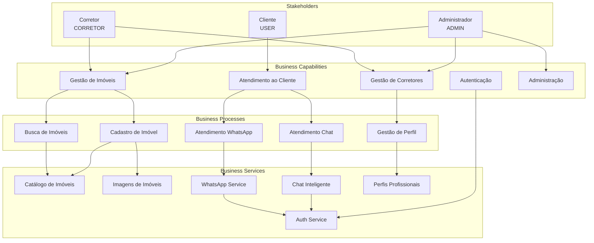

# Business Architecture Diagram

## Visão Geral

Este documento apresenta o diagrama integrado da **Arquitetura de Negócio** da plataforma Litoral Imóveis, mostrando as relações entre capacidades, processos, organização e serviços.

## Diagrama de Arquitetura de Negócio

## Mapa de Relacionamentos

### Capacidades → Processos

| Capacidade | Processos Relacionados |
|------------|----------------------|
| Gestão de Imóveis | Cadastro de Imóvel, Busca de Imóveis, Visualização de Detalhes |
| Gestão de Corretores | Gestão de Perfil Corretor, Promoção para Corretor |
| Atendimento ao Cliente | Atendimento via Chat, Atendimento via WhatsApp |
| Autenticação e Autorização | Registro de Usuário, Login de Usuário |
| Administração | Gestão de Usuários, Gestão de Imóveis, Gestão de Corretores |

### Processos → Serviços

| Processo | Serviços Utilizados |
|----------|-------------------|
| Cadastro de Imóvel | Catálogo de Imóveis, Imagens de Imóveis, Auth Service |
| Busca de Imóveis | Catálogo de Imóveis |
| Atendimento via Chat | Chat Inteligente, MCP Tools, Catálogo de Imóveis |
| Atendimento via WhatsApp | WhatsApp Service, Chat Inteligente |
| Gestão de Perfil | Perfis Profissionais, Auth Service |

### Organização → Capacidades

| Role | Capacidades Acessíveis |
|------|----------------------|
| ADMIN | Todas as capacidades |
| CORRETOR | Gestão de Imóveis (próprios), Gestão de Corretores (próprio perfil) |
| USER | Atendimento ao Cliente (consumidor) |

## Fluxo de Valor de Negócio

## Matriz de Responsabilidades

| Capacidade | ADMIN | CORRETOR | USER | Sistema |
|------------|-------|----------|------|---------|
| Gestão de Imóveis | ✅ Todos | ✅ Próprios | ❌ | ⚙️ Suporte |
| Gestão de Corretores | ✅ Todos | ✅ Próprio | ❌ | ⚙️ Suporte |
| Atendimento ao Cliente | ✅ | ✅ | ✅ | ⚙️ Automatizado |
| Autenticação | ✅ | ✅ | ✅ | ⚙️ Sistema |
| Administração | ✅ | ❌ | ❌ | ⚙️ Suporte |

## Objetivos de Negócio

1. **Aumentar Base de Imóveis**: Facilitar cadastro e gestão de imóveis
2. **Melhorar Atendimento**: Atendimento inteligente 24/7 via chat e WhatsApp
3. **Aumentar Conversão**: Facilitar busca e visualização de imóveis
4. **Escalar Operações**: Automação de processos de atendimento
5. **Melhorar Experiência**: Interface conversacional e intuitiva

## Métricas de Negócio

| Métrica | Objetivo | Atual |
|---------|----------|-------|
| Imóveis Cadastrados | Crescimento 20% mês | - |
| Buscas Realizadas | 1000+ por dia | - |
| Taxa de Conversão Chat | > 30% | - |
| Tempo Médio de Resposta | < 5s | - |
| Satisfação do Cliente | > 4.5/5 | - |

## Próximos Passos

- [ ] Definir KPIs específicos por capacidade
- [ ] Implementar dashboards de métricas
- [ ] Automatizar processos manuais
- [ ] Expandir canais de atendimento
- [ ] Integrar com sistemas externos (CRM, ERP)

