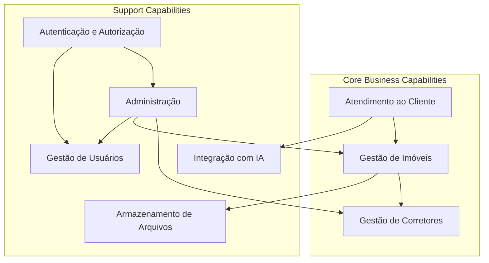

# Business Capabilities - Arquitetura de Negócio

## Visão Geral

Este documento mapeia as **capacidades de negócio** da plataforma Litoral Imóveis, identificando as habilidades organizacionais necessárias para alcançar os objetivos estratégicos.

## Capacidades Principais

### 1. Gestão de Imóveis (Property Management)

**Descrição**: Capacidade de gerenciar o ciclo de vida completo de imóveis na plataforma.

**Sub-capacidades**:
- Cadastro de Imóveis
- Atualização de Imóveis
- Exclusão de Imóveis
- Listagem e Busca de Imóveis
- Gestão de Imagens de Imóveis
- Definição de Imagem de Capa

**Responsáveis**: CORRETOR, ADMIN

**Aplicações de Suporte**: Properties Module, Property Images Module

### 2. Gestão de Corretores (Realtor Management)

**Descrição**: Capacidade de gerenciar perfis profissionais de corretores.

**Sub-capacidades**:
- Criação de Perfil Profissional
- Atualização de Perfil
- Visualização de Perfil
- Promoção de Usuário para Corretor

**Responsáveis**: ADMIN, CORRETOR (próprio perfil)

**Aplicações de Suporte**: Realtors Module, Admin Module

### 3. Atendimento ao Cliente (Customer Service)

**Descrição**: Capacidade de fornecer atendimento inteligente aos clientes através de múltiplos canais.

**Sub-capacidades**:
- Atendimento via Chat Inteligente
- Atendimento via WhatsApp
- Busca Conversacional de Imóveis
- Resolução de Dúvidas sobre Imóveis
- Manutenção de Contexto de Conversação

**Responsáveis**: Sistema Automatizado (Chatbot)

**Aplicações de Suporte**: Chat Module, WhatsApp Webhook Module, MCP Server

### 4. Autenticação e Autorização (Authentication & Authorization)

**Descrição**: Capacidade de gerenciar acesso e permissões dos usuários.

**Sub-capacidades**:
- Registro de Usuários
- Login de Usuários
- Gerenciamento de Tokens JWT
- Controle de Acesso Baseado em Roles
- Validação de Permissões

**Responsáveis**: Sistema

**Aplicações de Suporte**: Auth Module

### 5. Gestão de Usuários (User Management)

**Descrição**: Capacidade de gerenciar contas e perfis de usuários.

**Sub-capacidades**:
- Criação de Usuários
- Atualização de Perfis
- Visualização de Usuários
- Gestão de Roles

**Responsáveis**: ADMIN

**Aplicações de Suporte**: Users Module, Admin Module

### 6. Administração (Administration)

**Descrição**: Capacidade de administração geral da plataforma.

**Sub-capacidades**:
- Gestão de Usuários
- Gestão de Imóveis
- Visualização de Estatísticas
- Configurações do Sistema

**Responsáveis**: ADMIN

**Aplicações de Suporte**: Admin Module

### 7. Integração com IA (AI Integration)

**Descrição**: Capacidade de integrar serviços de inteligência artificial para melhorar a experiência do usuário.

**Sub-capacidades**:
- Processamento de Linguagem Natural
- Busca Inteligente de Imóveis
- Geração de Respostas Contextuais
- Integração com OpenAI

**Responsáveis**: Sistema

**Aplicações de Suporte**: Chat Module, MCP Server

### 8. Armazenamento de Arquivos (File Storage)

**Descrição**: Capacidade de armazenar e gerenciar arquivos (imagens de imóveis).

**Sub-capacidades**:
- Upload de Imagens
- Processamento de Imagens (redimensionamento, thumbnails)
- Armazenamento em MinIO
- Geração de URLs de Acesso

**Responsáveis**: Sistema

**Aplicações de Suporte**: Property Images Module, Storage Service

## Mapa de Capacidades

## Relacionamento com Aplicações

| Capacidade | Aplicações Principais |
|------------|----------------------|
| Gestão de Imóveis | Properties Module, Property Images Module |
| Gestão de Corretores | Realtors Module |
| Atendimento ao Cliente | Chat Module, WhatsApp Webhook Module |
| Autenticação e Autorização | Auth Module |
| Gestão de Usuários | Users Module, Admin Module |
| Administração | Admin Module |
| Integração com IA | Chat Module, MCP Server |
| Armazenamento de Arquivos | Property Images Module, Storage Service |

## Maturidade das Capacidades

| Capacidade | Nível de Maturidade | Observações |
|------------|-------------------|-------------|
| Gestão de Imóveis | Alto | Funcionalidade completa implementada |
| Gestão de Corretores | Médio | Perfis profissionais implementados |
| Atendimento ao Cliente | Alto | Chat e WhatsApp funcionais |
| Autenticação e Autorização | Alto | JWT e roles implementados |
| Gestão de Usuários | Médio | Funcionalidades básicas |
| Administração | Baixo | Em desenvolvimento |
| Integração com IA | Alto | OpenAI integrado via MCP |
| Armazenamento de Arquivos | Alto | MinIO integrado |

## Próximos Passos

- [ ] Expandir capacidade de Administração
- [ ] Adicionar capacidade de Relatórios e Analytics
- [ ] Implementar capacidade de Notificações
- [ ] Adicionar capacidade de Pagamentos (futuro)

