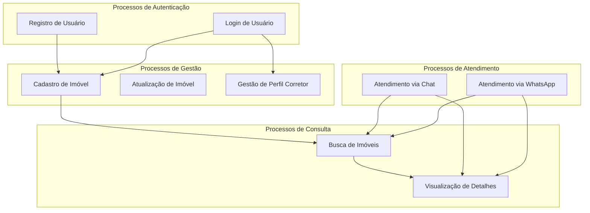

# Business Processes - Processos de Negócio

## Visão Geral

Este documento descreve os **processos de negócio principais** da plataforma Litoral Imóveis, mapeando os fluxos de trabalho que suportam as capacidades de negócio.

## Processos Principais

### 1. Processo: Cadastro de Imóvel

**Objetivo**: Registrar um novo imóvel na plataforma com todas as informações necessárias.

**Ator Principal**: Corretor

**Fluxo**:
1. Corretor autentica no sistema
2. Acessa funcionalidade de cadastro de imóvel
3. Preenche informações básicas (título, descrição, tipo, finalidade, preço)
4. Informa localização (cidade, bairro)
5. Adiciona características (quartos, banheiros, área, vagas)
6. Seleciona comodidades (piscina, jacuzzi, frente mar, etc.)
7. Faz upload de imagens do imóvel
8. Define imagem de capa
9. Sistema valida dados
10. Sistema salva imóvel no banco de dados
11. Sistema processa e armazena imagens
12. Sistema retorna confirmação

**Aplicações Envolvidas**: Properties Module, Property Images Module, Auth Module

**Dados Envolvidos**: Property, PropertyImage, User

### 2. Processo: Busca de Imóveis

**Objetivo**: Permitir que clientes encontrem imóveis que atendam seus critérios.

**Ator Principal**: Cliente (via Chat ou API)

**Fluxo**:
1. Cliente envia consulta (via chat ou API)
2. Sistema processa filtros (cidade, tipo, finalidade, preço, comodidades)
3. Sistema busca imóveis no banco de dados
4. Sistema preenche imagens de capa automaticamente se necessário
5. Sistema formata resultados
6. Sistema retorna lista de imóveis

**Aplicações Envolvidas**: Properties Module, Chat Module (se via chat)

**Dados Envolvidos**: Property, PropertyImage

### 3. Processo: Atendimento via Chat

**Objetivo**: Fornecer atendimento inteligente aos clientes através de chat conversacional.

**Ator Principal**: Cliente

**Fluxo**:
1. Cliente envia mensagem no chat
2. Sistema identifica intenção do cliente
3. Sistema determina se precisa buscar informações (via MCP Tools)
4. Sistema chama ferramentas apropriadas (list_properties, get_property_by_id)
5. Sistema recebe dados atualizados
6. Sistema formata resposta contextual
7. Sistema retorna resposta ao cliente
8. Sistema mantém contexto da conversa (sessionId)

**Aplicações Envolvidas**: Chat Module, MCP Server, Properties Module

**Dados Envolvidos**: Property, Conversation, Message

### 4. Processo: Atendimento via WhatsApp

**Objetivo**: Fornecer atendimento via WhatsApp com registro automático de usuários.

**Ator Principal**: Cliente

**Fluxo**:
1. Cliente envia mensagem no WhatsApp
2. Evolution API recebe mensagem
3. Webhook envia mensagem para backend
4. Sistema identifica se usuário está registrado
5. Se não registrado, sistema registra automaticamente
6. Sistema processa mensagem (similar ao chat)
7. Sistema retorna resposta via Evolution API
8. Cliente recebe resposta no WhatsApp

**Aplicações Envolvidas**: WhatsApp Webhook Module, Chat Module, Auth Module

**Dados Envolvidos**: User, Message, Conversation

### 5. Processo: Visualização de Detalhes de Imóvel

**Objetivo**: Exibir informações completas de um imóvel específico.

**Ator Principal**: Cliente

**Fluxo**:
1. Cliente solicita detalhes de imóvel (por ID ou via chat)
2. Sistema valida ID do imóvel
3. Sistema busca imóvel no banco de dados
4. Sistema busca imagens do imóvel
5. Sistema busca perfil do corretor responsável
6. Sistema formata dados completos
7. Sistema retorna detalhes do imóvel

**Aplicações Envolvidas**: Properties Module, Property Images Module, Realtors Module

**Dados Envolvidos**: Property, PropertyImage, RealtorProfile, User

### 6. Processo: Gestão de Perfil de Corretor

**Objetivo**: Permitir que corretores gerenciem seu perfil profissional.

**Ator Principal**: Corretor

**Fluxo**:
1. Corretor autentica no sistema
2. Acessa área de perfil profissional
3. Visualiza ou atualiza informações (nome fantasia, contato, redes sociais)
4. Sistema valida dados
5. Sistema salva perfil
6. Sistema retorna confirmação

**Aplicações Envolvidas**: Realtors Module, Auth Module

**Dados Envolvidos**: RealtorProfile, User

### 7. Processo: Registro de Usuário

**Objetivo**: Criar nova conta de usuário na plataforma.

**Ator Principal**: Usuário

**Fluxo**:
1. Usuário acessa formulário de registro
2. Preenche dados (nome, email, senha, telefone)
3. Sistema valida dados
4. Sistema verifica se email já existe
5. Sistema cria hash da senha
6. Sistema cria usuário no banco de dados
7. Sistema retorna confirmação

**Aplicações Envolvidas**: Auth Module, Users Module

**Dados Envolvidos**: User

### 8. Processo: Login de Usuário

**Objetivo**: Autenticar usuário no sistema.

**Ator Principal**: Usuário

**Fluxo**:
1. Usuário envia credenciais (email, senha)
2. Sistema busca usuário por email
3. Sistema valida senha
4. Sistema gera token JWT
5. Sistema retorna token e informações do usuário

**Aplicações Envolvidas**: Auth Module

**Dados Envolvidos**: User

## Diagrama de Processos de Negócio

## Relacionamento Processo-Capacidade

| Processo | Capacidade de Negócio |
|----------|----------------------|
| Cadastro de Imóvel | Gestão de Imóveis |
| Busca de Imóveis | Gestão de Imóveis, Atendimento ao Cliente |
| Atendimento via Chat | Atendimento ao Cliente, Integração com IA |
| Atendimento via WhatsApp | Atendimento ao Cliente |
| Visualização de Detalhes | Gestão de Imóveis, Atendimento ao Cliente |
| Gestão de Perfil Corretor | Gestão de Corretores |
| Registro de Usuário | Autenticação e Autorização |
| Login de Usuário | Autenticação e Autorização |

## Métricas de Processo

| Processo | Volume Esperado | Tempo Médio | SLA |
|----------|----------------|-------------|-----|
| Cadastro de Imóvel | Baixo | < 30s | 99% |
| Busca de Imóveis | Alto | < 2s | 99.9% |
| Atendimento via Chat | Médio | < 5s | 95% |
| Atendimento via WhatsApp | Médio | < 10s | 95% |
| Visualização de Detalhes | Alto | < 1s | 99.9% |
| Gestão de Perfil | Baixo | < 10s | 99% |
| Registro de Usuário | Médio | < 5s | 99% |
| Login de Usuário | Alto | < 1s | 99.9% |

## Melhorias Futuras

- [ ] Processo de Agendamento de Visitas
- [ ] Processo de Negociação de Preços
- [ ] Processo de Contratos Digitais
- [ ] Processo de Pagamentos Online
- [ ] Processo de Avaliação de Imóveis

