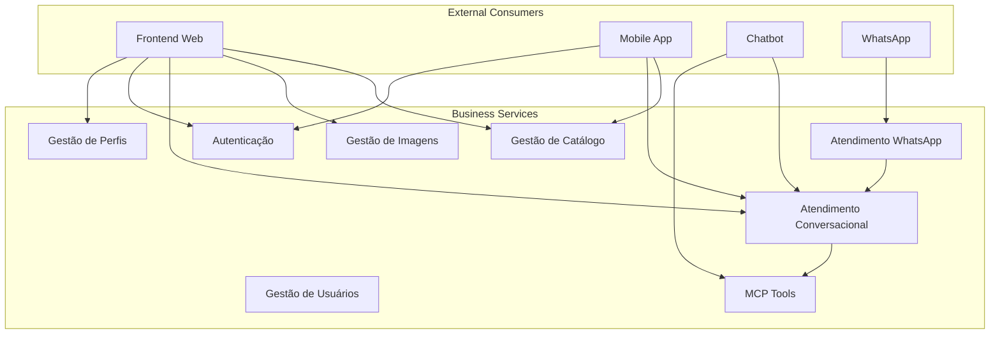

# Business Services - Serviços de Negócio

## Visão Geral

Este documento cataloga os **serviços de negócio** expostos pela plataforma Litoral Imóveis, definindo as interfaces de negócio disponíveis para clientes e parceiros.

## Serviços de Negócio Principais

### 1. Serviço: Gestão de Catálogo de Imóveis

**Descrição**: Serviço que permite gerenciar o catálogo completo de imóveis disponíveis na plataforma.

**Operações**:
- `createProperty`: Criar novo imóvel
- `updateProperty`: Atualizar imóvel existente
- `deleteProperty`: Remover imóvel
- `listProperties`: Listar imóveis com filtros
- `getPropertyById`: Obter detalhes de imóvel específico
- `listMyProperties`: Listar imóveis do corretor autenticado

**Interface**: REST API (`/api/properties`)

**Consumidores**: Frontend Web, Mobile App, Chatbot

**Responsáveis**: CORRETOR, ADMIN

### 2. Serviço: Gestão de Imagens de Imóveis

**Descrição**: Serviço para gerenciar imagens associadas a imóveis.

**Operações**:
- `uploadImage`: Fazer upload de imagem
- `listImages`: Listar imagens de um imóvel
- `setCoverImage`: Definir imagem de capa
- `deleteImage`: Remover imagem
- `reorderImages`: Reordenar imagens

**Interface**: REST API (`/api/properties/:id/images`)

**Consumidores**: Frontend Web, Mobile App

**Responsáveis**: CORRETOR, ADMIN

### 3. Serviço: Atendimento Conversacional

**Descrição**: Serviço de atendimento inteligente via chat utilizando IA.

**Operações**:
- `sendMessage`: Enviar mensagem e receber resposta
- `maintainContext`: Manter contexto da conversa (sessionId)

**Interface**: REST API (`/api/chat`)

**Consumidores**: Frontend Web, Mobile App

**Características**:
- Processamento de linguagem natural
- Integração com MCP Tools
- Respostas contextuais
- Suporte a múltiplos canais (Web, WhatsApp)

### 4. Serviço: Atendimento via WhatsApp

**Descrição**: Serviço de atendimento via WhatsApp com registro automático.

**Operações**:
- `receiveMessage`: Receber mensagem do WhatsApp
- `sendMessage`: Enviar resposta via WhatsApp
- `registerUser`: Registrar usuário automaticamente

**Interface**: Webhook (`/api/whatsapp-webhook`)

**Consumidores**: Evolution API (WhatsApp)

**Características**:
- Integração com Evolution API
- Registro automático de usuários
- Processamento de mensagens
- Envio de respostas

### 5. Serviço: Autenticação e Autorização

**Descrição**: Serviço para gerenciar autenticação e controle de acesso.

**Operações**:
- `register`: Registrar novo usuário
- `login`: Autenticar usuário
- `validateToken`: Validar token JWT
- `refreshToken`: Renovar token (futuro)

**Interface**: REST API (`/api/auth`)

**Consumidores**: Todos os serviços que requerem autenticação

**Características**:
- JWT tokens
- Roles e permissões
- Validação de credenciais
- Hash de senhas (bcrypt)

### 6. Serviço: Gestão de Perfis Profissionais

**Descrição**: Serviço para gerenciar perfis profissionais de corretores.

**Operações**:
- `createProfile`: Criar perfil profissional
- `updateProfile`: Atualizar perfil
- `getProfile`: Obter perfil
- `getMyProfile`: Obter próprio perfil

**Interface**: REST API (`/api/realtors`)

**Consumidores**: Frontend Web, Mobile App

**Responsáveis**: CORRETOR (próprio perfil), ADMIN (todos)

### 7. Serviço: Gestão de Usuários

**Descrição**: Serviço para gerenciar contas de usuários.

**Operações**:
- `listUsers`: Listar usuários
- `getUserById`: Obter usuário por ID
- `updateUser`: Atualizar usuário
- `promoteToCorretor`: Promover usuário para corretor

**Interface**: REST API (`/api/users`, `/api/admin`)

**Consumidores**: Frontend Web (Admin)

**Responsáveis**: ADMIN

### 8. Serviço: MCP Tools (Model Context Protocol)

**Descrição**: Serviço que expõe ferramentas da plataforma via MCP para integração com IA.

**Operações**:
- `list_properties`: Listar imóveis (tool MCP)
- `get_property_by_id`: Obter imóvel por ID (tool MCP)

**Interface**: MCP Server (SSE ou STDIO)

**Consumidores**: Chatbot (via OpenAI), Agentes de IA externos

**Características**:
- Protocolo MCP padrão
- Conversão automática de OpenAPI para MCP
- Autenticação via token
- Suporte a SSE e STDIO

## Diagrama de Serviços de Negócio

## Matriz Serviço-Capacidade

| Serviço de Negócio | Capacidade de Negócio |
|-------------------|---------------------|
| Gestão de Catálogo de Imóveis | Gestão de Imóveis |
| Gestão de Imagens de Imóveis | Gestão de Imóveis, Armazenamento de Arquivos |
| Atendimento Conversacional | Atendimento ao Cliente, Integração com IA |
| Atendimento via WhatsApp | Atendimento ao Cliente |
| Autenticação e Autorização | Autenticação e Autorização |
| Gestão de Perfis Profissionais | Gestão de Corretores |
| Gestão de Usuários | Gestão de Usuários, Administração |
| MCP Tools | Integração com IA |

## SLA dos Serviços

| Serviço | Disponibilidade | Tempo de Resposta | Throughput |
|---------|----------------|-------------------|------------|
| Gestão de Catálogo | 99.9% | < 500ms | 100 req/s |
| Gestão de Imagens | 99.5% | < 2s | 10 req/s |
| Atendimento Conversacional | 95% | < 5s | 50 req/s |
| Atendimento WhatsApp | 95% | < 10s | 20 req/s |
| Autenticação | 99.9% | < 200ms | 200 req/s |
| Gestão de Perfis | 99% | < 300ms | 50 req/s |
| Gestão de Usuários | 99% | < 500ms | 50 req/s |
| MCP Tools | 99% | < 3s | 30 req/s |

## Segurança dos Serviços

| Serviço | Autenticação | Autorização | Criptografia |
|---------|-------------|-------------|--------------|
| Gestão de Catálogo | JWT | Role-based | HTTPS |
| Gestão de Imagens | JWT | Role-based | HTTPS |
| Atendimento Conversacional | Opcional | Público | HTTPS |
| Atendimento WhatsApp | Token | Webhook validation | HTTPS |
| Autenticação | Credenciais | Público | HTTPS + bcrypt |
| Gestão de Perfis | JWT | Role-based | HTTPS |
| Gestão de Usuários | JWT | ADMIN only | HTTPS |
| MCP Tools | Token | MCP Auth | HTTPS/STDIO |

## Versionamento

Todos os serviços REST seguem o padrão:
- Base URL: `/api`
- Versionamento futuro: `/api/v1`, `/api/v2`
- Documentação: Swagger/OpenAPI

## Próximos Serviços

- [ ] Serviço de Notificações
- [ ] Serviço de Relatórios
- [ ] Serviço de Analytics
- [ ] Serviço de Pagamentos
- [ ] Serviço de Contratos

