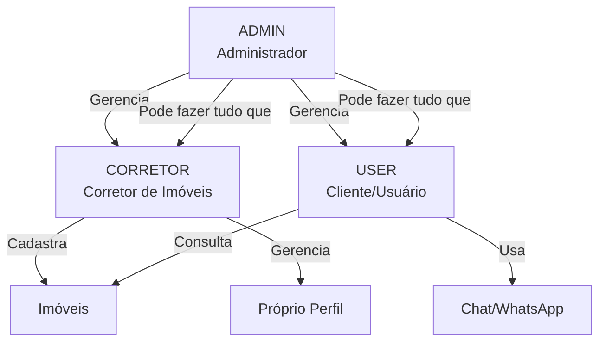
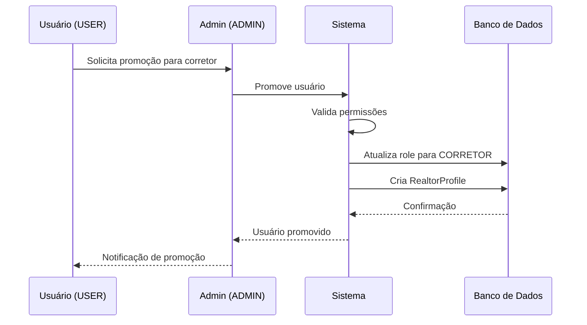

# Organization Structure - Estrutura Organizacional

## Visão Geral

Este documento descreve a **estrutura organizacional** da plataforma Litoral Imóveis, definindo os roles, responsabilidades e hierarquia de usuários.

## Roles e Responsabilidades

### 1. ADMIN (Administrador)

**Descrição**: Usuário com acesso total ao sistema, responsável pela administração geral da plataforma.

**Permissões**:
- Gerenciar todos os usuários
- Gerenciar todos os imóveis
- Promover usuários para corretor
- Acessar dashboard administrativo
- Visualizar estatísticas gerais
- Configurar sistema

**Capacidades de Negócio**:
- Administração
- Gestão de Usuários
- Gestão de Imóveis
- Gestão de Corretores

**Aplicações**: Admin Module, Users Module, Properties Module, Realtors Module

### 2. CORRETOR (Corretor de Imóveis)

**Descrição**: Profissional responsável por cadastrar e gerenciar imóveis na plataforma.

**Permissões**:
- Cadastrar imóveis
- Atualizar próprios imóveis
- Deletar próprios imóveis
- Gerenciar imagens de próprios imóveis
- Gerenciar próprio perfil profissional
- Visualizar próprios imóveis

**Capacidades de Negócio**:
- Gestão de Imóveis (próprios)
- Gestão de Corretores (próprio perfil)

**Aplicações**: Properties Module, Property Images Module, Realtors Module

**Perfil Profissional**:
- Nome fantasia da imobiliária
- Nome de contato
- Telefone
- Email
- Redes sociais (Instagram, Facebook, LinkedIn)
- WhatsApp Business

### 3. USER (Usuário/Cliente)

**Descrição**: Cliente da plataforma que busca imóveis para alugar ou comprar.

**Permissões**:
- Buscar imóveis
- Visualizar detalhes de imóveis
- Usar chat para atendimento
- Usar WhatsApp para atendimento
- Registrar conta
- Atualizar próprio perfil

**Capacidades de Negócio**:
- Atendimento ao Cliente (consumidor)

**Aplicações**: Properties Module (read-only), Chat Module, WhatsApp Webhook Module

**Funcionalidades**:
- Busca de imóveis com filtros
- Visualização de detalhes completos
- Atendimento conversacional via chat
- Atendimento via WhatsApp

## Hierarquia Organizacional

## Matriz de Permissões

| Funcionalidade | ADMIN | CORRETOR | USER |
|----------------|-------|----------|------|
| Gerenciar Usuários | ✅ | ❌ | ❌ |
| Promover para Corretor | ✅ | ❌ | ❌ |
| Cadastrar Imóveis | ✅ | ✅ (próprios) | ❌ |
| Atualizar Imóveis | ✅ (todos) | ✅ (próprios) | ❌ |
| Deletar Imóveis | ✅ (todos) | ✅ (próprios) | ❌ |
| Gerenciar Imagens | ✅ (todos) | ✅ (próprios) | ❌ |
| Buscar Imóveis | ✅ | ✅ | ✅ |
| Visualizar Detalhes | ✅ | ✅ | ✅ |
| Usar Chat | ✅ | ✅ | ✅ |
| Usar WhatsApp | ✅ | ✅ | ✅ |
| Gerenciar Perfil Profissional | ✅ (todos) | ✅ (próprio) | ❌ |
| Acessar Dashboard Admin | ✅ | ❌ | ❌ |

## Fluxo de Promoção para Corretor

## Estrutura de Dados Organizacional

### User Entity
- `id`: Identificador único
- `name`: Nome do usuário
- `email`: Email (único)
- `role`: Role (USER, CORRETOR, ADMIN)
- `phone`: Telefone
- `whatsappNumber`: WhatsApp
- `preferredAgentId`: Corretor preferido (para USER)

### RealtorProfile Entity
- `id`: Identificador único
- `userId`: Referência ao User
- `businessName`: Nome fantasia
- `contactName`: Nome de contato
- `phone`: Telefone profissional
- `email`: Email profissional
- `instagram`: Instagram
- `facebook`: Facebook
- `linkedin`: LinkedIn
- `whatsappBusiness`: WhatsApp Business

## Regras de Negócio

1. **Apenas ADMIN pode promover usuários para CORRETOR**
2. **CORRETOR só pode gerenciar próprios imóveis**
3. **ADMIN pode gerenciar todos os imóveis**
4. **USER não pode criar ou modificar imóveis**
5. **Todos os roles podem buscar e visualizar imóveis**
6. **Perfil profissional só existe para CORRETOR**

## Integração com Aplicações

| Role | Módulos Principais |
|------|-------------------|
| ADMIN | Admin Module, Users Module, Properties Module, Realtors Module |
| CORRETOR | Properties Module, Property Images Module, Realtors Module |
| USER | Properties Module (read-only), Chat Module, WhatsApp Webhook Module |

## Evolução Futura

- [ ] Role de MODERADOR (moderação de conteúdo)
- [ ] Role de FINANCEIRO (gestão financeira)
- [ ] Hierarquia de CORRETOR (sênior, júnior)
- [ ] Equipes de corretores
- [ ] Gestão de comissões

