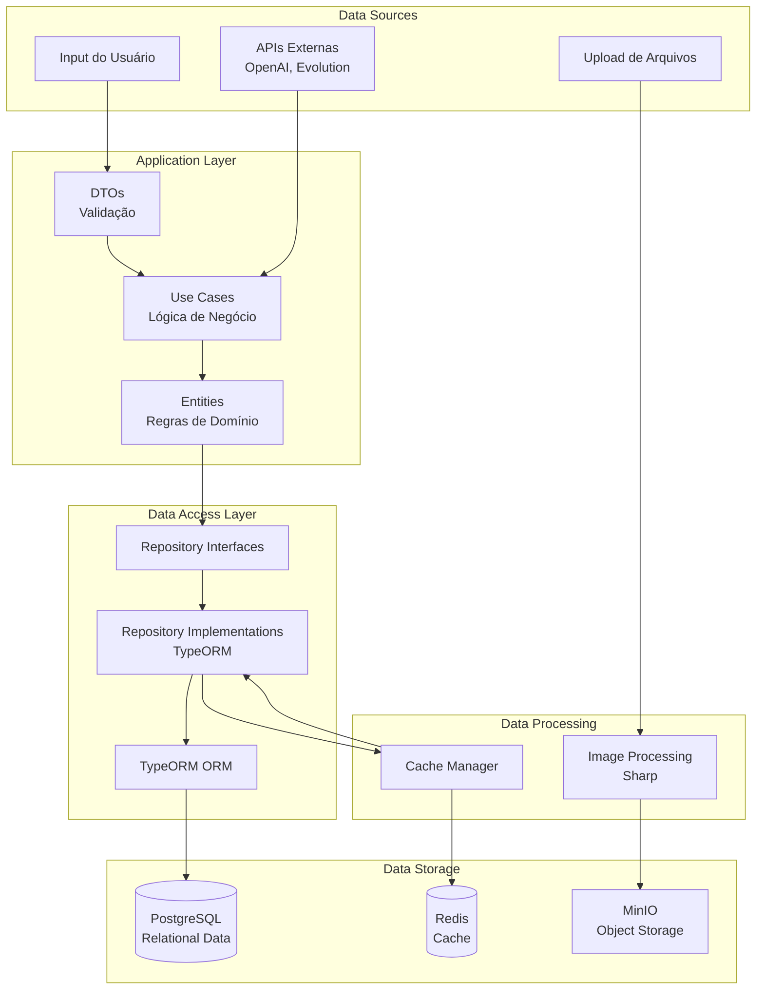
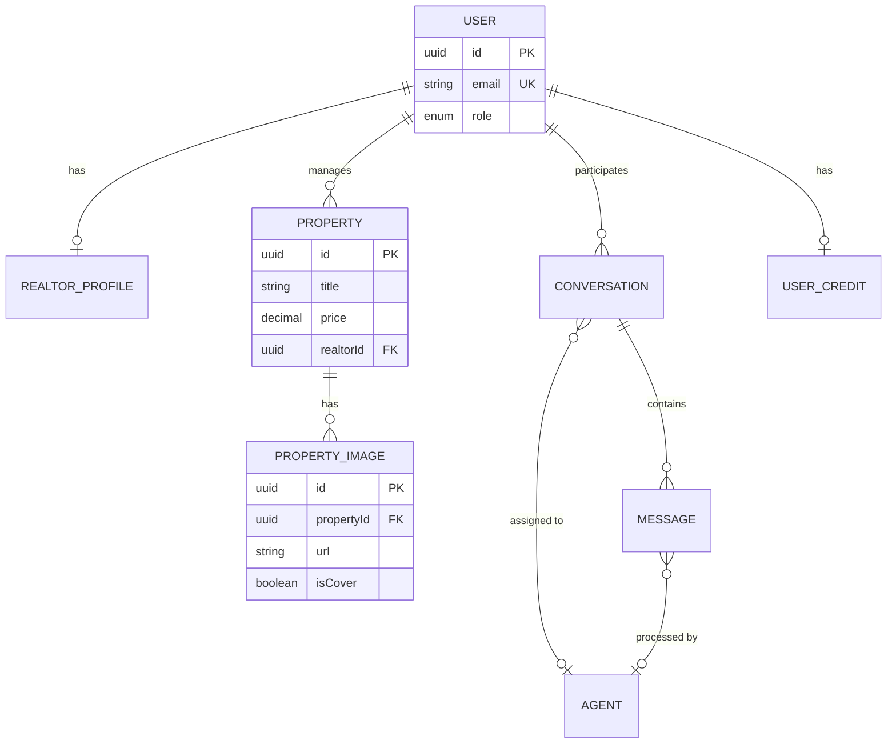
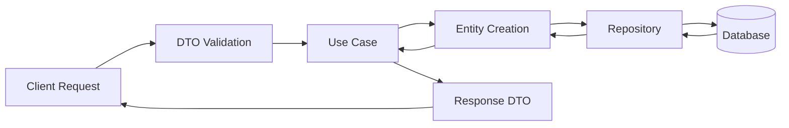
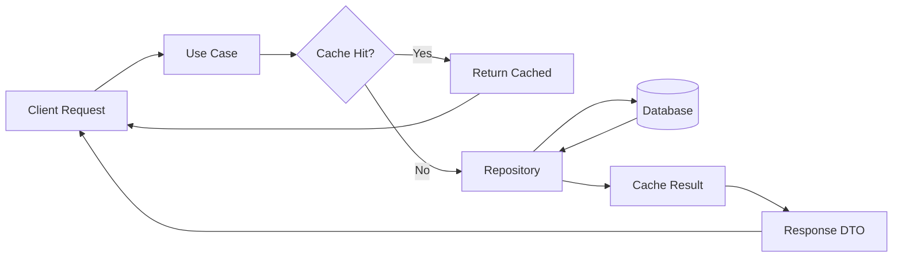
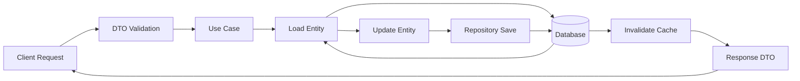
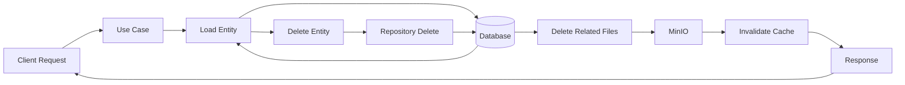
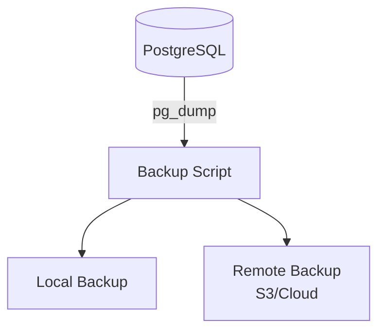

# Data Architecture Diagram

## Visão Geral

Este documento apresenta o **diagrama de arquitetura de dados** da plataforma Litoral Imóveis, mostrando a estrutura completa de armazenamento, processamento e fluxo de dados.

## Arquitetura de Dados Completa



## Camadas de Dados

### 1. Camada de Apresentação (Data Input)

**Componentes**:
- DTOs (Data Transfer Objects)
- Validators (class-validator)
- Transformers (class-transformer)

**Responsabilidades**:
- Validação de formato
- Sanitização de entrada
- Transformação de tipos

**Exemplo**:
```typescript
// Input validation
@IsString()
@IsNotEmpty()
@MaxLength(255)
title: string;

@IsNumber()
@Min(0)
price: number;
```

### 2. Camada de Aplicação (Business Logic)

**Componentes**:
- Use Cases
- Service Interfaces

**Responsabilidades**:
- Validação de regras de negócio
- Orquestração de operações
- Transformação de dados

**Exemplo**:
```typescript
// Business logic validation
if (newPrice <= 0) {
  throw new Error('Price must be greater than zero');
}
```

### 3. Camada de Domínio (Domain Rules)

**Componentes**:
- Entities
- Value Objects
- Domain Methods

**Responsabilidades**:
- Regras de negócio imutáveis
- Invariantes de domínio
- Métodos de domínio

**Exemplo**:
```typescript
// Domain method
public updatePrice(newPrice: number): void {
  if (newPrice <= 0) {
    throw new Error('Price must be greater than zero');
  }
  this.price = newPrice;
  this.updatedAt = new Date();
}
```

### 4. Camada de Infraestrutura (Data Access)

**Componentes**:
- Repository Implementations
- TypeORM
- Database Connections

**Responsabilidades**:
- Persistência de dados
- Queries otimizadas
- Transações

**Exemplo**:
```typescript
// Repository implementation
async findAll(): Promise<Property[]> {
  return this.repository.find({
    relations: ['realtor'],
    order: { createdAt: 'DESC' },
  });
}
```

### 5. Camada de Armazenamento (Storage)

**Componentes**:
- PostgreSQL (relacional)
- MinIO (objetos)
- Redis (cache)

**Responsabilidades**:
- Persistência permanente
- Armazenamento de arquivos
- Cache de dados frequentes

## Modelo de Dados Lógico



## Estratégias de Armazenamento

### 1. Dados Relacionais (PostgreSQL)

**Uso**: Dados estruturados com relacionamentos

**Tabelas**:
- `users`
- `properties`
- `property_images`
- `realtor_profiles`
- `conversations`
- `messages`
- `agents`
- `user_credits`

**Características**:
- ACID compliance
- Transações
- Integridade referencial
- Queries complexas

### 2. Armazenamento de Objetos (MinIO)

**Uso**: Arquivos binários (imagens)

**Estrutura**:
```
bucket: gwan-imoveis-uploads
  └── properties/
      └── {propertyId}/
          ├── {timestamp}-original-image-{index}.jpg
          └── thumb-{timestamp}-original-image-{index}.jpg
```

**Características**:
- Escalável
- URLs públicas
- Versionamento (futuro)

### 3. Cache (Redis)

**Uso**: Dados frequentes, sessões

**Estrutura**:
- Chaves: `properties:{filters_hash}`
- TTL: 1 hora
- Formato: JSON

**Características**:
- Alta performance
- TTL automático
- Distribuído (futuro)

## Fluxo de Dados Completo

### Create Flow



### Read Flow



### Update Flow



### Delete Flow



## Estratégias de Backup

### Backup de Banco de Dados



**Frequência**:
- Diário: Backup completo
- Incremental: A cada 6 horas
- Retenção: 30 dias diários, 12 meses mensais

### Backup de Arquivos

**Estratégia**:
- Replicação no MinIO
- Sincronização com backup remoto
- Versionamento de arquivos (futuro)

## Segurança de Dados

### Criptografia

**Em Trânsito**:
- HTTPS para todas as comunicações
- SSL/TLS para conexões de banco
- TLS para Redis

**Em Repouso**:
- Senhas: Hash bcrypt
- Tokens: JWT assinados
- Arquivos: Acesso via URLs (futuro: assinadas)

### Controle de Acesso

**Níveis**:
- Público: Dados de imóveis (read-only)
- Autenticado: Dados próprios
- Autorizado: Dados baseados em role

**Implementação**:
- JWT tokens
- Role-based access control
- Guards do NestJS

## Performance e Otimização

### Índices

**Principais Índices**:
- `properties.realtorId` (FK)
- `properties.city` (busca)
- `conversations.phoneNumber` (busca)
- `messages.conversationId` (FK)
- `messages.timestamp` (ordenação)

### Cache Strategy

**Cache de Queries**:
- Listagens de propriedades: 1 hora
- Detalhes de propriedade: 30 minutos
- Perfis de corretores: 1 hora

**Invalidação**:
- On create/update/delete
- TTL automático

### Otimizações Futuras

- [ ] Particionamento de tabelas grandes
- [ ] Read replicas para PostgreSQL
- [ ] CDN para imagens
- [ ] Elasticsearch para busca
- [ ] Data warehouse para analytics

## Próximas Melhorias

- [ ] Implementar data warehouse
- [ ] Adicionar data lake para logs
- [ ] Implementar streaming de dados
- [ ] Adicionar search engine (Elasticsearch)
- [ ] Implementar data quality checks automatizados

