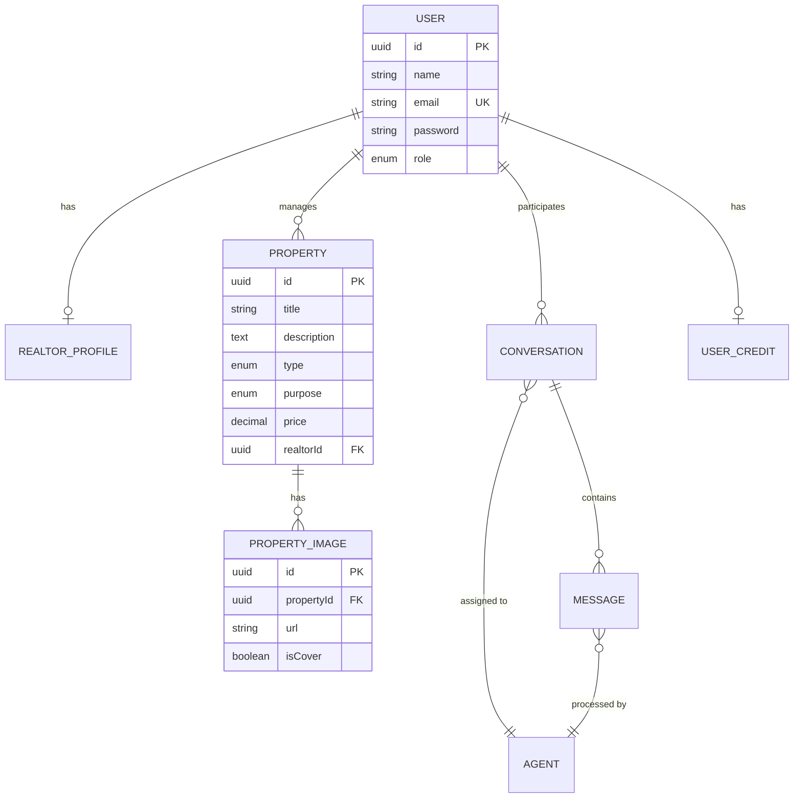

# Data Catalog - Catálogo de Dados

## Visão Geral

Este documento cataloga todas as **entidades de dados** da plataforma Litoral Imóveis, descrevendo suas estruturas, relacionamentos e uso.

## Entidades Principais

### 1. Property (Imóvel)

**ID**: ENT-001  
**Tabela**: `properties`  
**Descrição**: Representa um imóvel cadastrado na plataforma.

**Atributos Principais**:
- `id` (UUID, PK): Identificador único
- `title` (VARCHAR 255): Título do imóvel
- `description` (TEXT): Descrição detalhada
- `type` (ENUM): Tipo (CASA, APARTAMENTO, TERRENO, SALA_COMERCIAL)
- `purpose` (ENUM): Finalidade (RENT, SALE, INVESTMENT)
- `price` (DECIMAL 12,2): Preço
- `neighborhood` (VARCHAR 255): Bairro
- `city` (VARCHAR 255): Cidade
- `bedrooms` (INT): Número de quartos
- `bathrooms` (INT): Número de banheiros
- `area` (DECIMAL 10,2): Área em m²
- `garageSpaces` (INT): Vagas de garagem
- `hasPool` (BOOLEAN): Tem piscina
- `hasJacuzzi` (BOOLEAN): Tem hidromassagem
- `oceanFront` (BOOLEAN): Frente para o mar
- `hasGarden` (BOOLEAN): Tem jardim
- `hasGourmetArea` (BOOLEAN): Tem área gourmet
- `furnished` (BOOLEAN): Mobiliado
- `realtorId` (UUID, FK): ID do corretor responsável
- `coverImageUrl` (VARCHAR 500): URL da imagem de capa
- `createdAt` (TIMESTAMP): Data de criação
- `updatedAt` (TIMESTAMP): Data de atualização

**Relacionamentos**:
- Many-to-One com User (realtor)
- One-to-Many com PropertyImage

**Uso**: Core da aplicação, usado em todas as funcionalidades principais

**Localização**: `src/shared/domain/entities/property.entity.ts`

### 2. PropertyImage (Imagem de Imóvel)

**ID**: ENT-002  
**Tabela**: `property_images`  
**Descrição**: Representa uma imagem associada a um imóvel.

**Atributos Principais**:
- `id` (UUID, PK): Identificador único
- `propertyId` (UUID, FK): ID do imóvel
- `url` (VARCHAR 500): URL da imagem original
- `thumbnailUrl` (VARCHAR 500): URL do thumbnail
- `filePath` (VARCHAR 500): Caminho do arquivo no storage
- `thumbnailPath` (VARCHAR 500): Caminho do thumbnail
- `isCover` (BOOLEAN): É imagem de capa
- `order` (INT): Ordem de exibição
- `createdAt` (TIMESTAMP): Data de criação
- `updatedAt` (TIMESTAMP): Data de atualização

**Relacionamentos**:
- Many-to-One com Property

**Uso**: Gestão de imagens de imóveis, definição de capa

**Localização**: `src/shared/domain/entities/property-image.entity.ts`

### 3. User (Usuário)

**ID**: ENT-003  
**Tabela**: `users`  
**Descrição**: Representa um usuário da plataforma (cliente, corretor ou admin).

**Atributos Principais**:
- `id` (UUID, PK): Identificador único
- `name` (VARCHAR 255): Nome do usuário
- `email` (VARCHAR 255, UNIQUE): Email
- `password` (VARCHAR 255): Hash da senha (bcrypt)
- `phone` (VARCHAR 20): Telefone
- `whatsappNumber` (VARCHAR 20): WhatsApp
- `role` (ENUM): Role (USER, CORRETOR, ADMIN)
- `preferredAgentId` (UUID, FK): ID do agente preferido
- `createdAt` (TIMESTAMP): Data de criação
- `updatedAt` (TIMESTAMP): Data de atualização

**Relacionamentos**:
- One-to-One com RealtorProfile (se CORRETOR)
- One-to-Many com Property (como realtor)
- One-to-Many com Conversation
- One-to-One com UserCredit

**Uso**: Autenticação, autorização, gestão de usuários

**Localização**: `src/shared/domain/entities/user.entity.ts`

### 4. RealtorProfile (Perfil Profissional)

**ID**: ENT-004  
**Tabela**: `realtor_profiles`  
**Descrição**: Representa o perfil profissional de um corretor.

**Atributos Principais**:
- `id` (UUID, PK): Identificador único
- `userId` (UUID, FK, UNIQUE): ID do usuário corretor
- `businessName` (VARCHAR 255): Nome fantasia da imobiliária
- `contactName` (VARCHAR 255): Nome de contato
- `phone` (VARCHAR 20): Telefone profissional
- `email` (VARCHAR 255): Email profissional
- `instagram` (VARCHAR 255): Instagram
- `facebook` (VARCHAR 255): Facebook
- `linkedin` (VARCHAR 255): LinkedIn
- `whatsappBusiness` (VARCHAR 20): WhatsApp Business
- `createdAt` (TIMESTAMP): Data de criação
- `updatedAt` (TIMESTAMP): Data de atualização

**Relacionamentos**:
- One-to-One com User

**Uso**: Exibição de informações profissionais dos corretores

**Localização**: `src/shared/domain/entities/realtor-profile.entity.ts`

### 5. Conversation (Conversa)

**ID**: ENT-005  
**Tabela**: `conversations`  
**Descrição**: Representa uma conversa entre usuário e sistema (chat ou WhatsApp).

**Atributos Principais**:
- `id` (UUID, PK): Identificador único (sessionId)
- `phoneNumber` (VARCHAR 50, INDEXED): Número de telefone
- `userId` (UUID, FK, INDEXED): ID do usuário (opcional)
- `instanceName` (VARCHAR 100): Nome da instância (WhatsApp)
- `status` (ENUM): Status (ACTIVE, ENDED)
- `currentAgentId` (UUID, FK): ID do agente atual
- `startedAt` (TIMESTAMP): Data de início
- `endedAt` (TIMESTAMP): Data de término
- `metadata` (JSONB): Metadados adicionais
- `createdAt` (TIMESTAMP): Data de criação
- `updatedAt` (TIMESTAMP): Data de atualização

**Relacionamentos**:
- Many-to-One com User (opcional)
- One-to-Many com Message
- Many-to-One com Agent

**Uso**: Manutenção de contexto de conversas, histórico de atendimento

**Localização**: `src/shared/domain/entities/conversation.entity.ts`

### 6. Message (Mensagem)

**ID**: ENT-006  
**Tabela**: `messages`  
**Descrição**: Representa uma mensagem em uma conversa.

**Atributos Principais**:
- `id` (UUID, PK): Identificador único
- `conversationId` (UUID, FK, INDEXED): ID da conversa
- `phoneNumber` (VARCHAR 50, INDEXED): Número de telefone
- `messageId` (VARCHAR 255, INDEXED): ID da mensagem do WhatsApp
- `content` (TEXT): Conteúdo da mensagem
- `direction` (ENUM): Direção (INCOMING, OUTGOING)
- `agentId` (UUID, FK): ID do agente que processou
- `channel` (ENUM, INDEXED): Canal (WEB, WHATSAPP)
- `timestamp` (TIMESTAMP, INDEXED): Timestamp da mensagem
- `response` (TEXT): Resposta gerada (para incoming)
- `toolsUsed` (JSONB): Tools usadas pelo chat
- `createdAt` (TIMESTAMP): Data de criação
- `updatedAt` (TIMESTAMP): Data de atualização

**Relacionamentos**:
- Many-to-One com Conversation
- Many-to-One com Agent

**Uso**: Histórico de mensagens, análise de conversas

**Localização**: `src/shared/domain/entities/message.entity.ts`

### 7. Agent (Agente)

**ID**: ENT-007  
**Tabela**: `agents`  
**Descrição**: Representa um agente de atendimento configurado.

**Atributos Principais**:
- `id` (UUID, PK): Identificador único
- `name` (VARCHAR 100): Nome do agente
- `slug` (VARCHAR 50, UNIQUE, INDEXED): Slug único
- `route` (VARCHAR 255): Rota do agente
- `active` (BOOLEAN): Está ativo
- `createdAt` (TIMESTAMP): Data de criação
- `updatedAt` (TIMESTAMP): Data de atualização

**Relacionamentos**:
- One-to-Many com Conversation
- One-to-Many com Message

**Uso**: Roteamento de conversas para agentes específicos

**Localização**: `src/shared/domain/entities/agent.entity.ts`

### 8. UserCredit (Crédito de Usuário)

**ID**: ENT-008  
**Tabela**: `user_credits`  
**Descrição**: Representa o saldo de créditos de um usuário (futuro uso).

**Atributos Principais**:
- `id` (UUID, PK): Identificador único
- `userId` (UUID, FK, INDEXED): ID do usuário
- `balance` (DECIMAL 10,2): Saldo de créditos
- `createdAt` (TIMESTAMP): Data de criação
- `updatedAt` (TIMESTAMP): Data de atualização

**Relacionamentos**:
- Many-to-One com User

**Uso**: Sistema de créditos (implementado, aguardando uso)

**Localização**: `src/shared/domain/entities/user-credit.entity.ts`

## Value Objects (Objetos de Valor)

### PropertyType
- CASA
- APARTAMENTO
- TERRENO
- SALA_COMERCIAL

### PropertyPurpose
- RENT (Aluguel)
- SALE (Venda)
- INVESTMENT (Investimento)

### UserRole
- USER
- CORRETOR
- ADMIN

### MessageDirection
- INCOMING
- OUTGOING

### MessageChannel
- WEB
- WHATSAPP

### ConversationStatus
- ACTIVE
- ENDED

## Diagrama de Relacionamentos

## Índices e Performance

### Índices Principais

**Property**:
- `realtorId` (FK index)
- `city` (para buscas por cidade)
- `type` (para buscas por tipo)
- `purpose` (para buscas por finalidade)

**Conversation**:
- `phoneNumber` (para busca por número)
- `userId` (para busca por usuário)
- `status` (para filtros)

**Message**:
- `conversationId` (FK index)
- `phoneNumber` (para busca)
- `timestamp` (para ordenação)
- `direction` (para filtros)
- `channel` (para filtros)

## Volume de Dados Esperado

| Entidade | Volume Esperado | Crescimento |
|----------|----------------|-------------|
| Property | 1.000 - 10.000 | 20% ao mês |
| PropertyImage | 5.000 - 50.000 | Proporcional a Property |
| User | 500 - 5.000 | 10% ao mês |
| RealtorProfile | 50 - 500 | Proporcional a CORRETOR |
| Conversation | 10.000 - 100.000 | 30% ao mês |
| Message | 50.000 - 500.000 | Proporcional a Conversation |
| Agent | 5 - 20 | Estável |
| UserCredit | 500 - 5.000 | Proporcional a User |

## Retenção de Dados

| Entidade | Período de Retenção | Observações |
|----------|-------------------|-------------|
| Property | Indefinido | Dados críticos de negócio |
| PropertyImage | Indefinido | Vinculado a Property |
| User | Indefinido | Dados de conta |
| RealtorProfile | Indefinido | Vinculado a User |
| Conversation | 2 anos | Histórico de atendimento |
| Message | 2 anos | Vinculado a Conversation |
| Agent | Indefinido | Configuração |
| UserCredit | Indefinido | Dados financeiros |

## Próximas Entidades

- [ ] Visit (Agendamento de visitas)
- [ ] Contract (Contratos digitais)
- [ ] Payment (Pagamentos)
- [ ] Review (Avaliações de imóveis)
- [ ] Favorite (Imóveis favoritos)

