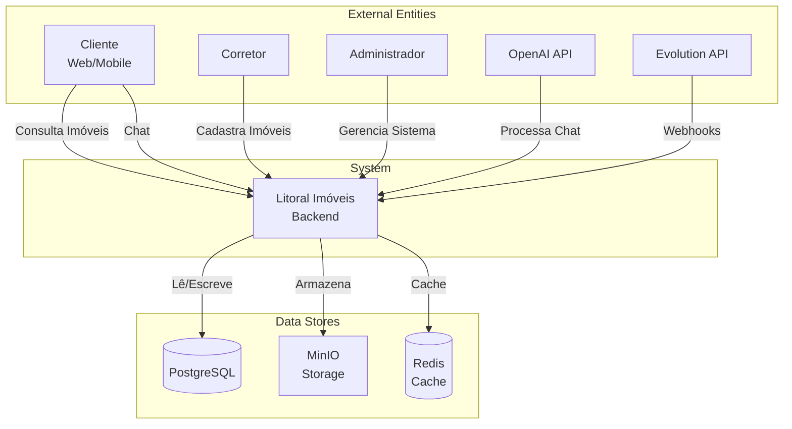
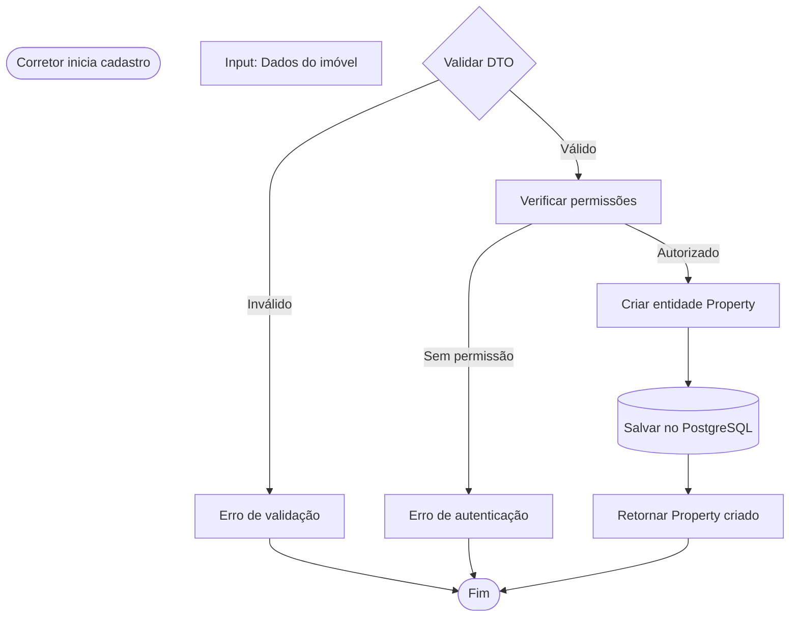
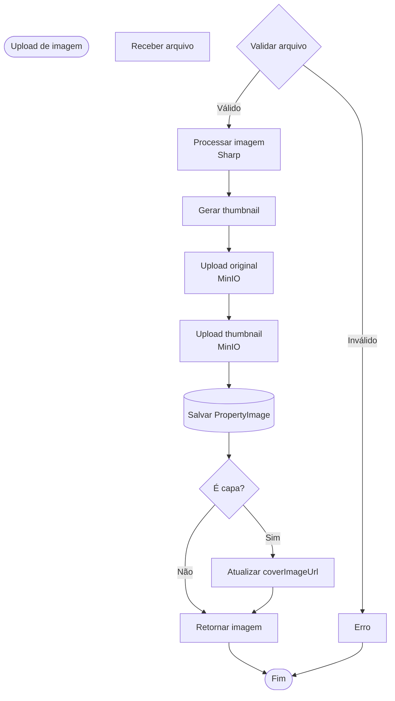
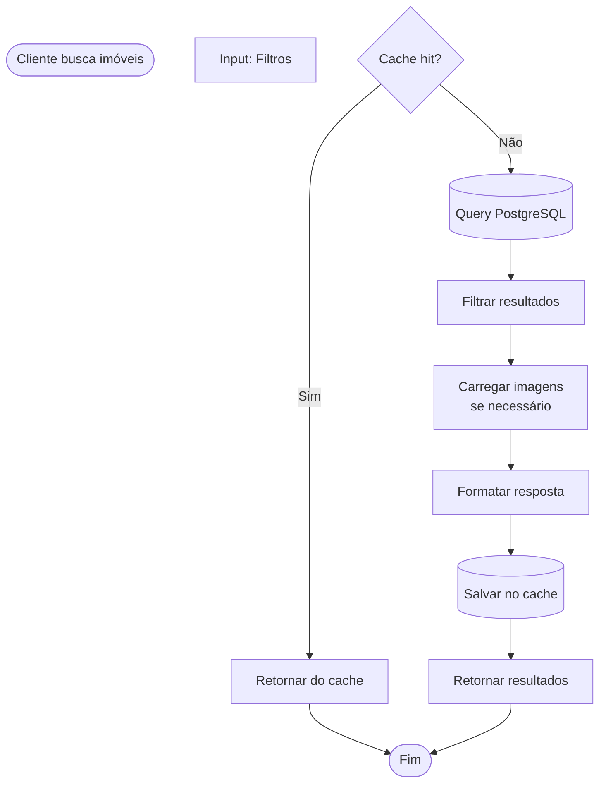
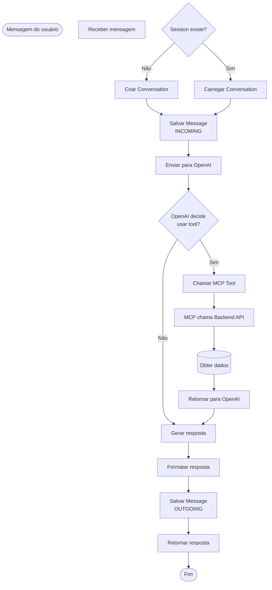
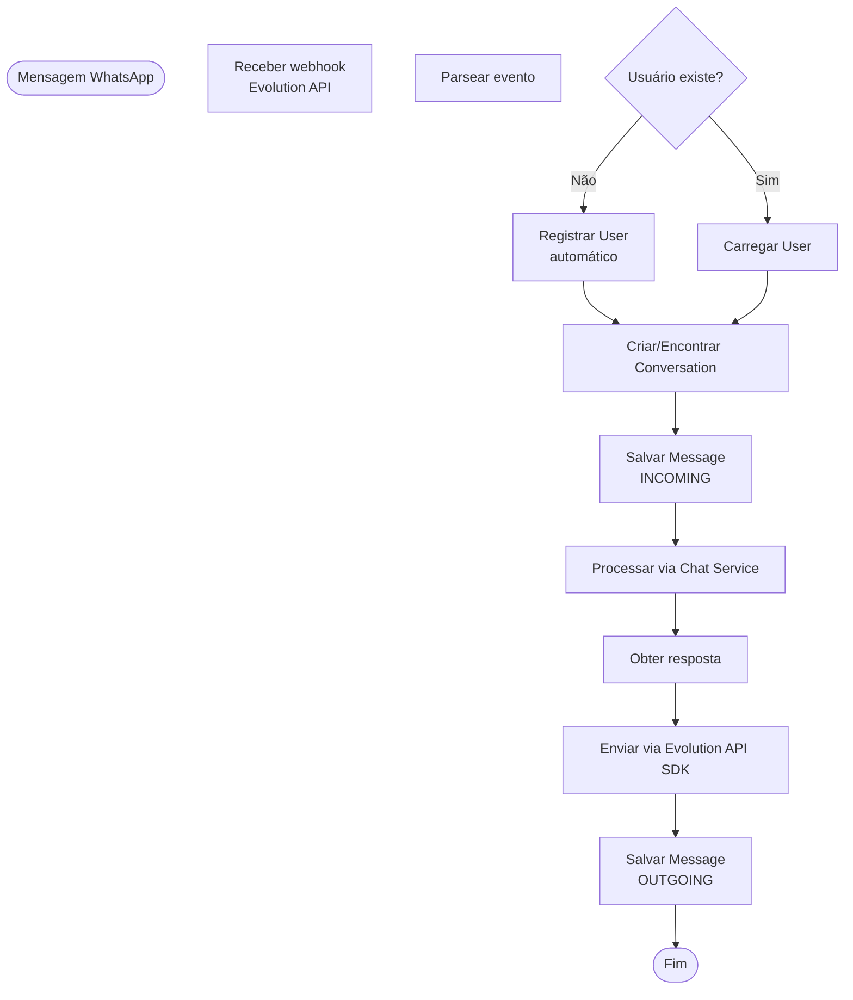
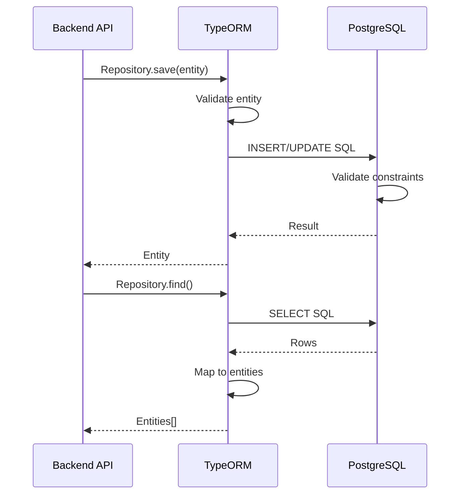
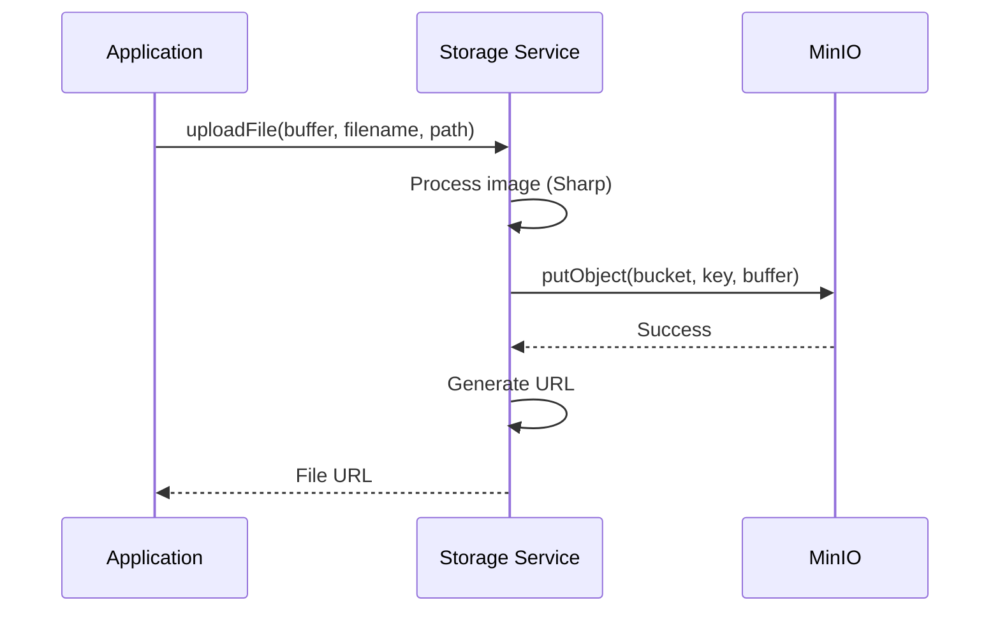
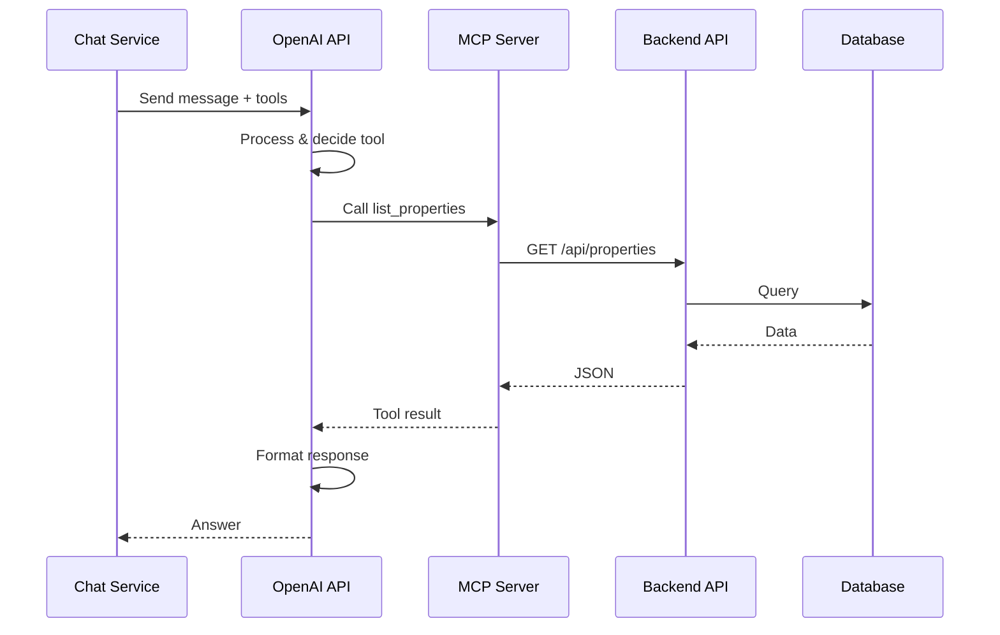

# Data Flow Diagram - Diagrama de Fluxo de Dados

## Visão Geral

Este documento apresenta os **diagramas de fluxo de dados** da plataforma Litoral Imóveis, mostrando como os dados fluem entre sistemas, processos e armazenamentos.

## Fluxo de Dados Principal

### Diagrama de Contexto (Nível 0)



## Fluxos de Dados Detalhados

### 1. Fluxo: Cadastro de Imóvel



**Dados Envolvidos**:
- Input: CreatePropertyDto
- Processamento: Property Entity
- Output: PropertyResponseDto
- Persistência: `properties` table

### 2. Fluxo: Upload de Imagem



**Dados Envolvidos**:
- Input: Multipart file
- Processamento: Buffer → Processed Image → Thumbnail
- Storage: MinIO (original + thumbnail)
- Persistência: `property_images` table
- Output: PropertyImageResponseDto

### 3. Fluxo: Busca de Imóveis



**Dados Envolvidos**:
- Input: Query parameters (filters)
- Cache: Redis (chave: `properties:{filters}`)
- Database: `properties` table + `property_images` table
- Output: PropertyResponseDto[]

### 4. Fluxo: Atendimento via Chat



**Dados Envolvidos**:
- Input: ChatRequestDto (message, sessionId, userCtx)
- Processamento: OpenAI API, MCP Tools
- Persistência: `conversations`, `messages` tables
- Output: ChatResponseDto

### 5. Fluxo: Atendimento via WhatsApp



**Dados Envolvidos**:
- Input: Evolution API webhook payload
- Processamento: Chat Service (similar ao fluxo de chat)
- Persistência: `users`, `conversations`, `messages` tables
- Output: Mensagem enviada via Evolution API

## Fluxos de Dados entre Sistemas

### Backend API ↔ Database



### Storage Service ↔ MinIO



### Chat Service ↔ OpenAI ↔ MCP ↔ Backend API



## Transformações de Dados

### 1. DTO → Entity

**Fluxo**: CreatePropertyDto → Property Entity

```typescript
// Input (DTO)
{
  title: "Casa de Praia",
  price: 850000,
  type: "CASA"
}

// Transformação
const property = new Property();
property.title = dto.title;
property.price = dto.price;
property.type = dto.type;

// Output (Entity)
Property {
  id: "uuid",
  title: "Casa de Praia",
  price: 850000,
  type: PropertyType.CASA
}
```

### 2. Entity → DTO

**Fluxo**: Property Entity → PropertyResponseDto

```typescript
// Input (Entity)
Property {
  id: "uuid",
  title: "Casa de Praia",
  price: 850000,
  realtor: User {...}
}

// Transformação
PropertyResponseDto.fromEntity(property)

// Output (DTO)
{
  id: "uuid",
  title: "Casa de Praia",
  price: 850000,
  realtor: {
    id: "uuid",
    name: "João Silva"
  }
}
```

### 3. Image Processing

**Fluxo**: Raw Image → Processed → Thumbnail

```typescript
// Input: Buffer (raw image)
// Processamento: Sharp
- Resize original (max 1920x1080)
- Generate thumbnail (400x300)
- Optimize quality

// Output: 2 buffers
- Original processed
- Thumbnail
```

## Armazenamento de Dados

### Estrutura de Armazenamento

**PostgreSQL**:
- Tabelas relacionais
- Índices para performance
- Constraints de integridade
- JSONB para dados flexíveis

**MinIO**:
- Estrutura: `bucket/properties/{propertyId}/{filename}`
- Original: `{timestamp}-original-image-{index}.jpg`
- Thumbnail: `thumb-{timestamp}-original-image-{index}.jpg`

**Redis**:
- Chaves: `properties:{filters_hash}`
- TTL: 1 hora
- Formato: JSON serializado

## Volume de Dados por Fluxo

| Fluxo | Volume por Operação | Frequência | Volume Total/Dia |
|-------|-------------------|------------|------------------|
| Cadastro Imóvel | ~5 KB | 10-100/dia | 50-500 KB |
| Upload Imagem | ~500 KB | 50-500/dia | 25-250 MB |
| Busca Imóveis | ~50 KB | 1.000-10.000/dia | 50-500 MB |
| Chat Message | ~2 KB | 5.000-50.000/dia | 10-100 MB |
| WhatsApp Message | ~2 KB | 2.000-20.000/dia | 4-40 MB |

## Próximas Melhorias

- [ ] Implementar cache distribuído (Redis Cluster)
- [ ] Adicionar CDN para imagens
- [ ] Implementar data warehouse para analytics
- [ ] Adicionar streaming de dados (Kafka)
- [ ] Implementar data lake para logs

