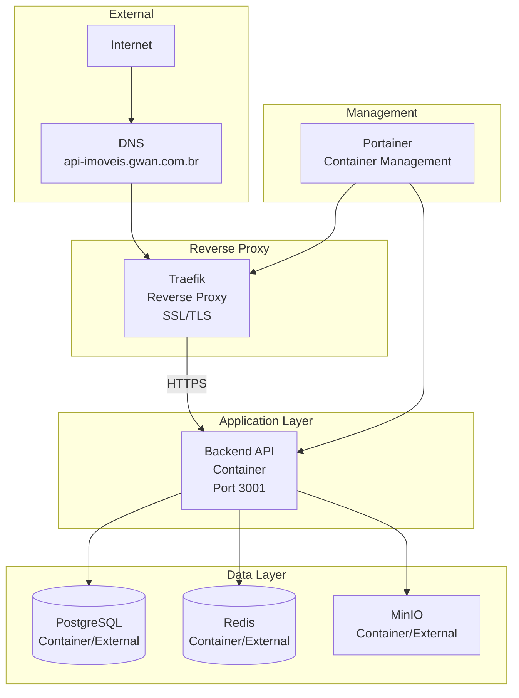
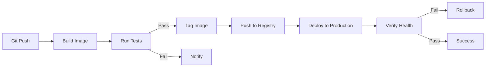

# Deployment Architecture - Arquitetura de Deploy

## Visão Geral

Este documento descreve a **arquitetura de deploy** da plataforma Litoral Imóveis, incluindo containers, orquestração, rede e estratégias de deploy.

## Arquitetura de Deploy

### Diagrama de Deploy



## Containers

### 1. Backend API Container

**Imagem Base**: `node:20-alpine`  
**Porta**: 3001  
**Health Check**: `GET /api/health`  

**Build Process**:
1. Build Stage: Instala dependências e compila TypeScript
2. Production Stage: Copia apenas arquivos necessários

**Dockerfile**:
- Multi-stage build
- Otimização de tamanho (Alpine)
- Non-root user (nestjs)
- Health check configurado

**Variáveis de Ambiente**:
- `NODE_ENV=production`
- `PORT=3001`
- `DATABASE_URL`
- `JWT_SECRET`
- `OPENAI_API_KEY`
- `EVOLUTION_API_KEY`
- `MINIO_*`
- `REDIS_URL`

**Volumes**:
- `logs_data:/app/logs` (logs persistentes)

**Networks**:
- `gwan` (network externa)

### 2. Traefik Container

**Função**: Reverse proxy e load balancer

**Configuração**:
- Labels do Docker para auto-discovery
- Let's Encrypt para SSL/TLS
- Redirecionamento HTTP → HTTPS
- Roteamento baseado em host

**Labels** (Backend API):
```yaml
traefik.enable=true
traefik.http.routers.gwan-imoveis-backend.rule=Host(`api-imoveis.gwan.com.br`)
traefik.http.routers.gwan-imoveis-backend.entrypoints=websecure
traefik.http.routers.gwan-imoveis-backend.tls=true
traefik.http.routers.gwan-imoveis-backend.tls.certresolver=letsencrypt
traefik.http.services.gwan-imoveis-backend.loadbalancer.server.port=3001
```

### 3. Portainer Container

**Função**: Gerenciamento de containers via UI

**Uso**:
- Deploy de stacks
- Monitoramento de containers
- Logs
- Status de saúde

## Estrutura de Deploy

### Docker Compose (Produção)

**Arquivo**: `docker-compose.production.yml`

**Serviços**:
- `gwan-imoveis-backend`: Backend API
- (Outros serviços gerenciados externamente)

**Networks**:
- `gwan`: Network externa compartilhada

**Volumes**:
- `logs_data`: Logs persistentes

### Build Process

**Stages**:
1. **Builder**: Instala dependências e compila
2. **Production**: Imagem final otimizada

**Otimizações**:
- Multi-stage build
- Alpine Linux (imagem pequena)
- Apenas dependências de produção
- Cache de layers

## Estratégia de Deploy

### Deploy Automático

**Ferramenta**: Portainer + Git

**Processo**:
1. Push para repositório Git
2. Webhook ou polling detecta mudanças
3. Portainer executa build
4. Deploy do novo container
5. Health check
6. Rollback automático se falhar

### Deploy Manual

**Processo**:
1. Build local ou CI/CD
2. Push da imagem para registry
3. Deploy via Portainer
4. Verificação manual

### Rollback

**Estratégia**:
- Manter imagens anteriores
- Deploy rápido da versão anterior
- Health check antes de finalizar

## Rede

### Network Topology

**Network Externa**: `gwan`
- Compartilhada entre serviços
- Isolamento de outros containers
- Comunicação entre serviços

**Portas Expostas**:
- Backend API: 3001 (interno)
- Traefik: 80, 443 (externo)

### Firewall e Segurança

**Regras**:
- Apenas Traefik expõe portas externas
- Comunicação interna via network Docker
- SSL/TLS obrigatório para tráfego externo

## Configuração

### Environment Variables

**Produção**:
- Variáveis via `.env` ou Portainer
- Secrets gerenciados separadamente
- Não commitados no Git

**Desenvolvimento**:
- `.env` local
- Valores de exemplo no `.env.example`

### Secrets Management

**Atual**:
- Variáveis de ambiente
- Arquivo `.env` (não versionado)

**Futuro**:
- Docker Secrets
- Vault ou similar
- Rotação automática

## Monitoramento de Deploy

### Health Checks

**Backend API**:
```yaml
healthcheck:
  test: ["CMD", "wget", "--no-verbose", "--tries=1", "--spider", "http://localhost:3001/api/health"]
  interval: 30s
  timeout: 10s
  retries: 3
  start_period: 40s
```

**Verificações**:
- Endpoint `/api/health` responde
- Status code 200
- Tempo de resposta < 10s

### Logs

**Estrutura**:
- Logs em `/app/logs`
- Volume persistente
- Rotação automática (futuro)

**Níveis**:
- DEBUG: Desenvolvimento
- INFO: Produção padrão
- WARN: Avisos
- ERROR: Erros

## Escalabilidade

### Horizontal Scaling

**Estratégia Atual**:
- Single container
- Vertical scaling (recursos)

**Futuro**:
- Múltiplos containers
- Load balancer (Traefik)
- Auto-scaling baseado em métricas

### Vertical Scaling

**Recursos**:
- CPU: 2 cores (recomendado)
- Memória: 2GB (mínimo), 4GB (recomendado)
- Disco: 20GB (mínimo)

## Backup e Recuperação

### Backup de Containers

**Estratégia**:
- Imagens Docker versionadas
- Volumes persistentes backupados
- Configurações versionadas no Git

### Disaster Recovery

**RTO**: 4 horas  
**RPO**: 6 horas  

**Processo**:
1. Restaurar volumes
2. Deploy de containers
3. Verificação de saúde
4. Validação funcional

## CI/CD Pipeline (Futuro)



## Próximas Melhorias

- [ ] Implementar CI/CD completo
- [ ] Adicionar staging environment
- [ ] Implementar blue-green deployment
- [ ] Adicionar canary releases
- [ ] Implementar auto-scaling
- [ ] Adicionar service mesh
- [ ] Implementar distributed tracing

