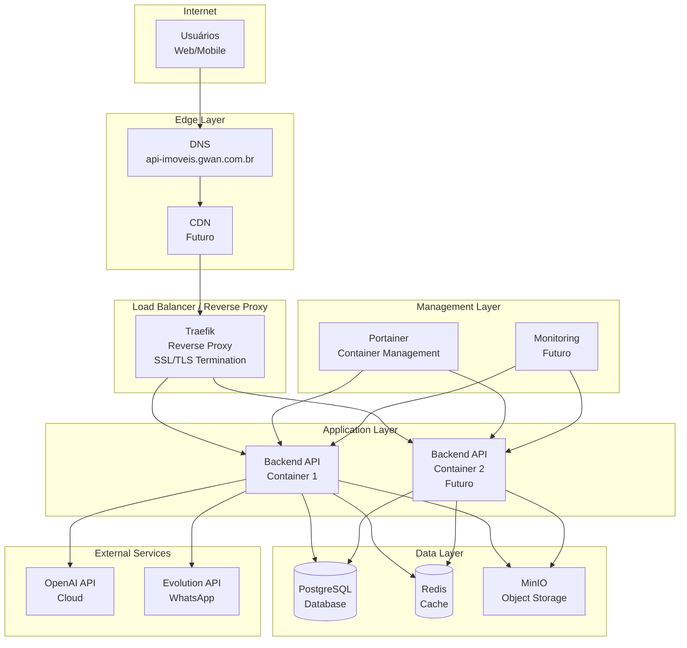
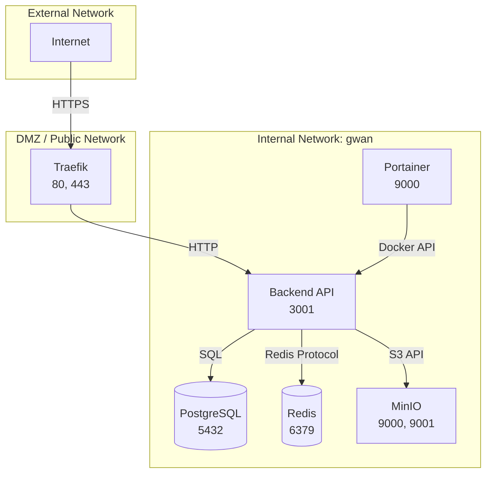

# Infrastructure Diagram - Diagrama de Infraestrutura

## Visão Geral

Este documento apresenta o **diagrama de infraestrutura** completo da plataforma Litoral Imóveis, mostrando servidores, redes, serviços e suas interconexões.

## Infraestrutura Completa

### Diagrama de Alto Nível

## Camadas de Infraestrutura

### 1. Edge Layer (Camada de Borda)

**Componentes**:
- **DNS**: Resolução de nomes
- **CDN** (Futuro): Distribuição de conteúdo estático

**Função**: Primeira camada de acesso, otimização de tráfego

### 2. Load Balancer / Reverse Proxy

**Componente**: Traefik

**Funções**:
- SSL/TLS termination
- Roteamento baseado em host
- Load balancing (futuro)
- Rate limiting (futuro)

**Configuração**:
- Let's Encrypt para certificados
- Auto-discovery via Docker labels
- Redirecionamento HTTP → HTTPS

### 3. Application Layer (Camada de Aplicação)

**Componentes**:
- Backend API Containers

**Características**:
- Stateless (pode escalar horizontalmente)
- Health checks configurados
- Logs centralizados
- Métricas (futuro)

**Escalabilidade**:
- Atual: 1 container
- Futuro: Múltiplos containers com load balancing

### 4. Data Layer (Camada de Dados)

**Componentes**:
- PostgreSQL (relacional)
- Redis (cache)
- MinIO (objetos)

**Características**:
- Persistência de dados
- Backup automatizado
- Replicação (futuro)

### 5. External Services (Serviços Externos)

**Componentes**:
- OpenAI API (cloud)
- Evolution API (WhatsApp)

**Características**:
- APIs externas
- Autenticação via API keys
- Rate limiting externo

### 6. Management Layer (Camada de Gerenciamento)

**Componentes**:
- Portainer (container management)
- Monitoring (futuro: Prometheus, Grafana)

**Função**: Gerenciamento, monitoramento e observabilidade

## Topologia de Rede

### Network Diagram

### Portas e Protocolos

| Serviço | Porta Interna | Porta Externa | Protocolo |
|---------|--------------|---------------|-----------|
| Traefik | 80, 443 | 80, 443 | HTTP, HTTPS |
| Backend API | 3001 | - | HTTP |
| PostgreSQL | 5432 | - | PostgreSQL |
| Redis | 6379 | - | Redis |
| MinIO | 9000, 9001 | - | HTTP, Console |
| Portainer | 9000 | - | HTTP |

## Segurança de Infraestrutura

### Network Security

**Zonas de Segurança**:
- **Public**: Traefik (acesso externo)
- **Internal**: Aplicações e dados (acesso interno apenas)

**Firewall Rules**:
- Apenas Traefik expõe portas externas
- Comunicação interna via Docker network
- Isolamento de serviços

### SSL/TLS

**Certificados**:
- Let's Encrypt (automático)
- Renovação automática
- HTTPS obrigatório

**Cipher Suites**:
- TLS 1.2+
- Cipher suites modernos
- Perfect Forward Secrecy

### Secrets Management

**Atual**:
- Environment variables
- Arquivo `.env` (não versionado)

**Futuro**:
- Docker Secrets
- Vault ou similar
- Rotação automática

## Disponibilidade

### High Availability (Futuro)

**Estratégia**:
- Múltiplos containers de aplicação
- Load balancer com health checks
- Database com replicação
- Failover automático

**RTO**: 1 hora (futuro)  
**RPO**: 6 horas  

### Disaster Recovery

**Backup**:
- Database: Diário + incremental
- Volumes: Backup de arquivos
- Configurações: Versionadas no Git

**Recovery**:
- Restaurar backups
- Deploy de containers
- Verificação de saúde

## Monitoramento e Observabilidade

### Métricas (Futuro)

**Infraestrutura**:
- CPU, memória, disco
- Network I/O
- Container health

**Aplicação**:
- Latência de requisições
- Taxa de erro
- Throughput
- Tempo de resposta

**Ferramentas Futuras**:
- Prometheus (coleta)
- Grafana (visualização)
- AlertManager (alertas)

### Logs

**Estrutura**:
- Logs centralizados
- Formato estruturado (JSON)
- Rotação automática
- Retenção: 30 dias

**Ferramentas Futuras**:
- ELK Stack (Elasticsearch, Logstash, Kibana)
- Centralização de logs
- Busca e análise

### Tracing (Futuro)

**Distributed Tracing**:
- Jaeger ou Zipkin
- Rastreamento de requisições
- Análise de performance

## Escalabilidade

### Horizontal Scaling

**Aplicação**:
- Múltiplos containers
- Load balancer
- Stateless design

**Database**:
- Read replicas (futuro)
- Sharding (futuro)

**Cache**:
- Redis Cluster (futuro)

### Vertical Scaling

**Recursos por Container**:
- CPU: 2 cores (mínimo), 4 cores (recomendado)
- Memória: 2GB (mínimo), 4GB (recomendado)
- Disco: 20GB (mínimo), 50GB (recomendado)

## Backup e Recuperação

### Estratégia de Backup

**Database**:
- Backup completo: Diário
- Backup incremental: A cada 6 horas
- Retenção: 30 dias diários, 12 meses mensais

**Storage**:
- Replicação (futuro)
- Backup remoto (futuro)

**Configurações**:
- Versionadas no Git
- Backup de secrets (criptografado)

### Recovery Procedures

**RTO**: 4 horas  
**RPO**: 6 horas  

**Processo**:
1. Identificar ponto de recuperação
2. Restaurar database
3. Restaurar volumes
4. Deploy de containers
5. Verificação de saúde
6. Validação funcional

## Próximas Melhorias

- [ ] Implementar CDN para assets estáticos
- [ ] Adicionar múltiplos containers (HA)
- [ ] Implementar database replicação
- [ ] Adicionar monitoring completo (Prometheus/Grafana)
- [ ] Implementar logging centralizado (ELK)
- [ ] Adicionar distributed tracing
- [ ] Implementar auto-scaling
- [ ] Adicionar service mesh (Istio/Linkerd)

