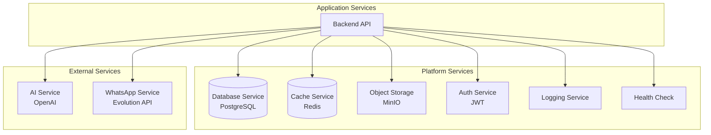

# Platform Services - Serviços de Plataforma

## Visão Geral

Este documento descreve os **serviços de plataforma** da infraestrutura Litoral Imóveis, definindo serviços compartilhados que suportam múltiplas aplicações.

## Serviços de Plataforma Principais

### 1. Database Service

**ID**: PLAT-001  
**Tipo**: Relational Database  
**Tecnologia**: PostgreSQL 14+  
**Status**: Produção  

**Descrição**: Serviço de banco de dados relacional principal.

**Características**:
- ACID compliance
- Transações
- Integridade referencial
- JSONB para dados flexíveis
- Full-text search (futuro)
- Replicação (futuro)

**Uso**:
- Armazenamento de todas as entidades de domínio
- Queries complexas
- Relacionamentos entre dados
- Migrations versionadas

**Configuração**:
- Connection pooling
- SSL/TLS
- Backup automático
- Monitoring (futuro)

**Localização**: Servidor dedicado ou container

### 2. Cache Service

**ID**: PLAT-002  
**Tipo**: In-Memory Cache  
**Tecnologia**: Redis 7.x  
**Status**: Produção  

**Descrição**: Serviço de cache em memória para melhorar performance.

**Características**:
- Alta performance
- TTL automático
- Estruturas de dados ricas (strings, hashes, lists, sets)
- Pub/Sub (futuro)
- Clustering (futuro)

**Uso**:
- Cache de queries frequentes
- Cache de resultados de API
- Sessões (futuro)
- Rate limiting (futuro)

**Estratégias de Cache**:
- Listagens de propriedades: 1 hora
- Detalhes de propriedade: 30 minutos
- Perfis de corretores: 1 hora

**Localização**: Container ou servidor dedicado

### 3. Object Storage Service

**ID**: PLAT-003  
**Tipo**: Object Storage  
**Tecnologia**: MinIO  
**Status**: Produção  

**Descrição**: Serviço de armazenamento de objetos (S3-compatible).

**Características**:
- S3-compatible API
- Self-hosted
- Escalável
- Replicação (futuro)
- Versionamento (futuro)

**Uso**:
- Armazenamento de imagens de imóveis
- Upload de arquivos
- URLs públicas de acesso

**Estrutura**:
```
bucket: gwan-imoveis-uploads
  └── properties/
      └── {propertyId}/
          ├── {timestamp}-original-image-{index}.jpg
          └── thumb-{timestamp}-original-image-{index}.jpg
```

**Localização**: Container ou servidor dedicado

### 4. AI Service (OpenAI)

**ID**: PLAT-004  
**Tipo**: External API  
**Tecnologia**: OpenAI API  
**Status**: Produção  

**Descrição**: Serviço de inteligência artificial para processamento de linguagem natural.

**Características**:
- GPT models (gpt-4, gpt-3.5-turbo)
- Function calling
- Embeddings (futuro)
- Fine-tuning (futuro)

**Uso**:
- Chatbot inteligente
- Processamento de linguagem natural
- Geração de respostas contextuais

**Integração**:
- Via axios (HTTP client)
- API Key authentication
- Rate limiting (OpenAI)

**Localização**: Cloud (OpenAI)

### 5. WhatsApp Service (Evolution API)

**ID**: PLAT-005  
**Tipo**: External API  
**Tecnologia**: Evolution API  
**Status**: Produção  

**Descrição**: Serviço de integração com WhatsApp.

**Características**:
- Webhooks para mensagens
- SDK para envio
- Múltiplas instâncias
- QR Code para autenticação

**Uso**:
- Recebimento de mensagens WhatsApp
- Envio de mensagens WhatsApp
- Registro automático de usuários

**Integração**:
- Via @solufy/evolution-sdk
- Webhook endpoint
- API Key authentication

**Localização**: Servidor dedicado ou cloud

### 6. Authentication Service

**ID**: PLAT-006  
**Tipo**: Application Service  
**Tecnologia**: JWT, Passport  
**Status**: Produção  

**Descrição**: Serviço de autenticação e autorização.

**Características**:
- JWT tokens
- Stateless authentication
- Role-based access control
- Token expiration
- Refresh tokens (futuro)

**Uso**:
- Autenticação de usuários
- Validação de tokens
- Controle de acesso

**Implementação**:
- JwtStrategy (Passport)
- LocalStrategy (Passport)
- Guards (NestJS)

**Localização**: Backend API (interno)

### 7. Logging Service

**ID**: PLAT-007  
**Tipo**: Application Service  
**Tecnologia**: NestJS Logger  
**Status**: Produção  

**Descrição**: Serviço de logging estruturado.

**Características**:
- Logs estruturados (JSON)
- Níveis: DEBUG, INFO, WARN, ERROR
- Contexto automático
- Timestamps
- Stack traces

**Uso**:
- Debugging
- Monitoramento
- Auditoria
- Troubleshooting

**Futuro**:
- Centralização (ELK Stack)
- Alertas
- Dashboards

**Localização**: Backend API (interno)

### 8. Health Check Service

**ID**: PLAT-008  
**Tipo**: Application Service  
**Tecnologia**: NestJS  
**Status**: Produção  

**Descrição**: Serviço de health check para monitoramento.

**Características**:
- Endpoint `/api/health`
- Verificação de dependências
- Status de serviços
- Métricas básicas

**Uso**:
- Health checks do Docker
- Monitoramento externo
- Load balancer health checks

**Localização**: Backend API (interno)

## Diagrama de Serviços de Plataforma



## Matriz Serviço-Aplicação

| Serviço de Plataforma | Aplicações que Usam |
|----------------------|-------------------|
| Database Service | Backend API, Chat Service |
| Cache Service | Backend API |
| Object Storage Service | Backend API (Property Images) |
| AI Service | Chat Service |
| WhatsApp Service | WhatsApp Webhook Service |
| Authentication Service | Backend API (todos os módulos) |
| Logging Service | Todas as aplicações |
| Health Check Service | Backend API |

## Disponibilidade e SLA

| Serviço | Disponibilidade | RTO | RPO |
|---------|----------------|-----|-----|
| Database Service | 99.9% | 4 horas | 6 horas |
| Cache Service | 99.5% | 1 hora | - |
| Object Storage Service | 99.9% | 4 horas | 6 horas |
| AI Service | 99.5% | - | - |
| WhatsApp Service | 99% | - | - |
| Authentication Service | 99.9% | 1 hora | - |
| Logging Service | 99% | - | - |
| Health Check Service | 99.9% | - | - |

## Segurança dos Serviços

| Serviço | Autenticação | Criptografia | Isolamento |
|---------|-------------|--------------|------------|
| Database Service | Credenciais | SSL/TLS | Network |
| Cache Service | Credenciais | - | Network |
| Object Storage Service | Access/Secret Key | HTTPS | Network |
| AI Service | API Key | HTTPS | External |
| WhatsApp Service | API Key | HTTPS | External |
| Authentication Service | JWT | HTTPS | Internal |
| Logging Service | - | - | Internal |
| Health Check Service | - | HTTPS | Public |

## Monitoramento

**Métricas Coletadas** (Futuro):
- Latência de requisições
- Taxa de erro
- Throughput
- Uso de recursos (CPU, memória, disco)
- Disponibilidade

**Ferramentas Futuras**:
- Prometheus (métricas)
- Grafana (dashboards)
- ELK Stack (logs)
- Sentry (erros)

## Escalabilidade

**Estratégias**:
- Database: Read replicas (futuro)
- Cache: Redis Cluster (futuro)
- Storage: MinIO distributed (futuro)
- Application: Horizontal scaling (Docker)

## Backup e Recuperação

**Database Service**:
- Backup diário completo
- Backup incremental a cada 6 horas
- Retenção: 30 dias diários, 12 meses mensais

**Object Storage Service**:
- Replicação (futuro)
- Backup remoto (futuro)

## Próximos Serviços

- [ ] Message Queue Service (Kafka/RabbitMQ)
- [ ] Search Service (Elasticsearch)
- [ ] CDN Service (CloudFlare)
- [ ] Monitoring Service (Prometheus/Grafana)
- [ ] Notification Service (Email/SMS/Push)
- [ ] Analytics Service (Data Warehouse)

